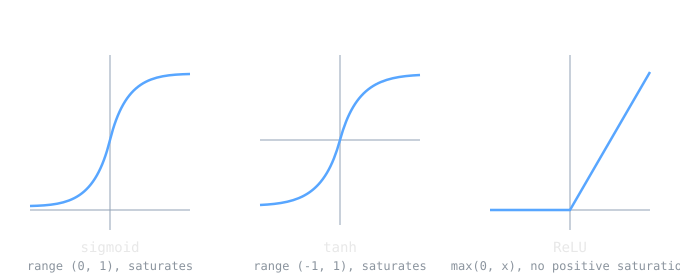

Every unit in a network computes a weighted sum and then does one more thing: it passes that sum through an activation function. This small step is what earns a deep network its name. Without it, stacking layers is pointless, because [[cs/math/matrices-and-linear-transformations|a pile of linear maps is still just one linear map]], and a hundred layers would collapse into the power of a single line. The activation function is the nonlinearity that lets each layer bend the space a little, so that many layers together can bend it into whatever shape the data demands.

> [!note] The idea
> An activation function $f$ is the nonlinear map applied to a unit's weighted sum: the unit outputs $f(\mathbf{w}^\top \mathbf{x} + b)$. Nonlinearity is the whole point. It is what stops a deep network from collapsing into a single linear model and gives the stack its representational power. The practical question is which nonlinearity, and the answer has shifted from the saturating sigmoid and tanh toward the ReLU family, mainly to keep gradients alive in deep networks.

## Why Nonlinearity Is Required

Compose two linear functions and you get another linear function. Multiply matrices $W_2(W_1 \mathbf{x}) = (W_2 W_1)\mathbf{x}$ and the two layers are mathematically identical to one layer with weights $W_2 W_1$ (this is just how linear maps compose, see [[linear-algebra-fundamentals]]). So a network of purely linear units, however deep, can only ever represent a linear function. Inserting a nonlinear activation between the layers breaks that collapse, and it is the reason a multilayer network can represent things a single [[artificial-neural-networks|unit]] cannot.

## Sigmoid

[[cs/machine-learning/logistic-regression|The logistic sigmoid]] is the historical default:

$$\sigma(x) = \frac{1}{1 + e^{-x}}$$

It squashes any real input into the open interval $(0, 1)$, which reads naturally as a probability, and it has the convenient derivative $\sigma'(x) = \sigma(x)\,(1 - \sigma(x))$. That clean derivative is a gift to [[backpropagation]], which is one reason sigmoid dominated early networks.

Its flaw shows up in depth. For large positive or negative inputs the curve flattens, and when the output saturates near 0 or 1 the derivative goes to nearly zero. A near-zero local derivative kills the gradient flowing through that unit, and across many layers these small factors multiply into the vanishing gradient problem, where early layers barely learn at all.

## Tanh

The hyperbolic tangent is a rescaled sigmoid with output range $(-1, 1)$. Being zero-centered, its outputs are not all positive, which tends to make optimization behave better than raw sigmoid. It is still an S-shaped curve, though, so it saturates at both ends in exactly the same way and suffers the same vanishing gradients in deep networks.

## ReLU

The rectified linear unit is the modern default:

$$f(x) = \max(0, x)$$

It is almost embarrassingly simple, which is part of the appeal. It costs a single comparison to evaluate, and on its positive side the derivative is exactly 1, so gradients pass through undiminished. That is the cure for the saturation problem: ReLU does not flatten as inputs grow, so it propagates gradients far better than sigmoid or tanh and made training genuinely deep networks practical. Xavier Glorot, Antoine Bordes, and Yoshua Bengio made the case in their 2011 paper "Deep Sparse Rectifier Neural Networks," reporting performance equal to or better than tanh despite the hard corner at zero.

ReLU has one failure mode, the dying ReLU. If a unit's weights drift so that its input is always negative, it outputs zero for every example, its gradient is zero, and it never recovers. Often this traces back to a learning rate set too high.

## Leaky ReLU and ELU

The variants patch the dying problem by giving the negative side a nonzero response. Leaky ReLU replaces the flat zero with a small slope, $f(x) = \alpha x$ for $x < 0$ with $\alpha$ around $0.01$, so a dormant unit still leaks a little gradient. The exponential linear unit (ELU, Clevert and colleagues, 2015) uses a smooth negative branch, $f(x) = \alpha(e^{x} - 1)$ for $x < 0$, which can push mean activations closer to zero and sometimes trains more accurately than plain ReLU.

## Output Units Are a Separate Choice

Hidden-layer activations and output-layer activations answer different questions. Hidden units are about learning features, where ReLU shines. Output units are about matching the shape of the target: a linear output for regression, a single sigmoid for a binary probability, and a softmax for a distribution over $k$ classes, $\text{softmax}(z)_i = e^{z_i} / \sum_j e^{z_j}$, which is a smooth differentiable stand-in for picking the argmax. The output activation is chosen to fit the [[cs/machine-learning/loss-functions|loss]], often so that minimizing the loss corresponds to [[maximum-likelihood-estimation]]. These three output choices are exactly [[cs/machine-learning/regression|linear, logistic, and softmax regression]]; a neural-net classifier's output layer is softmax regression by another name.

> [!example]
> Push the same two inputs through each function to see saturation in action. At a small input $x = 0.5$: $\sigma(0.5) \approx 0.62$, $\tanh(0.5) \approx 0.46$, $\text{ReLU}(0.5) = 0.5$. At a large input $x = 6$: $\sigma(6) \approx 0.9975$, $\tanh(6) \approx 0.99999$, $\text{ReLU}(6) = 6$.
>
> The telling part is the slope out there. At $x = 6$ the sigmoid derivative is $\sigma(6)(1 - \sigma(6)) \approx 0.0025$, almost nothing, so a gradient passing through is throttled to a fraction of a percent. ReLU's slope at $x = 6$ is still exactly 1. Multiply many such factors down a deep network and you can see why saturating units stall training while ReLU does not.

## Related Notes

- [[artificial-neural-networks]] apply an activation to every unit's weighted sum
- [[backpropagation]] multiplies these functions' local derivatives on the backward pass
- [[gradient-descent]] is what the surviving gradients drive
- [[loss-functions]] pair with the output activation to define the training objective
- [[maximum-likelihood-estimation]] explains why softmax and sigmoid outputs are principled
- [[linear-algebra-fundamentals]] for why stacked linear maps collapse without a nonlinearity
- [[ai-vs-ml-vs-dl]] for the broader deep learning context

## Sources

- https://en.wikipedia.org/wiki/Activation_function (the activation as the nonlinearity a unit applies; without it a network is linear)
- https://en.wikipedia.org/wiki/Sigmoid_function (the sigmoid squashing function used in neural units)
- https://en.wikipedia.org/wiki/Logistic_function (standard logistic $1/(1+e^{-x})$, range $(0,1)$, derivative $\sigma(1-\sigma)$)
- https://en.wikipedia.org/wiki/Rectifier_%28neural_networks%29 (ReLU $\max(0,x)$, leaky ReLU, ELU by Clevert et al. 2015, the dying ReLU problem, and better gradient propagation than saturating activations)
- https://en.wikipedia.org/wiki/Vanishing_gradient_problem (how saturating activations shrink gradients across depth)
- https://proceedings.mlr.press/v15/glorot11a.html (Glorot, Bordes, Bengio, "Deep Sparse Rectifier Neural Networks," 2011)
- https://proceedings.mlr.press/v9/glorot10a.html (Glorot and Bengio, "Understanding the difficulty of training deep feedforward neural networks," 2010: sigmoid saturation in deep nets)
- https://cs231n.github.io/neural-networks-1/ (Stanford CS231n: sigmoid, tanh, ReLU, and their tradeoffs)
- Course framing: CSCE 479/879 (Stephen Scott, UNL), "Basic Artificial Neural Networks" lecture slides
