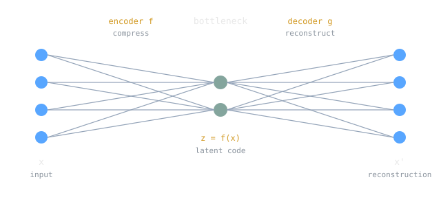

Copying the input to the output sounds pointless, and it is, right up until you make it hard. An autoencoder is a network trained to reproduce whatever you feed it, but the network is built with a narrow waist in the middle, a hidden layer smaller than the input. The data has to squeeze through that waist and come back out looking like it went in. To pull that off, the network cannot store the input verbatim. It has to discover which attributes of the data actually matter and encode those. The task is trivial; the constraint is where the learning lives.

> [!note] The idea
> An autoencoder learns the identity function under a constraint. An encoder $f$ maps input $x$ to a latent code $z = f(x)$, and a decoder $g$ maps back to reconstruct $x' = g(z)$. Training minimizes reconstruction error between $x$ and $x'$. Because $z$ is forced to be small (or otherwise regularized), the code becomes a compressed, learned [[cs/machine-learning/features-and-representations|representation]] of the data rather than a copy of it.

## Encoder, Bottleneck, Decoder

The network splits into two subnetworks that meet in the middle. The encoder $f(\cdot)$ maps each input to an embedded, or latent, representation. The decoder $g(\cdot)$ maps that representation back into input space. What connects them is a loss you already know: reconstruction is scored with square loss for real-valued inputs or cross-entropy for binary ones, so training an autoencoder is ordinary [[gradient-descent]] on a [[cs/machine-learning/loss-functions|reconstruction loss]]. There are no labels involved, which makes this a form of [[unsupervised-learning]]: the input is its own target.

The width of the bottleneck defines the two regimes. An **undercomplete** autoencoder has a hidden layer smaller than the input, so the latent space has fewer dimensions than the data. It cannot simply memorize the training instances; it has to compress. An **overcomplete** autoencoder has a hidden layer larger than the input, which invites the trivial solution of copying the input straight through. To stop that, overcomplete autoencoders are regularized, for example by enforcing a sparsity constraint so that most latent units sit near zero for any given input.

Compression is the right way to picture what happens. The autoencoder is doing [[cs/military-computing/shannon-and-information-theory|lossy compression]], keeping the important structure and discarding the rest. There is a clean special case that anchors the intuition: a linear autoencoder with one hidden layer trained under square loss recovers [[cs/machine-learning/pca-and-dimensionality-reduction|principal component analysis]], finding the linear projection of the data that preserves the most variance. Nonlinear autoencoders generalize that idea to curved, low-dimensional structure.

## Why the Latent Code Is Useful

The reconstruction is rarely the point. The interesting object is $z$, the code sitting in the bottleneck, because a good code captures the data's underlying factors in a compact form. That makes autoencoders a workhorse for a few jobs. They give you unsupervised pre-training: train an autoencoder on a pile of unlabeled data, keep the encoder as a feature extractor, then train a small classifier on top with whatever labeled data you have. They produce embeddings for retrieval, where similar inputs land near each other in latent space. And they compress.

Variants shape the code in different ways. A **denoising** autoencoder is fed a corrupted input $\tilde{x}$ and asked to reconstruct the clean $x$, which forces it to learn the structure of the data manifold instead of the identity map. A **sparse** autoencoder penalizes the latent activations, often with a target sparsity enforced through KL divergence, so only a few units fire per input. A **contractive** autoencoder penalizes the sensitivity of the code to input changes, making the representation robust to small perturbations. Each is the same core idea with a different constraint on $z$.

## Variational Autoencoders: From Compression to Generation

A plain autoencoder gives you a code for each training instance, but the latent space between those codes is a wilderness. Sample a random point in it, decode, and you usually get garbage, because nothing ever forced the codes to fill the space in an organized way. A variational autoencoder (VAE), introduced by Kingma and Welling in 2013, fixes this by turning the autoencoder into a proper generative model, one that can draw brand-new instances that resemble the training data.

The change is that the encoder stops outputting a single code and instead outputs the parameters of a distribution. For each latent dimension $i$ it emits a mean $\mu_i$ and a standard deviation $\sigma_i$, and the actual code is sampled, $z_i \sim \mathcal{N}(\mu_i, \sigma_i^2)$ (here $\sigma_i$ is a standard deviation), then decoded. The loss adds a second term to the reconstruction error: a regularizer that pulls the encoder's distribution toward a standard [[cs/statistics/normal-distribution|Gaussian]] $\mathcal{N}(0, I)$, measured by KL divergence. That prior is what organizes the latent space. Once the codes are trained to look like samples from $\mathcal{N}(0, I)$, you can generate by drawing $z \sim \mathcal{N}(0, I)$ and decoding it, with no input image required. This is a [[cs/statistics/maximum-likelihood-estimation|maximum-likelihood]] approach to generation: find parameters that make the training set probable under the model.

> [!warning]
> You cannot backpropagate through a random sampling step, which is a problem because the VAE samples $z$ in the middle of the network. The fix is the reparameterization trick: instead of sampling $z \sim \mathcal{N}(\mu, \sigma^2)$ directly, sample noise $\epsilon \sim \mathcal{N}(0, 1)$ and compute $z = \mu + \epsilon \sigma$. Now the randomness lives in $\epsilon$, which has no parameters, and the gradient flows cleanly through $\mu$ and $\sigma$.

> [!example]
> Train a VAE on MNIST digits with a two-dimensional latent space, then walk a grid across that space and decode each point. The images morph smoothly: a 7 slides into a 9, which rounds into an 8, which opens into a 0. The latent axes end up standing in for interpretable factors like digit thickness, slant, and loop closure. Contrast this with a plain autoencoder, whose latent space has no such smooth, samplable structure. That contrast, an organized samplable prior versus a raw compressed code, is what separates a generative model from a compressor.

## Related Notes

- [[artificial-neural-networks]] for the encoder and decoder building blocks
- [[unsupervised-learning]] because an autoencoder learns from unlabeled data, its own input as target
- [[loss-functions]] and [[gradient-descent]] supply the reconstruction objective and the optimizer
- [[features-and-representations]] on why the latent code is the real product
- [[generative-adversarial-networks]] and [[diffusion-models]] are the other two generative models in this batch; a VAE organizes a latent prior, a GAN plays an adversarial game, and diffusion learns to denoise
- [[normal-distribution]] and [[maximum-likelihood-estimation]] underpin the VAE's Gaussian prior and training objective
- [[ai-vs-ml-vs-dl]] for where generative deep learning sits in the bigger picture

## Sources

- https://arxiv.org/abs/1312.6114 (Kingma & Welling, 2013, "Auto-Encoding Variational Bayes": the VAE, the ELBO objective, and the reparameterization trick)
- https://en.wikipedia.org/wiki/Autoencoder (encoder/decoder structure, undercomplete vs overcomplete, denoising/sparse/contractive variants, PCA connection)
- https://en.wikipedia.org/wiki/Variational_autoencoder (VAE as a generative model, Gaussian latent, KL regularizer to a standard normal prior)
- https://www.deeplearningbook.org/contents/autoencoders.html (Goodfellow, Bengio, Courville, *Deep Learning*, ch. 14: autoencoders, regularized autoencoders, the manifold view)
- https://en.wikipedia.org/wiki/Principal_component_analysis (the variance-maximizing linear projection a linear square-loss autoencoder recovers)
- Course framing: CSCE 479/879 (Stephen Scott, UNL), "Autoencoders, GANs, and Diffusion Models" lecture slides
