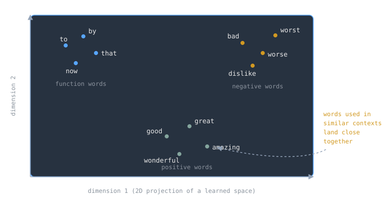

A neural network cannot read the word "apricot." It needs numbers. The obvious encoding, a one-hot vector with a single 1 in a vocabulary of a hundred thousand words, has two fatal flaws: the vectors are enormous, and every pair of them is orthogonal, so "car" and "automobile" look exactly as unrelated as "car" and "jam." An embedding replaces that with a short dense vector, learned from data, where words used in similar contexts end up near each other. Distance in the space becomes a stand-in for similarity of meaning.

> [!note] The idea
> Represent each word as a learned vector of maybe 100 to 300 real numbers, trained so that words appearing in similar contexts get similar vectors. Instead of counting co-occurrences, train a small classifier to predict a word from its context (or the reverse) and keep the learned weights as the vectors. The payoff is geometric: similar words cluster, and some relationships even become vector arithmetic.

## From counts to dense vectors

The older route to vector semantics is counting. A term-document matrix records how often each word appears in each document; a word-word matrix records how often two words share a context window. Weight the counts with tf-idf so common words like "the" do not swamp everything, and compare words by the cosine of the angle between their vectors (a normalized dot product, plain [[cs/math/linear-algebra-fundamentals|linear algebra]]). This works, but the vectors are as long as the vocabulary and mostly zeros. Dense vectors are shorter, give the downstream model fewer parameters to learn, and capture synonymy that sparse dimensions structurally cannot.

## word2vec: predict, don't count

The word2vec approach of Mikolov et al. (2013, at Google) flips counting into prediction. Rather than tallying how often a word appears near "apricot," train a model to predict how likely it is to. The paper proposed two architectures: continuous bag-of-words (CBOW), which predicts the current word from its surrounding context words, and skip-gram, which predicts the context words from the current word. Either way the model is a shallow network whose learned weight matrix, one row per vocabulary word, is the embedding table. The follow-up paper made training cheap with negative sampling: treat words that genuinely co-occur as positive examples, randomly sample other words as negatives, and train a logistic classifier to tell them apart, which pushes real word-context pairs together in the space and random pairs apart. Training is just [[gradient-descent]] on that classification [[cs/machine-learning/loss-functions|loss]], and it scaled: the original setup learned high-quality vectors from a 1.6-billion-word corpus in under a day. GloVe from Stanford is the other widely used pretrained embedding of that generation.

## The embedding space

The learned space has structure nobody explicitly put there. Project it to two dimensions and words cluster by meaning: positive sentiment words together, negative ones together, function words off in their own region. Some relationships come out as directions, the famous example being vector("King") minus vector("Man") plus vector("Woman") landing closest to vector("Queen"). The same geometry also absorbs whatever biases live in the training corpus, which is worth remembering before treating the space as neutral.

Nothing about the trick is specific to words. Anything with a notion of context can be embedded: node2vec (Grover and Leskovec, 2016) embeds graph nodes by treating random walks as sentences, so nodes with similar neighborhoods get similar vectors. Embeddings are the purest example of learned [[cs/machine-learning/features-and-representations|representations]]: the network discovers the useful dimensions instead of a human designing them.

> [!example] Embeddings that knew chemistry before we did
> Tshitoyan et al. (Nature, 2019) trained word embeddings on millions of materials science abstracts, with no chemistry knowledge built in. The space recovered concepts like the structure of the periodic table on its own, and embeddings trained only on papers published before a cutoff year could recommend materials for applications (such as thermoelectrics) years before those materials were actually reported for that use.

One limit worth naming: word2vec and GloVe are static embeddings, one vector per word regardless of usage, so "bank" gets a single vector whether the sentence is about rivers or deposits. Contextual models like BERT assign a different vector per usage. In a sequence model, the embedding layer is the front door: a [[recurrent-neural-networks|recurrent network]] reading text consumes one embedding per token, either trained along with the rest of the [[artificial-neural-networks|network]] or loaded pretrained.

## Related Notes

- [[cs/machine-learning/features-and-representations|Features and Representations]], embeddings as the canonical learned representation
- [[recurrent-neural-networks|Recurrent Neural Networks]], the sequence models that consume embeddings token by token
- [[artificial-neural-networks|Artificial Neural Networks]], the machinery word2vec's shallow network is built from
- [[cs/machine-learning/gradient-descent|Gradient Descent]], how the vectors get trained
- [[cs/machine-learning/loss-functions|Loss Functions]], the classification objective behind negative sampling
- [[cs/math/linear-algebra-fundamentals|Linear Algebra Fundamentals]], dot products and cosine similarity as the comparison tools
- [[cs/history/deep-learning-revolution|The Deep Learning Revolution]], the era that made learned representations the default
- [[cs/machine-learning/ai-vs-ml-vs-dl|AI vs ML vs DL]], where representation learning sits in the bigger picture

## Sources

- Mikolov, Chen, Corrado, Dean, "Efficient Estimation of Word Representations in Vector Space" (2013). https://arxiv.org/abs/1301.3781 . Supports the CBOW and skip-gram architectures, learning high-quality vectors from a 1.6-billion-word dataset in less than a day, and the syntactic/semantic vector regularities including the King minus Man plus Woman is close to Queen example.
- Mikolov, Sutskever, Chen, Corrado, Dean, "Distributed Representations of Words and Phrases and their Compositionality" (2013). https://arxiv.org/abs/1310.4546 . Supports negative sampling as the efficient training objective for skip-gram.
- Jurafsky and Martin, *Speech and Language Processing* (3rd ed. draft), Chapter 6: Vector Semantics and Embeddings. https://web.stanford.edu/~jurafsky/slp3/6.pdf . Supports the distributional idea (words in similar contexts have similar meanings), term-document and word-word matrices, tf-idf weighting, cosine similarity, sparse versus dense vectors, and static versus contextual embeddings.
- "Word2vec," Wikipedia. https://en.wikipedia.org/wiki/Word2vec . Supports word2vec as a 2013 technique from a team at Google and its role in producing dense word vectors.
- GloVe project page, Stanford NLP Group. https://nlp.stanford.edu/projects/glove/ . Supports GloVe (Pennington, Socher, Manning) as a widely used pretrained word embedding.
- Grover and Leskovec, "node2vec: Scalable Feature Learning for Networks" (2016). https://arxiv.org/abs/1607.00653 . Supports extending the word2vec approach to graph nodes via sampled neighborhoods.
- Tshitoyan et al., "Unsupervised word embeddings capture latent knowledge from materials science literature," *Nature* (2019). https://www.nature.com/articles/s41586-019-1335-8 . Supports embeddings trained on materials science abstracts capturing periodic-table structure and recommending materials for applications years before their published discovery.
