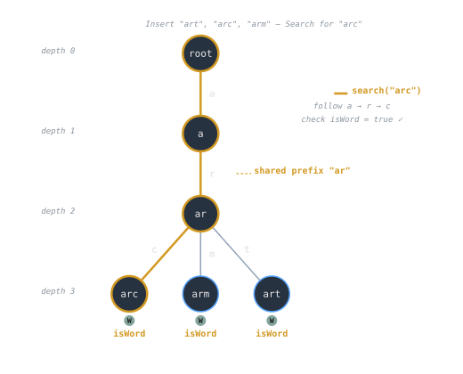
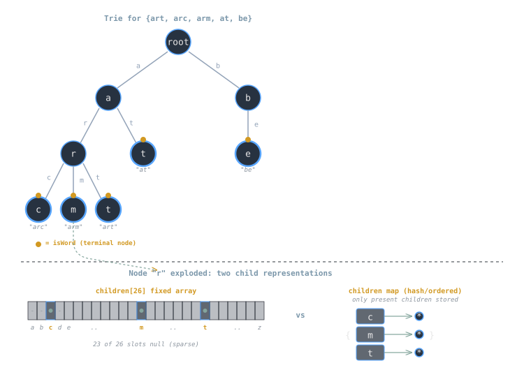

## Overview
A **standard trie** (a.k.a. *prefix tree*) stores strings so that each edge corresponds to a character and each root-to-node path spells a **prefix** of some key. Tries provide **prefix-friendly** lookup: exact membership, prefix queries, and lexicographic iteration in time proportional to the **length of the query**, not the number of stored keys. The trade-off is **memory**: naive node designs allocate a child slot per alphabet symbol, which can be expensive on large alphabets or sparse branches.

> [!note]
> A “standard trie” here means **uncompressed**—every character consumes one edge. For space-optimized variants see [[cs/dsa/compressed-trie|Compressed Trie]] and for substring indexing see [[cs/dsa/suffix-trie|Suffix Trie]].

## Structure Definition
Each node represents a **prefix** `p`. It stores:
- **Children**: a mapping from next character `c` to the child node for prefix `p·c`.
- **Terminal flag**: `isWord` indicating whether `p` is a complete key.
- **Optional payload**: counts, values, or end-of-word metadata (e.g., frequency for autocomplete).

Two common child representations:

1) **Fixed array** of size `|Σ|` (alphabet):
   - `children[σ]` pointers indexed by character code.
   - Fast and [[cs/systems/memory-hierarchy-and-caching|cache-friendly]] on small alphabets (e.g., lowercase English, DNA).
   - Wastes memory when branching is sparse or `|Σ|` is large ([[cs/languages/common/text-encoding-and-unicode|Unicode]]).

2) **Dictionary/map** (hash map or ordered map):
   - Stores only **present** children.
   - Space-efficient and flexible with large or sparse alphabets.
   - Slightly higher per-step constant factors than arrays.

> [!tip]
> Use arrays for **tiny alphabets** (e.g., `Σ = {a..z}`), and maps for **large or unknown** alphabets. A hybrid that switches from array→map at low degree can balance speed and memory.

## Core Operations
Assume `A[i]` yields the `i`-th character and `|s|` is string length.

### Insert
```pseudo
function INSERT(root, s):
    node = root
    for i in 0..|s|-1:
        c = s[i]
        if node.children lacks c:
            node.children[c] = new Node()
        node = node.children[c]
    node.isWord = true
````

### Search (exact key)

```pseudo
function SEARCH(root, s) -> bool:
    node = root
    for i in 0..|s|-1:
        c = s[i]
        if node.children lacks c: return false
        node = node.children[c]
    return node.isWord
```

### Starts-with / Prefix probe

```pseudo
function STARTS_WITH(root, prefix) -> bool:
    node = root
    for c in prefix:
        if node.children lacks c: return false
        node = node.children[c]
    return true   // reached the node for 'prefix'
```

### Delete (unmark + prune)

```pseudo
function DELETE(root, s) -> bool:
    // returns true if a node can be pruned up the call
    function RECUR(node, i) -> bool:
        if i == |s|:
            if not node.isWord: return false
            node.isWord = false
            return node.children is empty
        c = s[i]
        if node.children lacks c: return false
        canPrune = RECUR(node.children[c], i+1)
        if canPrune:
            remove node.children[c]
        return (not node.isWord) and node.children is empty

    return RECUR(root, 0)
```

### Enumerate by prefix (autocomplete)

Depth-first iterate from the node reached by `prefix`, yielding all words under it in lexicographic order (if children are ordered).



## Example (Stepwise)

Suppose keys: `art`, `arc`, `arm`, `at`, `be`.

1. **Insert `art`**: create nodes along `a→r→t`, set `isWord` at `t`.
    
2. **Insert `arc`/`arm`**: share `a→r`, branch at `c` and `m`.
    
3. **Insert `at`**: reuse `a`, create `t` under `a`, set `isWord`.
    
4. **Insert `be`**: create new `b→e` branch from root.
    

- `SEARCH("arc")` succeeds: path exists and `isWord=true`.
    
- `STARTS_WITH("ar")` succeeds even though `ar` isn’t a word; it is a **prefix node**.
    
- `DELETE("arm")` unmarks `isWord` at `m` and prunes the `m` node if it now has no children.
    

## Complexity and Performance

Let `n` be the number of stored keys, `L` the **average key length**, and `k = |s|` the query length.

- **Insert / Search (exact) / Starts-with**: `Θ(k)` time; depends only on query length, not on `n`.  
    With array children, each character step is `O(1)`; with map children, each step is `O(1)` expected (hash) or `O(log d)` for ordered maps where `d` is node degree.
    
- **Delete**: `Θ(k)` for traversal plus **pruning** on the path back (bounded by `k`).
    
- **Space**: `Θ(Σ nodes + Σ edges)`; worst case `Θ(n·L)` pointers plus node headers. With arrays, multiply by `|Σ|`; with maps, proportional to nonempty children plus map overhead.
    

Cache and constants:

- Array child pointers give predictable, branch-light traversal with good locality on small `|Σ|`.
    
- Hash-map children add indirection and hashing but save memory when branching is sparse.
    
- Ordered maps enable **lexicographic traversal** without extra sorting.
    

> [!warning]  
> **Memory blow-up on large alphabets.** An array of size `|Σ|` per node becomes prohibitive for Unicode or mixed symbol sets. Prefer dictionary children or adopt [[cs/dsa/compressed-trie|Compressed Trie]].

## Optimizations or Variants

### Node representation

- **Tagged union**: Start nodes as a tiny dictionary; upgrade to an array once degree exceeds a threshold (e.g., 4–8). This captures array speed on dense nodes and map economy on sparse nodes.
    
- **Bitset + compact edge list**: For small fixed alphabets, track a presence bitset and a packed child vector; compute indices with `rank(bitset, c)`.
    

### Path compression (radix tree)

Merge chains of single-child nodes so edges carry **strings** instead of single characters. This reduces height and memory; see [[cs/dsa/compressed-trie|Compressed Trie]] for details.

### End-of-word payloads

Store per-word metadata at terminal nodes:

- **Frequencies** for ranking autocomplete suggestions.
    
- **Document/posting lists** for inverted indexes.
    
- **Values** for dictionary maps (key→value).
    

### Case & normalization

Normalize input at insert/search time:

- Choose **case folding** policy (e.g., lowercase).
    
- Normalize Unicode (NFC/NFKC) to canonicalize equivalent strings.
    
- Strip/standardize punctuation as needed for the application.
    

### Iteration & ordering

- With **ordered maps** or arrays, a simple DFS yields lexicographic order for free.
    
- With **hash maps**, maintain a lightweight sorted index per node if lexicographic iteration is required.
    

### Space reductions

- **Shared suffix pooling** is not typical for tries (prefix-oriented), but **DAWG** (directed acyclic word graph) merges isomorphic suffix subtrees for large lexicons.
    
- **Pointer compression**: store child offsets in a contiguous node arena and encode small offsets with fewer bytes.
    

## Applications

- **Autocomplete & prefix search**: fast `STARTS_WITH` queries with top-k enumeration by walking a subtree and ranking by stored frequencies.
    
- **Spell-checking**: near-neighbor search (edits at small Levenshtein distance) prunes by prefix mismatch.
    
- **Routing & command trees**: structured command parsing (`git chec…`) and URL routing by segments (trie over tokens).
    
- **Dictionary maps (string keys)**: exact membership and value retrieval with predictable `Θ(k)` latency, independent of `n`.
    
- **Security/log analysis**: [[cs/security/ids-and-ips|blocklists/allowlists]] where early prefix mismatch yields immediate rejection.
    



## Common Pitfalls or Edge Cases

> [!warning]  
> **Alphabet mismatch.** Inconsistent encoding (ASCII vs UTF-8 vs UTF-16) breaks indexing; normalize input and use a well-defined **alphabet mapping** from code points to child indices/keys.

> [!warning]  
> **Terminal flag confusion.** A node can be both a **word** and a **prefix** (e.g., `at` vs `atom`). Never infer `isWord` from “leafness”.

> [!warning]  
> **Delete semantics.** Removing a word should **unmark** `isWord` and prune only if the node has **no children** and `isWord=false`. Over-eager pruning can delete valid longer words sharing the prefix.

> [!warning]  
> **Memory hotspots.** Storing big payloads at every terminal node inflates memory. Keep payloads minimal (IDs, counts) and store large objects externally.

> [!warning]  
> **Locale & normalization bugs.** Case folding and Unicode normalization can map multiple spellings to the same path or vice versa; define policies upfront and apply them consistently on both insert and query.

## Implementation Notes or Trade-offs

- **Map choice**:
    
    - **Arrays**: best constants on tiny alphabets; require dense usage to justify cost.
        
    - **Hash maps**: average `O(1)` step, robust with large or variable alphabets.
        
    - **Ordered maps**: enable sorted iteration without extra structures; `O(log d)` per step.
        
- **Memory layout**:
    
    - Node **arenas/pools** avoid allocator overhead and improve locality.
        
    - **SoA** (structure of arrays) layouts can compact child tables for dense nodes.
        
- **Concurrency**:
    
    - Writes (insert/delete) require synchronization; readers can use RCU or epoch reclamation with copy-on-write nodes.
        
    - For high-QPS read-mostly workloads, build the trie **immutably** and rebuild off to the side for batch updates.
        
- **Testing**:
    
    - Include keys that are prefixes of others.
        
    - Verify deletion does not affect supersets/superset prefixes.
        
    - Fuzz with random Unicode inputs if supporting non-ASCII.
        

## Summary

A standard trie offers **predictable `Θ(k)`** operations for exact and prefix queries by **indexing characters along edges** and marking **terminal nodes** for complete words. It excels at **prefix-heavy** tasks like autocomplete and routing, trading **space** for **speed and simplicity**. Sensible node representations (array vs map), clear normalization policies, and careful delete/pruning logic produce a robust, scalable implementation. For large datasets or long chains of degree-1 nodes, consider [[cs/dsa/compressed-trie|Compressed Trie]] to reduce height and memory while preserving prefix operations.

## See also

- [[cs/dsa/tries|Tries]]
    
- [[cs/dsa/compressed-trie|Compressed Trie]]
    
- [[cs/dsa/suffix-trie|Suffix Trie]]
    
- [[cs/dsa/strings|Strings]]