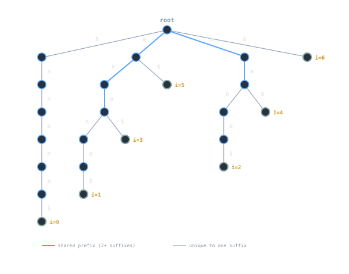

## Overview
A **suffix trie** stores **every suffix** of a string `S` in a trie, so that **every substring** of `S` appears as a **path** from the root. This makes substring queries straightforward - walk the pattern’s characters from the root and test if the path exists. The simplicity is attractive for teaching and small inputs, but the structure is **space-heavy**: a naive suffix trie has **Θ(n²)** nodes and edges in the worst case for a length-`n` string, which limits practical use. For large texts, compressed variants (suffix **trees**) and array-based indices (suffix **arrays**/LCP) are preferred.

> [!note]
> Always append a **unique end marker** (e.g., `$` not present in `S`) so every suffix ends at a distinct terminal; this avoids ambiguity and ensures that `S` itself is represented.

## Structure Definition
A suffix trie is an **uncompressed trie** over the set:
```

Suffixes(S) = { S[i..n] : i ∈ [0..n] } // include the empty suffix via '$'

````
Each node stores:
- **Children**: map from next character to child node.
- **Terminal metadata** (optional but useful): a list (or bitset) of **starting indices** where the path leading to this node occurs in `S`. For substring queries, store indices at **every node** reached during insertion of a suffix (occurrence posting lists).

Common representations:
- **Array children** for tiny alphabets (e.g., DNA); **hash/ordered map** for general text.
- **Per-node positions**:
  - Minimal: only mark terminal of each **suffix** with its starting index `i`.
  - Rich: at **every node** store positions where the node’s path occurs (supports substring → occurrences directly).

> [!tip]
> For teaching, store positions only at **terminal suffix nodes** and derive substring positions by following the query path and then **collecting** all suffix terminals reachable below it. For efficiency, many implementations store positions at **each node** during insertion.

## Core Operations

### Build (naive)
Insert each suffix `S[i..n]` into the trie, character by character, ending with `$`.

```pseudo
function BUILD_SUFFIX_TRIE(S):
    S = S + '$'                     // unique end marker
    root = new Node()
    for i in 0..|S|-1:              // start at every position
        node = root
        for j in i..|S|-1:
            c = S[j]
            if node.children lacks c:
                node.children[c] = new Node()
            node = node.children[c]
            // Optional: record occurrence of the current prefix
            node.positions.add(i)   // substring S[i..j] occurs starting at i
    return root
````

**Space/time:** `Θ(n²)` inserts, `Θ(n²)` edges in the worst case.

### Substring existence

Check if pattern `P` is a path from the root.

```pseudo
function CONTAINS(root, P) -> bool:
    node = root
    for c in P:
        if node.children lacks c: return false
        node = node.children[c]
    return true
```

### Find all occurrences

If positions were recorded per node during build, return them directly. Otherwise, descend by `P`, then **collect** starting indices from all **suffix-terminal** descendants.

```pseudo
function OCCURRENCES(root, P) -> list<int>:
    node = root
    for c in P:
        if node.children lacks c: return []     // not found
        node = node.children[c]
    if node.positions exists:
        return node.positions                   // O(|P|) + output
    else:
        return collectSuffixStarts(node)        // DFS to leaves with '$'
```

### Longest repeated substring (sketch)

Walk the trie; the deepest node with **subtree size ≥ 2** (distinct starting indices) yields a longest repeated substring. This is simpler on suffix **trees** due to compression.

![Querying "ana" in the suffix trie: follow edges a→n→a to find positions [1, 3]](assets/suffix-query-trace.svg)

## Example (Stepwise)

Let `S = "banana"`. Append `$`: `banana$`. Insert each suffix:

- `banana$`
    
- `anana$`
    
- `nana$`
    
- `ana$`
    
- `na$`
    
- `a$`
    
- `$`
    

As these are inserted, shared prefixes (like `a→n→a`) **merge**. Now:

- `CONTAINS("nan")` → true (path `n→a→n` exists).
    
- `OCCURRENCES("ana")` → `[1, 3]` (depending on how you stored positions).
    
- `CONTAINS("band")` → false at edge `d` missing under `ban`.
    

> [!note]  
> Because every suffix is present, **every substring** appears as a prefix of some suffix and thus as a path from the root.

## Complexity and Performance

Let `n = |S|` and `m = |P|`.

- **Build:** `Θ(n²)` time and space in the worst case (e.g., all characters identical). Even for random text, size is usually large.
    
- **Substring existence:** `Θ(m)` time (path walk), independent of `n`.
    
- **Occurrences:** `Θ(m + k)` where `k` is the number of matches if positions are stored per node; otherwise add the cost of a subtree traversal to collect suffix terminals.
    
- **Memory:** Dominated by nodes/edges. With alphabet `σ`, a naive array-child implementation costs `Θ(σ)` pointers **per node** - prohibitive for large `σ`.
    

**Why compression helps:** A suffix **tree** compresses chains of single-child nodes into **edge labels** (substrings), reducing size to `Θ(n)` nodes/edges and enabling linear-time builds (e.g., Ukkonen). Suffix **arrays** plus **LCP** achieve `Θ(n)` or `Θ(n log n)` build with excellent memory locality.

> [!warning]  
> A naive suffix trie is **not** suitable for large inputs. Treat it as a **didactic** structure or a practical choice only for small strings and tiny alphabets.

## Implementation Details or Trade-offs

- **Alphabet & encoding:** Choose UTF-8/16-aware iteration if `S` is Unicode. It’s usually best to index by **code points** (or even grapheme clusters for UI), not raw bytes. See [[strings|Strings]].
    
- **End marker:** Ensure `$` (or chosen sentinel) is **not** in the alphabet; otherwise, escape or reserve a unique code point.
    
- **Positions storage:**
    
    - **Per-node lists:** Fast queries; memory heavy (store many duplicates).
        
    - **Leaf-only indices:** Store only at suffix ends; for substring occurrences, descend to `P` then **collect** leaf indices (slower but lighter).
        
    - **Compressed postings:** Use sorted vectors with delta encoding; maintain de-duplicated sets to avoid quadratic blow-ups on repeated substrings.
        
- **Children representation:**
    
    - **Hash maps** give average `O(1)` step with lower memory than fixed arrays.
        
    - **Ordered maps** (trees) support lexicographic enumeration at the cost of `O(log d)` per step (`d` = degree).
        
- **Arenas/pools:** Allocate nodes in a memory pool to improve locality and reduce allocator overhead.
    
- **Hybrid approach:** Start with a suffix trie for clarity; when `n` grows past a threshold (or node count explodes), **migrate** to a suffix **tree**/**array**.
    

> [!tip]  
> For teaching or prototyping substring search, build a suffix trie **only for a sliding window** of recent text, or for a **dictionary** of modest size; switch to suffix arrays/trees for scale.

## Practical Use Cases

- **Didactic tool**: illustrate why every substring is a path and motivate compression into suffix trees.
    
- **Small dictionaries**: quick prefix/substring search across a few thousand keys.
    
- **Pattern lab**: compare behaviors of tries, compressed tries, suffix tries/trees, and arrays on the same `S`.
    



## Limitations / Pitfalls

> [!warning]  
> **Quadratic size.** Worst-case `Θ(n²)` nodes/edges; memory explodes quickly. Use suffix trees/arrays for production.

> [!warning]  
> **Redundant positions.** Storing positions at every node duplicates information across many nodes; compress or compute on demand.

> [!warning]  
> **Large alphabets.** Fixed-size child arrays per node are untenable; use maps and consider path compression.

> [!warning]  
> **Unicode boundaries.** Building over bytes can split code points; normalize and iterate by code point if string semantics matter.

## Summary

A suffix trie indexes **all suffixes** of `S`, making **substring queries** conceptually trivial: match the pattern as a path from the root. Its simplicity brings clear query-time benefits (`Θ(m)`), but the **space cost is quadratic** in the worst case, and constant factors are high. As a result, suffix tries are best seen as a **teaching** or **small-scale** structure that motivates efficient suffix **trees** (path-compressed) and suffix **arrays** (compact, cache-friendly). When you need scalability, compress; when you need clarity, the suffix trie is a good starting point.

## Related Notes

- [[standard-trie|Standard Trie]]
    
- [[compressed-trie|Compressed Trie]]
    
- [[strings|Strings]]