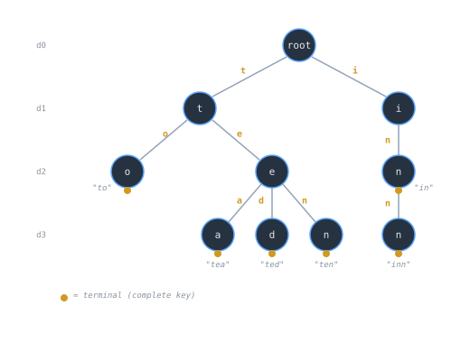
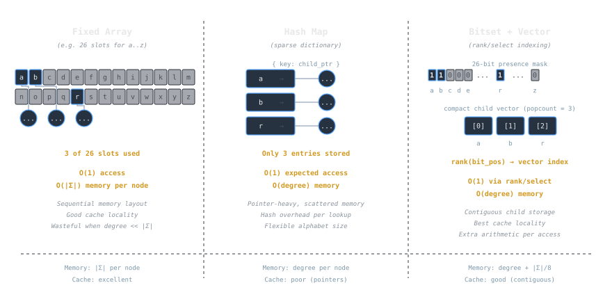

## Overview
A **trie** (prefix tree) stores a set or map of **strings** by laying characters along a path from the root. Keys that share prefixes **share nodes**, enabling fast **prefix queries**, **lexicographic iteration**, and operations like “list all keys with prefix `p`” in time proportional to `|p| + output`. Tries trade **extra memory** for **predictable** time: lookup, insert, and delete take `Θ(L)` where `L` is key length, independent of the number of stored keys `n` (assuming bounded alphabet and a suitable node representation).

> [!note]
> Unlike balanced BSTs or hash tables, the cost of a trie operation depends primarily on **characters examined**, not on `n`. This makes tries attractive when keys are long and share structure, or when prefix functionality is central.

## Structure Definition
A trie is a rooted tree where:
- Each **edge** is labeled by a symbol from an **alphabet** `Σ` (characters, bytes, tokens).
- Each **node** represents a **prefix** of one or more keys.
- A node may carry a **terminal marker** (and optionally a **value**) indicating a complete key ends at that prefix.

Per-node fields commonly include:
- `children`: mapping from `Σ` to child nodes
- `isTerminal`: boolean (or a value/payload for maps)
- Optional: `count` (# of keys in the subtree), `terminalCount` (multiset semantics), `compressedEdge` (for path compression)

> [!tip]
> Choose the **alphabet** carefully (e.g., lowercase ASCII, Unicode code points). Tries are sensitive to `|Σ|`; shrinking `Σ` (e.g., by normalizing case or tokenizing on bytes) can reduce memory pressure.

## Core Operations
Below, `Adj[u][c]` denotes the child reached from node `u` by symbol `c`. Keys are arrays `K[0..L-1]`.

### Insert (set or map)
```pseudo
function INSERT(root, K, value?):
    u = root
    for i in 0..L-1:
        c = K[i]
        if Adj[u] lacks c:
            Adj[u][c] = new Node()
        u = Adj[u][c]
        // optional: u.count += 1
    u.isTerminal = true
    if value? provided: u.value = value
````

### Search (exact key)

```pseudo
function CONTAINS(root, K) -> bool:
    u = root
    for i in 0..L-1:
        c = K[i]
        if Adj[u] lacks c: return false
        u = Adj[u][c]
    return u.isTerminal
```

### Prefix lookup

```pseudo
function HAS_PREFIX(root, P) -> bool:
    u = root
    for c in P:
        if Adj[u] lacks c: return false
        u = Adj[u][c]
    return true  // P is a prefix of some key
```

### Enumerate with prefix (autocomplete)

```pseudo
function LIST_WITH_PREFIX(root, P) -> list<Key>:
    u = nodeAtPrefix(root, P)
    if u == null: return []
    result = []
    DFS_COLLECT(u, P, result)
    return result

function DFS_COLLECT(u, prefix, out):
    if u.isTerminal: out.append(prefix)
    for (c, v) in Adj[u]:           // iterate children in lexicographic order to get sorted output
        DFS_COLLECT(v, prefix + c, out)
```

Time is `Θ(|P| + k + total_output_length)`, where `k` is the number of returned keys.

### Erase (set semantics)

```pseudo
function ERASE(root, K) -> bool:
    // return false if absent; otherwise unset terminal and prune empty tails
    path = []               // stack of (parent, char) pairs
    u = root
    for c in K:
        if Adj[u] lacks c: return false
        path.push((u, c))
        u = Adj[u][c]
    if not u.isTerminal: return false
    u.isTerminal = false

    // prune from the end while node has no children and is not terminal
    while path not empty and u.isTerminal == false and Adj[u] is empty:
        (p, ch) = path.pop()
        delete Adj[p][ch]
        u = p
    return true
```

> [!note]  
> Maps store `value` at terminals; deletion clears the value and terminal flag. Multisets can keep a `terminalCount` instead of a boolean.

## Example (Stepwise)

Suppose the set is `{to, tea, ted, ten, in, inn}` over lowercase letters.

1. Insert `"to"`: root→`t`→`o` (terminal at `o`).
    
2. Insert `"tea"`: root→`t`→`e`→`a` (terminal at `a`).
    
3. Insert `"ted"`: share `t→e`, then edge `d` (terminal at `d`).
    
4. Insert `"ten"`: share `t→e`, then edge `n` (terminal at `n`).
    
5. Insert `"in"` and `"inn"`: share `i→n`, then `n` for `"inn"`.
    

Now:

- `CONTAINS("te")` is **false** (prefix only, not terminal).
    
- `HAS_PREFIX("te")` is **true**.
    
- `LIST_WITH_PREFIX("te")` yields `["tea","ted","ten"]` (lexicographic if child iteration is ordered).
    



## Complexity and Performance

Let `L` be key length, `σ = |Σ|` the alphabet size, and `n` the number of keys.

- **Lookup/Insert/Delete:** `Θ(L)` expected/worst-case steps (one per character), given `Adj[u]` offers near-constant-time child access by symbol (e.g., array or hash map).
    
- **Space:** In the worst case, `Θ(total_characters_across_keys)` nodes/edges if little prefix sharing. With strong sharing, space can be close to the number of unique prefixes.
    
- **Enumeration by prefix:** `Θ(|P| + output)` (plus traversal overhead). This is the big advantage over hash tables and many trees.
    

**Constant factors matter**:

- Fixed-size child arrays (`σ` slots per node) provide `O(1)` access but inflate memory (`Θ(σ·nodes)`).
    
- Sparse maps (hash tables or ordered maps) cut memory when degree is small, at the cost of lookup overhead (hashing or `log d` where `d` is node degree).
    

> [!tip]  
> For byte alphabets (`σ=256`), prefer **sparse children** until node degree grows beyond a threshold, then switch to a **dense** representation (adaptive nodes).

## Implementation Details or Trade-offs

### Node representations

- **Dense array (e.g., 26 for lowercase letters)**
    
    - Pros: truly constant-time child access; sequential memory.
        
    - Cons: wastes space for sparse nodes; large σ ([[cs/languages/common/text-encoding-and-unicode|Unicode]]) makes it impractical.
        
- **Sparse dictionary (hash map)**
    
    - Pros: space proportional to actual degree; flexible alphabet.
        
    - Cons: hash overhead; iteration order may be arbitrary (sort keys for lexicographic output).
        
- **Ordered map (tree)**
    
    - Pros: natural **lexicographic iteration** without sorting; predictable iteration order.
        
    - Cons: `O(log d)` child access.
        
- **Bitset + compact vector**
    
    - Pros: a **bitset** marks present children; an array stores only existing edges; quick rank/select maps char→index.
        
    - Cons: extra arithmetic per step; more complex code.



### Memory engineering

- **Pool/arena allocators** reduce overhead of many small node allocations and improve locality.
    
- **Path compression** (radix/Patricia tries) merges single-child chains into a single edge with a string label, shrinking depth and memory (see [[cs/dsa/compressed-trie|Compressed Trie]]).
    
- **DAWG/minimal DFA** for static sets deduplicates identical subtries to near-minimal size (advanced; build-time cost).
    

### Values and payloads

- For map semantics, store `value` at terminals. If values are large, consider **indirection** (IDs into a side array) to keep nodes small.
    
- Add `count` or `subtreeWeight` to support “how many keys start with this prefix?” or **top-k** completions with heaps.
    

### Unicode & normalization

- Decide whether to iterate by **code units**, **code points**, or **grapheme clusters**. Normalize text (NFC/NFKC) to avoid multiple encodings for the same visible string. See [[cs/dsa/strings|Strings]].
    

### Persistence and concurrency

- **Persistent tries** (copy-on-write path to leaf) enable snapshots and versioning with structural sharing.
    
- **Lock-free** variants exist using [[cs/languages/Racket/immutable-data-and-persistent-structures|immutable nodes]]; writers publish new roots, readers see consistent versions.
    

> [!note]  
> For **static** dictionaries (read-mostly), consider building a **compressed** trie or even a minimal DFA for drastic memory savings with the same prefix capabilities.

## Practical Use Cases

- **Autocomplete & prefix search:** list completions for a typed prefix; maintain per-node counts for ranking by frequency.
    
- **Spell checking & approximate match:** traverse with edit-distance DP states (Levenshtein automaton + trie).
    
- **Routing & token dispatch:** longest-prefix match on tokens (domain names, URL segments, command parsers).
    
- **[[cs/security/ids-and-ips|Keyword filters]]:** store blocked terms; early exit on mismatch; linear scan through text with trie-guided branching (Aho–Corasick builds on this idea).
    
- **Config/key maps where order matters:** lexicographic enumeration and range-by-prefix queries integrate naturally.
    

## Limitations / Pitfalls

> [!warning]  
> **Memory blow-up.** Naive dense-child nodes multiply memory by `σ`. Prefer sparse children, compression, or hybrid nodes.

> [!warning]  
> **Alphabet mismatch.** If the runtime stream contains symbols outside `Σ`, you need normalization or fallback logic.

> [!warning]  
> **Cache-unfriendly layouts.** Pointer-rich structures cause cache misses. Arena allocators and contiguous child storage mitigate this.

> [!warning]  
> **Deletion complexity.** Pruning empty tails is simple, but multipurpose counters (`count`, `terminalCount`) must be kept consistent to avoid orphan nodes and incorrect prefix counts.

> [!warning]  
> **Security considerations.** Adversarial keys can force long shared prefixes or degenerate shapes; bounding key length and using compression help.

## Summary

Tries offer **predictable `Θ(L)`** operations and powerful **prefix-aware** features that hash tables and ordinary trees lack. They shine when keys share prefixes, when you must **enumerate by prefix**, or when lexicographic order is first-class. The main cost is **memory**, driven by the alphabet and node representation. With careful engineering—**sparse children**, **path compression**, **arenas**, and appropriate **text normalization**—tries become a practical and robust foundation for sets and maps of strings.

## See also

- [[cs/dsa/standard-trie|Standard Trie]]
    
- [[cs/dsa/compressed-trie|Compressed Trie]]
    
- [[cs/dsa/suffix-trie|Suffix Trie]]
    
- [[cs/dsa/hash-tables|Hash Tables]]