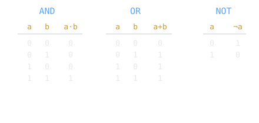

In 1854 a self-taught English mathematician published a book that turned logic into algebra. George Boole could not have known that [[cs/math/boolean-algebra|his two-valued system]] would become the mathematics of every digital circuit, since there were no such circuits for another eighty years.

> [!note] The idea
> Reduce logic to algebra over two values, true and false, written as 1 and 0, with the operations AND, OR, and NOT. Reasoning becomes calculation.

## The Laws of Thought

Boole developed his algebra of logic from 1847 and laid it out fully in An Investigation of the Laws of Thought, published in 1854. He recast logical statements as algebraic equations over just two values, so that [[cs/math/propositional-logic|deduction could be carried out by manipulating symbols according to fixed rules]].

## Why two values

A two-valued algebra was an odd thing for a mathematician of the 1850s to pursue. It had no machine to run on and little obvious use. Its hidden power is generality: a two-valued algebra describes anything that can be in one of two states, which turns out to include an electrical switch.

## The bridge to hardware

Boolean algebra became the foundation of [[cs/dsa/bitwise-operations|practical digital circuit design]], but that connection was not Boole's to make. It waited until [[shannon-boolean-algebra-switching|Shannon]] showed, in 1937, that switches obey exactly Boole's algebra. Boole's logic pairs naturally with [[leibniz-and-binary|binary]], two-valued logic over a two-symbol number system, and both feed into the limits-of-computation work of [[hilbert-godel-church-computability|Hilbert, Gödel, and Church]].

## Related Notes

- [[shannon-boolean-algebra-switching|Shannon's Master's Thesis]], where Boolean algebra became circuits
- [[leibniz-and-binary|Leibniz and Binary]], the matching two-symbol number system
- [[hilbert-godel-church-computability|Hilbert, Gödel, Church, and the Limits of Computation]], logic taken to its edge
- [[cs/history/index|History of Computing]], the section index

## Sources

- "George Boole," Wikipedia. https://en.wikipedia.org/wiki/George_Boole . Supports Boole as a 19th-century mathematician, his development of Boolean algebra from 1847 and its full statement in An Investigation of the Laws of Thought (1854), the reduction of logic to algebra over two values, and Boolean algebra becoming the foundation of practical digital circuit design.
