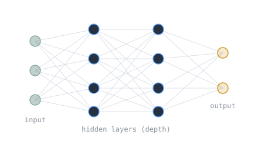

Artificial intelligence had promised and underdelivered for decades. In 2012 a single result changed that. A deep neural network called AlexNet won a major image-recognition contest by an enormous margin, and the modern era of AI began.

> [!note] The idea
> A deep neural network, many layers of simple units, trained on large labeled datasets using fast parallel hardware, can learn features better than humans can hand-engineer them. Depth plus data plus compute beat clever hand-built rules.

## AlexNet

Developed in 2012 by Alex Krizhevsky with Ilya Sutskever and Geoffrey Hinton at the University of Toronto, AlexNet was a deep [[cs/deep-learning/convolutional-neural-networks|convolutional neural network]] that won the ImageNet competition with [[cs/machine-learning/evaluation-metrics|a top-5 error rate of 15.3 percent]], more than ten percentage points better than the runner-up. It was trained for about a week on two Nvidia GPUs.

## Why GPUs

Training a deep network is a vast amount of [[linear-algebra-fundamentals|linear algebra]], multiplying large matrices over and over, which is exactly the parallel arithmetic graphics processors were built for. The [[moores-law|decades of hardware scaling]] had finally made that much computation cheap enough to throw at the problem.

## A civilian turning point

Yann LeCun called AlexNet an unequivocal turning point in computer vision. It is distinct from the military funding of AI told in [[darpa-and-the-funding-of-ai|the DARPA note]]: this was the breakthrough that took AI mainstream and commercial, and it raised the questions of [[ai-governance|AI governance]] we are still working through.

## Related Notes

- [[darpa-and-the-funding-of-ai|DARPA and the Funding of AI]], the earlier, military chapter
- [[ai-governance|AI Governance]], the questions deep learning forced open
- [[consciousness-access-vs-phenomenal|Consciousness: Access vs Phenomenal]], whether these systems only process information or could ever feel anything
- [[could-an-llm-be-conscious|Could an LLM Be Conscious?]], the live debate over whether a system like this could be a mind
- [[linear-algebra-fundamentals|Linear Algebra Fundamentals]], the math a neural net runs on
- [[moores-law|Moore's Law]], the cheap compute that made it possible
- [[cs/history/index|History of Computing]], the section index

## Sources

- "AlexNet," Wikipedia. https://en.wikipedia.org/wiki/AlexNet . Supports AlexNet as a deep convolutional neural network developed in 2012 by Krizhevsky, Sutskever, and Hinton that won ImageNet with a top-5 error rate of 15.3 percent (more than 10 points above the runner-up), was trained on two Nvidia GPUs, and is regarded as a turning point in computer vision.
