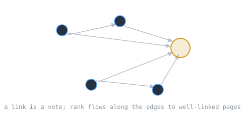

By the late 1990s the [[world-wide-web|Web]] had more pages than anyone could index by hand, and matching keywords returned mostly junk. Larry Page and Sergey Brin, at Stanford, had an insight that became Google: the Web's link structure is itself data you can rank.

> [!note] The idea
> Treat the Web as a [[graphs|directed graph]], pages as nodes and links as edges. A link is a vote, and a vote from an important page counts for more. Rank pages by this recursive importance and the good ones rise to the top.

## Links as votes

Page and Brin developed PageRank at Stanford in 1996. A hyperlink to a page counts as a vote of support, and a page's rank depends on both the number and the rank of the pages that link to it. The definition is recursive: to know how important a page is, you need to know how important the pages pointing at it are.

## The mathematics

That recursive definition has a clean solution. The PageRank values are the entries of the dominant eigenvector of the link matrix, rescaled so each column sums to one. Equivalently, picture a random surfer who clicks links forever and occasionally jumps to a random page; a page's rank is the long-run probability the surfer is on it. Eigenvector and random walk are two views of the same answer.

## Why it matters

Ranking by structure rather than keywords made web search genuinely useful, and it is a clean case of turning a real-world network into [[linear-algebra-fundamentals|linear algebra]]. The same idea, the dominant eigenvector of a graph, recurs throughout computer science wherever importance flows along connections.

## Related Notes

- [[graphs|Graphs]], the structure PageRank operates on
- [[linear-algebra-fundamentals|Linear Algebra Fundamentals]], the eigenvector behind it
- [[world-wide-web|The World Wide Web]], the graph being ranked
- [[hash-tables|Hash Tables]], part of how a search index is built
- [[cs/history/index|History of Computing]], the section index

## Sources

- "PageRank," Wikipedia. https://en.wikipedia.org/wiki/PageRank . Supports PageRank's development by Larry Page and Sergey Brin at Stanford in 1996, the treatment of a hyperlink as a vote with rank defined recursively, and the mathematical characterization as the dominant eigenvector of the rescaled link matrix, equivalent to a random-surfer model.
