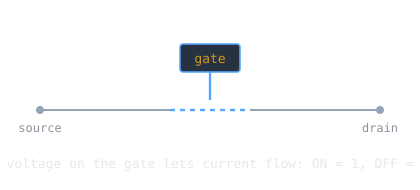

In December 1947, three physicists at Bell Labs made a sliver of germanium amplify a signal, and the direction of electronics changed. The transistor would replace the vacuum tube and become the physical atom of all digital computing.

> [!note] The idea
> A transistor is a tiny solid-state switch, and amplifier. A small signal on one terminal controls a larger current through the others, so a single transistor can hold or pass a bit. Wire enough of them together and you have logic.

## The invention

John Bardeen and Walter Brattain, working under William Shockley at Bell Labs, observed transistor action between 17 November and 23 December 1947; the three shared the 1956 Nobel Prize in Physics. A transistor is a semiconductor device that amplifies or switches electrical signals, and it is now considered one of the twentieth century's greatest inventions.

## Why it beat the tube

Compared with the vacuum tube, transistors are smaller, cheaper, and need far less power, and they do not burn out the way a heated filament does. The [[anfsq7-and-fault-tolerant-hardware|tube-based machines]] that needed heroic redundancy just to stay running gave way to solid-state reliability, and computers began their long shrink from buildings to pockets.

## The building block

The transistor is the key active component in practically all modern electronics. Everything above it is built from transistors acting as switches: the [[boole-and-boolean-algebra|logic gates]] that [[shannon-boolean-algebra-switching|Shannon]] showed how to design, and from those gates, processors and memory.

## Related Notes

- [[the-mosfet|The MOSFET]], the transistor design that made chips buildable
- [[the-integrated-circuit|The Integrated Circuit]], many transistors on one chip
- [[shannon-boolean-algebra-switching|Shannon's Master's Thesis]], switches as logic
- [[anfsq7-and-fault-tolerant-hardware|The AN/FSQ-7]], the tube era the transistor ended
- [[cs/history/index|History of Computing]], the section index

## Sources

- "Transistor," Wikipedia. https://en.wikipedia.org/wiki/Transistor . Supports the 1947 invention at Bell Labs by Bardeen and Brattain under Shockley, the transistor as a semiconductor device that amplifies or switches signals, its advantages over the vacuum tube (smaller, less power), and its role as a basic building block of modern electronics.
