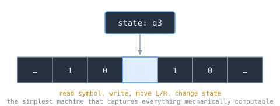

## Intuition

Before electronic computers existed, mathematicians needed a precise answer to the question *"What does it mean for a function to be computable?"* Alan Turing's 1936 paper answered this by describing an imaginary machine - a tape, a head, and a finite set of rules - that captures everything a mechanical process can do. The surprising result is not what this machine *can* compute, but what it provably *cannot*.

Think of a Turing machine as the simplest possible computer: it reads a symbol, decides what to write and which direction to move, and transitions to a new state. Despite this simplicity, no real computer can solve a problem that a Turing machine cannot. That equivalence is the heart of computability theory.

---

## Core Idea

### The Turing Machine

A Turing machine consists of:

1. **An infinite tape** divided into cells, each holding a symbol from a finite alphabet.
2. **A read/write head** positioned over one cell at a time.
3. **A finite state register** storing the machine's current state.
4. **A transition function** `δ(state, symbol) → (new_state, new_symbol, direction)` that drives computation.

Computation proceeds step-by-step: read the current symbol, consult the transition function, write a symbol, move left or right, and enter a new state. The machine halts when it reaches an accepting or rejecting state (or it may run forever).



### The Halting Problem

Turing proved that no algorithm can determine, for every possible program-input pair, whether the program will eventually halt or loop forever. The proof is a diagonal argument:

1. Assume a decider `H(P, I)` exists that returns "halts" or "loops" for any program `P` on input `I`.
2. Construct a program `D` that, given program `P`, runs `H(P, P)` and does the opposite - loops if `H` says "halts," halts if `H` says "loops."
3. Ask: what does `H(D, D)` return? Either answer leads to a contradiction.

This was the first rigorous proof that some well-defined mathematical questions have **no algorithmic solution**. It connects directly to Godel's incompleteness theorems and foreshadows Rice's theorem (no non-trivial semantic property of programs is decidable).

### The Church-Turing Thesis

Independently, Alonzo Church developed the [[lambda-calculus-syntax-substitution|lambda calculus]] as a formalism for computable functions. Church and Turing showed that their two models - lambda calculus and Turing machines - compute exactly the same class of functions. The **Church-Turing thesis** asserts:

> *Any function that can be computed by an effective procedure can be computed by a Turing machine.*

This is a thesis (not a theorem) because "effective procedure" is an informal notion. Every subsequent model of computation - register machines, cellular automata, quantum computers (for decision problems) - has turned out to be equivalent in computational power, reinforcing the thesis.

### Decidability and Complexity

Computability theory draws a hard line between **decidable** problems (a Turing machine always halts with the correct answer) and **undecidable** ones (no such machine exists). Within decidable problems, **complexity theory** further classifies by resource usage (time, space), giving rise to classes like P, NP, and PSPACE.

> [!note]
> Turing machines are the standard reference model for both computability and complexity. When we say a problem is "in P," we mean a deterministic Turing machine can solve it in polynomial time.

---

## Example

**A simple Turing machine that checks for balanced 0s and 1s:**

The input tape contains a string of 0s and 1s. The machine repeatedly scans right to find a 0, marks it with `X`, then scans right to find a 1, marks it with `Y`, and returns to the start. If the tape runs out of 0s and 1s at the same time, it accepts; if one runs out first, it rejects.

```
State A: scan right for 0
  Found 0 → write X, move right, go to State B
  Found Y → move right, stay in A
  Found blank → accept (no 0s left; check no 1s left)

State B: scan right for 1
  Found 1 → write Y, move left, go to State C
  Found 0 → move right, stay in B
  Found blank → reject (unmatched 0)

State C: scan left back to start
  Found X or Y or 0 → move left, stay in C
  Found blank → move right, go to State A
```

This machine halts on every input - it is a **decider**. The halting problem tells us we cannot build a general machine that determines whether *arbitrary* machines are deciders.

---

## Related Notes

- [[lambda-calculus-syntax-substitution|Lambda Calculus - Syntax & Substitution]] - Church's parallel formalism for computability
- [[programming-paradigms-models-of-computation|Programming Paradigms & Models of Computation]] - how Turing's ideas map to real language design
- [[von-neumann-architecture|Von Neumann Architecture]] - the practical realization of stored-program computation
- [[history-of-the-internet|History of the Internet]] - a later chapter in computing's timeline

## Sources

- "Turing machine," Wikipedia. https://en.wikipedia.org/wiki/Turing_machine . Supports the machine's components (infinite tape over a finite alphabet, read/write head, finite state register, transition function), its origin in Turing's paper "On Computable Numbers, with an Application to the Entscheidungsproblem" (submitted 31 May 1936, published 1937), and its use as a reference model in complexity theory.
- "Halting problem," Wikipedia. https://en.wikipedia.org/wiki/Halting_problem . Supports the undecidability of the halting problem, the proof by contradiction/diagonalization using a hypothetical decider, and the generalization to Rice's theorem.
- "Church–Turing thesis," Wikipedia. https://en.wikipedia.org/wiki/Church%E2%80%93Turing_thesis . Supports Church's lambda calculus, the proven equivalence of lambda calculus and Turing machines, the thesis being informally stated (not a theorem) because "effective calculability" lacks a formal definition, and the equivalence of other models such as register machines and cellular automata.
