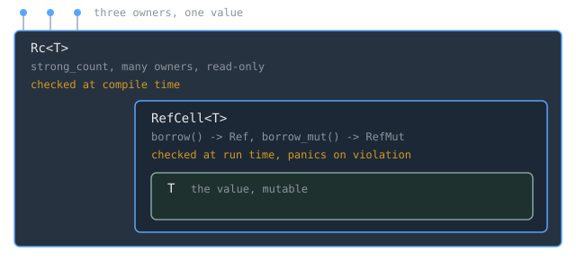

Rust's ownership model, covered in [[cs/languages/Rust/ownership-and-moves|ownership and moves]], assumes each value has exactly one owner and that borrows can be checked by reading the source. Real programs contain cases where neither holds: a recursive type whose size is not computable, a graph node owned by every edge pointing at it, a mock object that must record what it saw while presenting an immutable interface. Each of these gets a library type rather than a language exception, and the differences between them are precise.

> [!note] The idea
> `RefCell<T>` is usually introduced as a way around the borrow checker. It is the opposite. The borrowing rules are still enforced, in full, with the same "many immutable or one mutable" arithmetic; only the enforcement moved from compile time to run time, where a violation is a panic instead of a compile error. The reason such a type must exist is a limit on static analysis, not a gap in Rust's design: the compiler is conservative and will reject correct programs it cannot prove correct, and `RefCell` is the escape hatch for a programmer who can prove more than the analysis can.

## `Box<T>`: a pointer with a known size

`Box<T>` puts data on [[cs/dsa/dynamic-memory-allocation|the heap]] and has no performance overhead beyond that. It has few extra capabilities, and the Book lists exactly three situations where you reach for it: when a type's size cannot be known at compile time but you need it in a context requiring an exact size; when you have a large amount of data and want to transfer ownership without copying it; and when you care only that a value implements a particular trait rather than being a specific type. The third case is the trait object from [[cs/languages/Rust/traits-and-generic-bounds|traits and generic bounds]].

The size case is the sharpest. A recursive type can hold another value of the same type as part of itself, and Rust needs to know at compile time how much space a type takes. Define a cons list as `enum List { Cons(i32, List), Nil }` and the compiler reports `error[E0072]: recursive type 'List' has infinite size`, annotating the variant as recursive without indirection.

The size computation makes the error obvious once you see it. For a non-recursive enum, Rust walks the variants and takes the largest, because only one will be used. For the recursive `List`, `Cons` needs the size of an `i32` plus the size of a `List`, and computing the size of `List` requires computing the size of `Cons`, and the process continues infinitely. Boxing the recursive field ends it: a box has a known size regardless of what it points to, so `Cons(i32, Box<List>)` compiles. Indirection is what breaks the recurrence.

The second case, moving a large value, is worth restating in the ownership vocabulary. Transferring ownership of a large amount of data can take a long time because the data is copied around on the stack. Put it in a box and only the small pointer moves while the data stays in one place on the heap.

## `Rc<T>`: multiple ownership, explicitly

In the majority of cases ownership is clear. Graphs are the standard counterexample: multiple edges may point to the same node, the node is conceptually owned by all of them, and it should not be cleaned up until no edges point to it.

Multiple ownership has to be enabled explicitly, with `Rc<T>`, short for reference counting. The type tracks the number of references to a value to determine whether it is still in use, and at zero references the value can be cleaned up without any reference becoming invalid. The criterion for using it is stated as a compile-time-knowledge question: reach for `Rc<T>` when several parts of the program need to read heap data and you cannot determine at compile time which part will finish last. If you knew, you would make that part the owner and the ordinary rules would apply.

`Rc::clone(&a)` is the idiom for taking another handle. It could be written `a.clone()`, but the convention exists to make a visual distinction: `Rc::clone` does not deep copy like most `clone` implementations, it only increments the reference count, which does not take much time. When hunting performance problems you can then disregard `Rc::clone` calls and look only at the deep-copy ones.

Increment is explicit and decrement is not. `Rc::strong_count` reports the current count, and running the Book's example prints 1 after creating the first handle, 2 and 3 as clones are made, and back to 2 when one goes out of scope. Nothing calls a decrement function; the `Drop` implementation decreases the count automatically when an `Rc<T>` goes out of scope. The name is `strong_count` rather than `count` because `Rc<T>` also has a `weak_count`.

Two limits define the type. `Rc<T>` is only for single-threaded scenarios. And it shares data via immutable references, for reading only. Allowing multiple mutable references through it would violate the borrowing rules, since multiple mutable borrows to the same place can cause data races and inconsistencies. The reference-counting answer in general, and how it compares to tracing collection, is in [[cs/languages/common/memory-ownership-refcounting-gc|Who Frees the Memory]].

## `RefCell<T>`: the borrow check at run time

Interior mutability is a design pattern that allows mutating data even when there are immutable references to it, which the borrowing rules normally disallow. The pattern uses `unsafe` code inside a data structure to bend the usual rules, with the unsafe code wrapped in a safe API so the outer type stays immutable. The `unsafe` contract this rests on is the subject of [[cs/languages/common/undefined-behavior-as-a-contract|Undefined Behavior as a Contract]]. Types built this way are usable only when the borrowing rules can be guaranteed to hold at run time even though the compiler cannot prove it.

The justification is a statement about static analysis in general. Static analysis is inherently conservative, some properties of code are impossible to detect by analyzing it (the Book names [[cs/history/turing-and-computability|the halting problem]]), and so if the compiler cannot be sure the code complies with the ownership rules it may reject a correct program. The asymmetry is deliberate: accepting an incorrect program would destroy the guarantees, whereas rejecting a correct one merely inconveniences the programmer. `RefCell<T>` is for when you are sure your code follows the borrowing rules and the compiler cannot see it.

The Book's own recap is the cleanest summary of the three types.

| | Owners | Borrows |
|---|---|---|
| `Box<T>` | single | immutable or mutable, checked at compile time |
| `Rc<T>` | multiple | immutable only, checked at compile time |
| `RefCell<T>` | single | immutable or mutable, checked at run time |

Because `RefCell<T>` checks mutable borrows at run time, you can mutate the value inside it even when the `RefCell<T>` itself is immutable. Mutating the value inside an immutable value is the interior mutability pattern, stated in one line.

Mechanically, `&` and `&mut` are replaced by the `borrow` and `borrow_mut` methods, part of the safe API. `borrow` returns a `Ref<T>` and `borrow_mut` returns a `RefMut<T>`, both of which implement `Deref` so they act like ordinary references. The `RefCell<T>` tracks how many `Ref<T>` and `RefMut<T>` are currently active: each `borrow` increases the immutable count, and a `Ref<T>` going out of scope decreases it by one. Just as at compile time, you get many immutable borrows or one mutable borrow at any point in time.

Violating that gives a panic rather than a compile error, and the message is `already borrowed: BorrowMutError`. The Book is candid about the price. You are potentially finding mistakes later in development, possibly not until production, and the code incurs a small runtime performance penalty from tracking borrows at run time. What you get in exchange is the ability to write, for instance, a mock object that records the messages it has seen while living in a context that only allows immutable values.

## `Rc<RefCell<T>>`: the combination

A common way to use `RefCell<T>` is in combination with `Rc<T>`. The layering is the point: `Rc` supplies multiple owners but only immutable access, `RefCell` supplies mutability but only single ownership, and nesting one in the other yields multiple owners of mutable data.

> [!example] Mutating a shared cons list
> With `List` defined as `Cons(Rc<RefCell<i32>>, Rc<List>)`, three lists can share one value. Calling `borrow_mut` on the shared `value` dereferences the `Rc` to the inner `RefCell` automatically, returns a `RefMut<T>`, and lets you add to the inner number through the dereference operator. Printing afterward shows the shared element as 15 in all three lists while their private elements stay 3 and 4. The `List` values are outwardly immutable; the mutation happens through the `RefCell` methods.

> [!warning] Neither type crosses a thread boundary
> `Rc<T>` is for single-threaded scenarios only, and `RefCell<T>` likewise, giving a compile-time error if used in a multithreaded context. This is one of the places where Rust's guarantees show up as a type error rather than a runtime bug, and the multithreaded equivalents are a separate set of types. See [[cs/languages/common/concurrency-in-practice|Concurrency in Practice]] for what the shared-mutable-state problem looks like across languages.

## Related Notes

- [[cs/languages/Rust/ownership-and-moves|Ownership and Moves in Rust]] - the single-owner default these three types depart from
- [[cs/languages/Rust/borrowing-and-lifetimes|Borrowing and Lifetimes]] - the same borrowing rules, enforced statically
- [[cs/languages/Rust/traits-and-generic-bounds|Traits and Generic Bounds in Rust]] - `Box<dyn Trait>` as the third reason to box, and `Deref` behind `Ref`/`RefMut`
- [[cs/languages/common/memory-ownership-refcounting-gc|Who Frees the Memory]] - reference counting as one of four answers, and the cycle problem it inherits
- [[cs/dsa/dynamic-memory-allocation|Dynamic Memory Allocation]] - what putting a value on the heap actually costs
- [[cs/pl/mutable-state-references-effects|Mutable State, References, and Effects]] - interior mutability as an effect hidden behind an immutable interface

## Sources

- "Using Box&lt;T&gt; to Point to Data on the Heap," The Rust Programming Language. https://doc.rust-lang.org/book/ch15-01-box.html . Supports `Box<T>` having no overhead beyond heap storage, the three situations for using it, the recursive-type size problem with `error[E0072]` and "recursive without indirection", how Rust computes the size of a non-recursive enum versus the infinite recursion for `List`, and boxing a large value so only the pointer is copied on the stack.
- "Rc&lt;T&gt;, the Reference-Counted Smart Pointer," The Rust Programming Language. https://doc.rust-lang.org/book/ch15-04-rc.html . Supports the graph-node motivation, `Rc<T>` requiring explicit opt-in to multiple ownership, the count-to-zero cleanup rule, the compile-time-unknown-last-user criterion, the `Rc::clone` convention and that it only increments the count, `Rc::strong_count` and the 1/2/3/2 trace, `Drop` decrementing automatically, `weak_count`'s existence, single-threaded-only, and read-only sharing via immutable references.
- "RefCell&lt;T&gt; and the Interior Mutability Pattern," The Rust Programming Language. https://doc.rust-lang.org/book/ch15-05-interior-mutability.html . Supports the definition of interior mutability and its use of `unsafe` behind a safe API, the conservatism-of-static-analysis and halting-problem argument, the three-way recap of `Box`/`Rc`/`RefCell`, `borrow`/`borrow_mut` returning `Ref<T>`/`RefMut<T>` implementing `Deref`, the runtime borrow counting and the many-immutable-or-one-mutable rule, the `already borrowed: BorrowMutError` panic and its tradeoffs, `RefCell<T>` being single-threaded only, and the `Rc<RefCell<T>>` combination with the 15/3/4 output.
