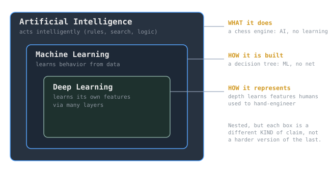

The three terms get used as if they were louder and quieter versions of the same word. They are not. Artificial intelligence, machine learning, and deep learning sit inside one another as nested sets, but each set is defined by a different question, and mistaking one for another is how people end up calling a spreadsheet formula "AI" or a linear regression "deep learning."

> [!note] The idea
> AI, ML, and DL are nested but answer three different questions: AI is about *what a system does* (it acts intelligently), ML is about *how it was built* (it learned from data), and DL is about *how it represents the world* (it learns its own features through depth). Going inward is not an upgrade in difficulty, it is a narrower kind of claim.

## Artificial intelligence: a claim about behavior

Artificial intelligence is the broadest of the three and the oldest, dating to the 1956 Dartmouth workshop. It names a goal rather than a method: build systems that perform tasks we would call intelligent if a human did them. Nothing in that definition says how. A chess engine that searches millions of positions with hand-written rules is AI, and it contains no learning at all. So is a logic-based expert system, or the pathfinding in a video game. AI is the answer to "does it behave intelligently?", and a hand-coded program can answer yes.

## Machine learning: a claim about method

Machine learning is a subset of AI defined by *how the behavior was acquired*. Instead of a programmer specifying the rules, the system infers them from data. The standard definition is Tom Mitchell's from 1997: a program learns from experience E with respect to some task T and performance measure P if its performance at T, as measured by P, improves with E. The key word is *improves with experience*. A [[cs/statistics/regression-fundamentals|linear regression]] fit to data is machine learning. So is a decision tree, a support vector machine, or a naive Bayes classifier built on [[cs/statistics/bayes-rule|Bayes' rule]]. None of those involve neural networks. ML is the answer to "was it learned from data rather than hand-programmed?"

This is why the [[supervised-learning|supervised]], [[unsupervised-learning|unsupervised]], and reinforcement paradigms all live at the ML layer: they are three ways of learning from experience, independent of what model does the learning.

## Deep learning: a claim about representation

Deep learning is a subset of ML that uses neural networks with many layers, and its defining move is *representation learning*. A traditional ML pipeline depends on humans engineering good [[features-and-representations|features]] first, then handing those features to the learner. A deep network learns the features itself, building them up layer by layer from raw input, so that early layers capture edges and textures and later layers capture objects and concepts. Depth is the mechanism: each layer transforms the representation from the one below it. DL is the answer to "does it learn its own representation through depth, instead of relying on features we hand it?"

The [[cs/history/deep-learning-revolution|2012 AlexNet result]] is the moment this stopped being a promise. A deep [[cs/deep-learning/convolutional-neural-networks|convolutional network]] learned better image features than decades of hand-engineering, and it did so because cheap parallel compute finally made the [[cs/math/linear-algebra-fundamentals|matrix arithmetic]] affordable.

## Why the distinction matters

Because the three answer different questions, the boundaries are real, not marketing.

- A rule-based chess engine is **AI but not ML**: intelligent behavior, no learning.
- A [[cs/statistics/simple-linear-regression|linear regression]] or decision tree is **ML but not DL**: learned from data, no learned representation.
- A convolutional network is **DL**: learned from data *and* learned its own features.

> [!warning] The common error
> Calling everything "AI" flattens the method question, and calling every neural network "deep learning" flattens the representation question. A single-layer perceptron is a neural network but is not usefully "deep." The label should track which claim you are actually making.

> [!tip] The one-line test
> Ask *what did a human specify?* If a human wrote the rules, it is AI without ML. If a human specified the features and the model learned the mapping, it is ML without DL. If the model learned the features too, it is deep learning.

## Related Notes

- [[supervised-learning|Supervised Learning]], one of the paradigms at the ML layer
- [[unsupervised-learning|Unsupervised Learning]], another ML paradigm
- [[generalization-vs-memorization|Generalization vs Memorization]], what "learning" actually requires
- [[features-and-representations|Features and Representations]], the thing deep learning learns for itself
- [[cs/deep-learning/artificial-neural-networks|Artificial Neural Networks]], the model class deep learning stacks into depth
- [[cs/history/deep-learning-revolution|The Deep Learning Revolution]], the history of how DL took over
- [[cs/geopolitics/ai-governance|AI Governance]], the questions this capability forced open

## Sources

- "Artificial intelligence," Wikipedia. https://en.wikipedia.org/wiki/Artificial_intelligence . Supports AI as the broad field of building systems that perform tasks associated with intelligence, tracing to the 1956 Dartmouth workshop, and encompassing non-learning approaches such as search and logic.
- "Machine learning," Wikipedia. https://en.wikipedia.org/wiki/Machine_learning . Supports ML as a subfield of AI concerned with algorithms that learn from data, and quotes Tom Mitchell's 1997 experience E / task T / performance P definition.
- "Deep learning," Wikipedia. https://en.wikipedia.org/wiki/Deep_learning . Supports DL as a subset of ML using multi-layer neural networks that perform representation learning, building features across layers.
- Goodfellow, Bengio, Courville, *Deep Learning*, MIT Press. https://www.deeplearningbook.org/ . Supports the framing of deep learning as representation learning and the AI / ML / representation-learning / deep-learning nesting (Chapter 1).
