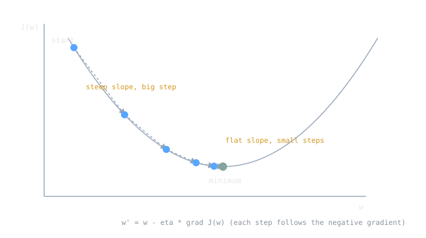

Picture the loss as a landscape: every point is a choice of model parameters, and the height at that point is how badly the model performs there. Training is finding a low spot. Gradient descent is the blindfolded hiker strategy (CS231n's analogy): feel the slope under your feet, take a small step downhill, repeat. It never sees the whole landscape, only the local slope, yet that is enough to train everything from [[simple-linear-regression]] to the deepest networks in [[ai-vs-ml-vs-dl|deep learning]].

> [!note] The idea
> Gradient descent is a first-order iterative method for minimizing a differentiable function. Repeatedly update the parameters opposite the gradient of the loss:
> $$\mathbf{w}' = \mathbf{w} - \eta \nabla J(\mathbf{w})$$
> where $\eta$ is the learning rate. The gradient points in the direction of steepest increase, so its negative is the locally steepest way down.

## The Update Rule

The gradient $\nabla J(\mathbf{w})$ is [[cs/math/derivatives-and-gradients|the vector of partial derivatives]] $\left[\frac{\partial J}{\partial w_i}\right]_{i=1}^n$, one per parameter (vectors and their geometry live in [[linear-algebra-fundamentals]]). Each component answers one question: if I nudge this weight, how much does the loss change? Stepping against that vector reduces the loss, at least for a small enough step. The method is old, first suggested by Cauchy in 1847, and it earns its keep today because computing a gradient is cheap even when the parameter space has billions of dimensions, where solving for the minimum directly is hopeless.

[[cs/math/convexity-and-optimization-basics|For a convex bowl like the squared-error surface of linear regression]], this walk converges to the global minimum. Neural network losses are not convex, but the same procedure still finds parameters that work remarkably well in practice.

## The Learning Rate

Everything hinges on $\eta$. The gradient only promises descent in the limit of small steps, so the step size is a gamble: too small and training crawls, too large and you overshoot the valley, bounce around, or diverge outright. CS231n calls picking it one of the more delicate settings, with the practical advice to use the smallest step size that makes steady progress without numerical trouble. In practice nobody keeps $\eta$ fixed; schedules shrink it over time, and the course covers power, exponential, performance, and 1cycle scheduling as standard options.

## Batch, Mini-Batch, Stochastic

The textbook update computes $\nabla J$ over the entire training set before moving. That is batch gradient descent, and on large datasets it is wastefully slow: you do an enormous amount of arithmetic for one step. Stochastic gradient descent (SGD) replaces the true gradient with an estimate computed from a randomly selected subset of the data, a lineage that runs back to the Robbins and Monro stochastic approximation work of the 1950s. The dominant practical form is mini-batch gradient descent: estimate the gradient from a small batch (dozens to hundreds of examples), step, repeat. Because datasets contain redundancy, a mini-batch gradient is a good approximation of the full gradient at a fraction of the cost, so you take many cheap, slightly noisy steps instead of few expensive perfect ones.

## Beyond Vanilla: Momentum, AdaGrad, RMSProp, Adam

Plain SGD struggles in ravines and on plateaus, so a family of variants modifies the step. Ruder's survey (arXiv:1609.04747) is the standard tour; the short version:

- **Momentum** accumulates a moving direction from past gradients, so persistent directions build speed and oscillations cancel.
- **AdaGrad** adapts the learning rate per parameter, scaling it down in dimensions that have seen large gradients.
- **RMSProp** fixes AdaGrad's tendency to shrink the rate toward zero by exponentially decaying the old gradient history.
- **Adam** (Kingma and Ba, 2014, arXiv:1412.6980) combines both ideas: first-order gradient optimization using adaptive estimates of the first and second moments of the gradient. Its hyperparameters have intuitive interpretations and typically need little tuning, which is a large part of why it became a default.

All of them are still gradient descent at heart. They change how the step is shaped, not the core loop of compute gradient, step downhill, repeat. The deep-network treatment, with the full update equations and how to schedule the learning rate they share, is in [[cs/deep-learning/faster-optimizers-and-learning-rate-scheduling|faster optimizers and learning rate scheduling]].

> [!example]
> Minimize $J(w) = (w - 3)^2$ with $\eta = 0.25$, starting at $w = 0$. The gradient is $J'(w) = 2(w - 3)$.
>
> | step | $w$ | $J'(w)$ | update $-\eta J'(w)$ |
> |---|---|---|---|
> | 0 | 0 | $-6$ | $+1.5$ |
> | 1 | 1.5 | $-3$ | $+0.75$ |
> | 2 | 2.25 | $-1.5$ | $+0.375$ |
> | 3 | 2.625 | $-0.75$ | $+0.1875$ |
>
> Each step halves the remaining distance to the minimum at $w = 3$. The steps shrink automatically because the gradient itself shrinks as the surface flattens, no schedule required (on this convex bowl, anyway).

## Related Notes

- [[loss-functions]] define the surface being descended
- [[simple-linear-regression]] is the cleanest case, a convex bowl with one global minimum
- [[linear-algebra-fundamentals]] for gradients as vectors of partials
- [[bias-variance-tradeoff]] on why perfectly minimizing training loss can backfire
- [[train-validation-test]] for how validation performance steers stopping and tuning
- [[supervised-learning]] supplies the labeled data the loss is computed on

## Sources

- https://en.wikipedia.org/wiki/Gradient_descent (first-order iterative minimization of a differentiable function; Cauchy 1847)
- https://en.wikipedia.org/wiki/Stochastic_gradient_descent (SGD as a stochastic approximation of the full-dataset gradient; Robbins and Monro heritage; momentum remembering past updates, AdaGrad's per-parameter learning rate, RMSProp's decaying gradient average)
- https://cs231n.github.io/optimization-1/ (blindfolded hiker analogy, step size tradeoffs, mini-batch gradients approximating the full objective)
- https://arxiv.org/abs/1609.04747 (Ruder, "An overview of gradient descent optimization algorithms": GD variants, challenges, and the momentum/AdaGrad/RMSProp/Adam family)
- https://arxiv.org/abs/1412.6980 (Kingma and Ba, "Adam: A Method for Stochastic Optimization," submitted 22 Dec 2014: first-order, adaptive estimates of lower-order moments, little tuning required)
- Course framing: CSCE 479/879 (Stephen Scott, UNL), "Basic Artificial Neural Networks" lecture slides
