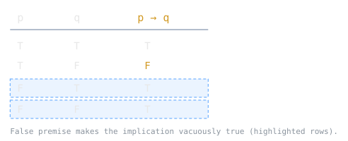

## Starting From True and False

Propositional logic is the smallest interesting logic. It has atomic propositions, each of which is simply true or false, and a handful of operators for gluing them together. That is the entire vocabulary, and it turns out to be enough to model digital circuits, database query conditions, and the branch tests in every program you write.

A logical connective, in the Wikipedia phrasing, is "an operator that combines or modifies one or more logical variables or formulas." Give it its inputs' truth values and it hands you back a truth value. Nothing about the meaning of the propositions matters, only whether they are true or false.

> [!note]
> The payload is truth-functionality: the truth value of a compound formula is completely determined by the truth values of its parts. That single property is why propositional logic is decidable, why a truth table can settle any question about it mechanically, and why the same algebra describes both a logic gate and an `if` condition. Meaning is irrelevant; only the true/false wiring survives.

## The Connectives

Five connectives carry almost all the weight. Using the standard symbols:

- **Negation** (NOT), $\neg p$: flips the truth value.
- **Conjunction** (AND), $p \land q$: true exactly when both are true.
- **Disjunction** (OR), $p \lor q$: true when at least one is true (inclusive).
- **Material conditional** (implication), $p \to q$: false only when $p$ is true and $q$ is false.
- **Biconditional** (if and only if), $p \leftrightarrow q$: true when both sides agree.

In classical logic these "connectives are interpreted as truth functions," which is the formal way of saying each one is just a lookup from input truth values to an output truth value. The material conditional is the one that trips people up. $p \to q$ is not causation and not relevance; it is false in one case only, when the premise holds but the conclusion fails. Every other combination, including both cases where $p$ is false, comes out true.

## Truth Tables

A truth table is a "mathematical table used in logic" that "sets out the functional values of logical expressions on each of their functional arguments." You list every combination of input truth values, evaluate the formula on each row, and read the result. For $n$ distinct variables the table has $2^n$ rows, because each variable independently takes one of two values.

This is the brute-force decision procedure for the whole logic. Any equivalence, any entailment, any question of "is this always true" reduces to filling in a table and inspecting the output column. The cost is the catch: $2^n$ grows fast, and deciding whether a formula can ever be true (the satisfiability problem, SAT) is the canonical NP-complete problem.

## Tautology and Contradiction

Two special shapes of the output column matter most. A **tautology** is a formula "true regardless of the interpretation of its component terms," true on every row of its table. $p \lor \neg p$ is the standard example. A **contradiction** is the opposite, false on every row, like $p \land \neg p$. Everything else, true on some rows and false on others, is contingent.

Tautologies are the theorems of propositional logic. When a compiler folds `x || !x` to `true`, or a query planner drops an always-false filter, it is exploiting exactly this classification. Logical equivalence is a tautology in disguise: $A$ and $B$ are equivalent precisely when $A \leftrightarrow B$ is a tautology.

> [!example]
> **Is $(p \to q) \leftrightarrow (\neg p \lor q)$ a tautology?** Build the table over $p, q$:
>
> | $p$ | $q$ | $p \to q$ | $\neg p \lor q$ | $\leftrightarrow$ |
> |----|----|----------|----------------|------------------|
> | T | T | T | T | T |
> | T | F | F | F | T |
> | F | T | T | T | T |
> | F | F | T | T | T |
>
> The final column is true on every row, so the equivalence holds. This is why implication is often defined away entirely as $\neg p \lor q$: the two formulas have identical truth tables.

> [!tip]
> When a boolean expression in code looks tangled, treat it as a formula and reduce it with known equivalences (De Morgan's laws, $\neg(p \land q) \equiv \neg p \lor \neg q$, are the workhorses). Simplifying the logic before writing the code is cheaper than debugging a condition that is subtly always-true or always-false.

## Related Notes

- [[predicate-logic-and-quantifiers|Predicate Logic and Quantifiers]] - extends propositions with variables, predicates, and quantifiers
- [[proof-techniques|Proof Techniques]] - propositional equivalences justify the moves inside a proof
- [[mathematical-induction|Mathematical Induction]] - proves statements that quantify over the naturals, built on this logical base
- [[set-theory-basics|Set Theory Basics]] - AND/OR/NOT mirror intersection, union, and complement exactly

## Sources

- [Logical connective (Wikipedia)](https://en.wikipedia.org/wiki/Logical_connective) - definition of a connective and that classical connectives are truth functions.
- [Truth table (Wikipedia)](https://en.wikipedia.org/wiki/Truth_table) - definition of a truth table and its role in evaluating logical expressions.
- [Tautology (logic) (Wikipedia)](https://en.wikipedia.org/wiki/Tautology_%28logic%29) - definition of a tautology as true under every interpretation.
