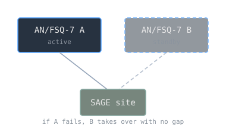

A machine built from tens of thousands of vacuum tubes has a tube failing somewhere all the time. For most computers that is an annoyance. For the computer at the center of a Cold War air-defense system, one that is supposed to be watching the skies without interruption, a failure in the wrong moment is the whole problem. The AN/FSQ-7, built by IBM for the [[sage-and-real-time-systems|SAGE]] network, answered that problem in the bluntest way available: it kept a second copy of itself ready to take over.

> [!note] The idea
> Fault tolerance through redundancy: run a second copy of the machine so that the failure of the first, which at this scale is guaranteed, does not take the system down.

## The largest computer ever built

The AN/FSQ-7 is, by most accounts, the largest discrete computer system ever built. A single installation used about 60,000 vacuum tubes, 49,000 of them in the computers themselves, and filled a building. At that scale, with that many tubes, the question is not whether something will fail but how to keep working when it does.

## Redundancy as the design

Each SAGE site was configured as a duplex system: two complete AN/FSQ-7 computers, one active and one on standby.

At any moment one machine ran the air-defense site while the other waited. If the active machine faltered, or had to come down for maintenance, the standby took over, and the site kept watching. The cost was building and running two of everything. The benefit was a system that survived the failure of parts that were guaranteed to fail.

## Why it matters

This is fault tolerance through redundancy, and it is one of the oldest ideas in keeping systems alive. The duplex AN/FSQ-7 is the direct ancestor of the failover pair, the hot standby database, and the replicated server cluster. The hardware changed completely. The idea, run a second copy so the loss of the first is survivable, did not.

## Related Notes

- [[whirlwind-and-core-memory|Whirlwind and Magnetic-Core Memory]], the lineage that led to this machine
- [[sage-and-real-time-systems|SAGE and Real-Time Systems]], the system the AN/FSQ-7 ran
- [[distributed-consensus|Distributed Consensus]], the modern problem of keeping replicas agreed
- [[von-neumann-architecture|Von Neumann Architecture]], the underlying machine model
- [[cs/military-computing/index|Computing and the U.S. Military]], the cluster index

## Sources

- "AN/FSQ-7 Combat Direction Central," Wikipedia. https://en.wikipedia.org/wiki/AN/FSQ-7_Combat_Direction_Central . Supports IBM as prime contractor, the description as the largest discrete computer system ever built, the figure of 60,000 vacuum tubes (49,000 in the computers), and the duplex configuration of two computers with one active and one on standby for fault tolerance.
