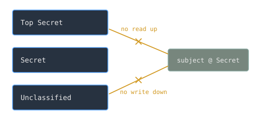

A military computer often holds data at several classification levels at once, and one rule governs all of it: a secret must never reach someone not cleared for it. Stating the rule is easy. Enforcing it on a shared machine, against mistakes and malicious code alike, is not. The Bell-LaPadula model, developed for the Defense Department, turned that rule into a formal mathematical model that a system can be built and checked against.

> [!note] The idea
> Treat confidentiality as a state machine. Two rules, never read above your level and never write below it, provably keep classified data from flowing to where it does not belong.

## Levels and mandatory control

Every subject, meaning a user or a running process, and every object, meaning a file or other resource, is assigned a security level. Access is then governed by mandatory rules that the system itself enforces. This is what mandatory access control means, and it is the key difference from ordinary file permissions: the owner of a secret file cannot choose to share it downward, because the policy is the machine's to enforce, not the user's to relax.

## The two rules

The model rests on two properties. The simple security property, often phrased as no read up, says a subject at a given level may not read an object at a higher level. The star property, phrased as no write down, says a subject at a given level may not write to an object at a lower level.

## Why no write down

The first rule is obvious. The second one surprises people. Why forbid a cleared user from writing to a less-secret file? Because that is precisely how secrets leak. A program running with a user's clearance, perhaps malware the user never intended to run, could copy classified data into an unclassified file where anyone could read it. Forbidding writes downward closes that path, whether the leak is deliberate or not.

## What it gave the field

Bell-LaPadula gave security something it had lacked: a formal model you can reason about and even verify, rather than a set of informal hopes. It is the foundation of multilevel security and a milestone in the larger project of treating security as something provable, which is exactly what the [[tcsec-and-graded-assurance|Orange Book]] would later try to grade and certify.

## Related Notes

- [[tcsec-and-graded-assurance|The Orange Book and Graded Assurance]], which built evaluation on top of this model
- [[cyber-warfare-and-the-fifth-domain|Cyber Warfare and the Fifth Domain]], the modern security domain
- [[processes-and-threads|Processes and Threads]], the subjects the model governs
- [[virtual-memory|Virtual Memory]], the isolation security models depend on
- [[cs/military-computing/index|Computing and the U.S. Military]], the cluster index

## Sources

- "Bell-LaPadula model," Wikipedia. https://en.wikipedia.org/wiki/Bell%E2%80%93LaPadula_model . Supports the model as a formal state-machine model focused on data confidentiality, developed to formalize the U.S. Department of Defense multilevel security policy, with mandatory access control rules including the simple security property (no read up) and the star property (no write down).
