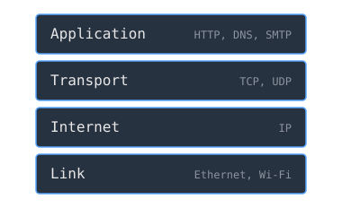

A protocol is a contract. For two machines to communicate they must agree on the rules at every level, from the voltage on the wire to the meaning of a web request. Once Cerf and Kahn had shown that heterogeneous networks could interconnect, the open question was how to organize all those rules so that the pieces could be built and changed independently. The answer the Defense Department settled on was a layered model and a deadline.

> [!note] The idea
> Sort all the rules of communication into independent layers, then make a single layered standard the law of the network, so that many different machines can interoperate.

## Four layers

The DoD model, the ancestor of what is now called the internet model, sorts the rules into four layers. The link layer moves bits between two directly connected machines. The internet layer, which is the Internet Protocol, gets a packet across many networks toward an address. The transport layer, chiefly the Transmission Control Protocol, turns that best-effort delivery into an ordered, reliable stream. The application layer is where the actual work lives, such as the web or email.

Each layer talks only to its peer on the other machine and uses the layer below as a service. That separation is the point. The web does not know whether it is riding fiber or radio, and the wire does not know whether it carries email or video. A change at one layer leaves the others alone.

## The flag day

A standard on paper is not a standard in practice until everyone uses it. The [[arpanet-survivable-communications|ARPANET]] ran an older protocol called NCP, and the migration to TCP/IP was not allowed to drag on as a slow mix of old and new. It was a hard cutover. On 1 January 1983, a date later remembered as the flag day, the network permanently switched from NCP to TCP/IP, and machines that had not converted were cut off. The switch worked, and it proved something larger than the protocol itself: a single layered contract could govern an entire network of independent machines. That is the contract the global internet inherited.

## Related Notes

- [[internetworking-prnet-satnet|Cerf, Kahn, and the Internetworking Problem]], where TCP/IP came from
- [[imp-the-first-router|The IMP, the First Router]], the internet layer's forwarding made physical
- [[network-protocols|Network Protocols]], layered protocols in general
- [[history-of-the-internet|History of the Internet]], the wider story
- [[cs/military-computing/index|Computing and the U.S. Military]], the cluster index

## Sources

- "Internet protocol suite," Wikipedia. https://en.wikipedia.org/wiki/Internet_protocol_suite . Supports the four-layer model (application, transport, internet, link), the split of the program into TCP and IP in 1978, and the completion of the ARPANET migration from NCP to TCP/IP on the flag day of 1 January 1983.
