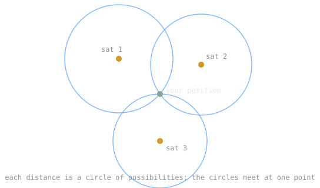

GPS quietly turns one question into another. It answers "where am I" by answering "what time is it, exactly, according to several clocks in space." Built by the Defense Department for navigation, it is one of the most successful distributed systems ever fielded, and it runs on [[cs/standards/ieee-1588-precision-time-protocol|precise, synchronized time]].

> [!note] The idea
> Position computed from time. If you know exactly when a signal left a satellite whose position you know, the travel time tells you how far away that satellite is. Combine several and you have pinned your location.

## Position from time

A GPS receiver calculates its own four-dimensional position in spacetime from the signals of multiple satellites. The time delay between when a satellite transmits a signal and when the receiver gets it is proportional to the distance between them. Each satellite's distance places the receiver somewhere on a sphere around that satellite, and the spheres from several satellites intersect at the receiver's position.

## Why four satellites

There are four unknowns to solve: three coordinates of position, and the deviation of the receiver's own cheap clock from true satellite time. [[cs/math/linear-algebra-fundamentals|Four unknowns need four measurements]], so at least four satellites must be in view. The fourth is what lets an inexpensive receiver clock be solved for rather than trusted, which is the clever heart of the design.

## Atomic clocks

The satellites carry very stable atomic clocks, synchronized with one another and with reference clocks at the ground control stations. Because the whole scheme converts time into distance, the accuracy of those clocks is the accuracy of your position. Keeping them right is the job of the [[gps-control-segment|control segment]].

## Why relativity matters

Time on a GPS satellite does not tick at the same rate as time on the ground. Special and general relativity together predict that the satellite clocks, as observed from Earth, run about 38 microseconds per day faster than clocks below. The design of GPS corrects for this difference. Without the correction, positions would drift by kilometers within a day. GPS is, among other things, a working engineering proof of relativity.

## A distributed system

Seen as computer science, GPS is [[cs/systems/logical-clocks-lamport-and-vector|synchronized clocks across many nodes]], continuous error correction, and a receiver [[cs/statistics/maximum-likelihood-estimation|fusing partial, noisy signals into one estimate]]. It shares that shape with [[ntp-distributed-clock-synchronization|NTP]] on the ground and with the [[sins-polaris-inertial-navigation|inertial navigation]] that fills in when no satellite is visible.

## Related Notes

- [[gps-control-segment|The GPS Control Segment]], the ground system that keeps the satellites honest
- [[ntp-distributed-clock-synchronization|NTP and Distributed Clock Synchronization]], the same problem on the network
- [[sins-polaris-inertial-navigation|Inertial Navigation and the Missile Submarine]], navigation without a sky view
- [[distributed-consensus|Distributed Consensus]], agreement across distributed nodes
- [[cs/military-computing/index|Computing and the U.S. Military]], the cluster index

## Sources

- "Global Positioning System," Wikipedia. https://en.wikipedia.org/wiki/Global_Positioning_System . Supports a receiver computing its four-dimensional position from satellite time signals with delay proportional to distance, the need for at least four satellites to solve for three position coordinates plus the receiver's clock error, the very stable atomic clocks on the satellites synchronized with ground reference clocks, and the special and general relativistic effect making satellite clocks run about 38 microseconds per day faster, which the design corrects.
