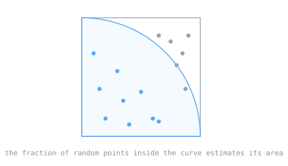

Some problems are too tangled to solve with a clean formula, yet easy to answer by experiment, if only you could run the experiment enough times. The Monte Carlo method, born at Los Alamos in the design of nuclear weapons, turns that observation into a computational tool: answer a hard, exact problem by simulating it at random, many times over, and averaging the result.

> [!note] The idea
> Use repeated random sampling to estimate a quantity that is hard to compute directly. Randomness, against intuition, becomes the tool for answering a deterministic question.

## The problem at Los Alamos

In 1946, nuclear weapons physicists at Los Alamos were investigating neutron diffusion in the core of a nuclear weapon: how neutrons scatter, get absorbed, and multiply as they move through the material. The exact equations describing all those interacting paths were intractable to solve directly.

## Ulam's idea

Stanislaw Ulam, working on the weapons project, saw a way around the equations. Instead of solving them, you could simulate many individual neutron histories at random, letting each one scatter and split according to the known probabilities, and then average over a great many of them to get the answer. He described the idea to John von Neumann, and the two began to plan actual calculations.

## On ENIAC

Von Neumann, Nicholas Metropolis, and others programmed [[ballistics-tables-and-eniac|ENIAC]] to perform the first fully automated Monte Carlo calculations, of a fission weapon core, in the spring of 1948. The machine built to compute artillery tables was now running statistical experiments on the behavior of a bomb.

## Why it matters

Monte Carlo is now used wherever randomness can stand in for an intractable integral or simulation, across physics, finance, computer graphics, and machine learning. It is one of the foundational randomized algorithms in all of computing, and it came directly out of weapons work.

## Related Notes

- [[ballistics-tables-and-eniac|Ballistics Tables and ENIAC]], the same machine put to a different mathematical use
- [[eniac-programmers-and-the-first-software|The ENIAC Programmers]], who made that machine run
- [[discrete-probability|Discrete Probability]], the mathematics Monte Carlo samples from
- [[random-variable|Random Variable]], the formal object being sampled
- [[expected-value|Expected Value]], the average a Monte Carlo estimate converges to
- [[cs/military-computing/index|Computing and the U.S. Military]], the cluster index

## Sources

- "Monte Carlo method," Wikipedia. https://en.wikipedia.org/wiki/Monte_Carlo_method . Supports Stanislaw Ulam inventing the method while working on nuclear weapons projects and describing it to John von Neumann, the 1946 Los Alamos investigation of neutron diffusion in a weapon core, the use of repeated random sampling to solve deterministic problems, and von Neumann, Metropolis, and others programming ENIAC for the first fully automated Monte Carlo calculations of a fission weapon core in the spring of 1948.
