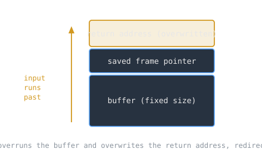

On the night of November 2, 1988, a program written by a graduate student spread across the early internet and brought a large part of it to a standstill. The Morris worm was [[cs/security/malware-classes|the first internet worm]] to cause serious disruption, and the flaw it rode is, decades later, still one of the most exploited classes of bug in all of computing.

> [!note] The idea
> A buffer overflow. When a program copies input into a fixed-size buffer without checking the length, an attacker can supply input that runs past the buffer and overwrites adjacent memory, including the address the program will jump to when the current function returns. Control of that address is control of the program.

## What happened

Robert Tappan Morris, a Cornell graduate student, launched the worm on November 2, 1988, releasing it from a machine at MIT to disguise where it had come from. It spread by exploiting [[cs/security/buffer-overflows|a buffer overflow]] in the [[unix-and-open-source|Unix]] fingerd network service, along with a debug feature left enabled in the sendmail mail program, copying itself from one machine to the next.

## The damage

The worm infected around 6,000 machines, roughly ten percent of the computers then connected to the internet. It was not designed to destroy data, but a flaw in how it checked for copies of itself made it reinfect machines over and over, and the multiplying copies [[cs/security/denial-of-service-and-ddos|clogged systems until they were unusable]].

## What changed

The disruption was a wake-up call for a network that had been built among people who trusted each other. The Morris worm prompted [[darpa-and-the-funding-of-ai|DARPA]] to fund the CERT Coordination Center at Carnegie Mellon University, giving the internet a central point for coordinating responses to security emergencies. Coordinated [[cs/security/incident-response-lifecycle|incident response]], now an entire profession, traces directly to this night.

## Related Notes

- [[cyber-warfare-and-the-fifth-domain|Cyber Warfare and the Fifth Domain]], where exploitation became a military domain
- [[history-of-the-internet|History of the Internet]], the network the worm spread across
- [[unix-and-open-source|Unix and Open Source]], the systems it exploited
- [[network-protocols|Network Protocols]], the services it traveled through
- [[cs/military-computing/index|Computing and the U.S. Military]], the cluster index

## Sources

- "Morris worm," Wikipedia. https://en.wikipedia.org/wiki/Morris_worm . Supports the launch on November 2, 1988 by Robert Tappan Morris from an MIT machine, the exploitation of a buffer overflow in fingerd and a debug hole in sendmail, the infection of around 6,000 machines (about ten percent of the internet of the time), and the worm prompting DARPA to fund the CERT Coordination Center at Carnegie Mellon.
