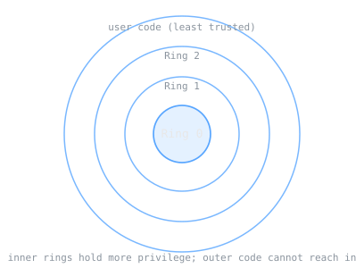

Before Multics, a computer mostly did one job at a time, and a user waited for a turn. Multics set out to change what a computer was: a shared utility that many people could draw on at once, the way many homes draw on one power grid. It was a research operating system funded through ARPA's Project MAC and built by MIT together with General Electric and Bell Labs. Much of it was ambitious to a fault, but the ideas it engineered still structure operating systems today.

> [!note] The idea
> Operating-system structure: time-sharing, a single-level store, and protection rings, the ideas that organize how one machine is shared among many users and protected from them.

## Time-sharing as a utility

The central goal was [[cs/history/operating-system-concept-batch-to-interactive|time-sharing]]: many users on one machine, each getting slices of its attention quickly enough that each feels served. Treating computing as a utility, something you tap rather than own outright, was a genuinely new way to think about a computer.

## A single-level store

Multics blurred a line that older systems kept sharp, the line between files on disk and memory in a running program. Data lived in units called segments, and [[cs/systems/virtual-memory|a program could address the contents of a file as if they were simply part of its own memory]]. This single-level store made the file system and memory two views of one thing.

## Protection rings

With many users sharing one machine, the system needed to keep them from harming each other and the system itself. Multics used hardware-supported protection rings, [[cs/security/privilege-separation-and-least-privilege|concentric levels of privilege]] with the most trusted code in the inner ring and less trusted code further out. Code in an outer ring cannot freely reach into an inner one, which bounds the damage any one program can do.

## The Unix connection

Multics grew large and complex. Some of the Bell Labs researchers who had worked on it went on to build Unix, carrying forward the ideas they valued in a far smaller form. Ken Thompson kept what he liked best, including [[cs/systems/file-systems|the hierarchical file system]] and the shell. Unix is not a rejection of Multics so much as a leaner descendant of it.

## Related Notes

- [[unix-and-open-source|Unix and Open Source]], the descendant that carried these ideas forward
- [[virtual-memory|Virtual Memory]], the memory model Multics helped pioneer
- [[processes-and-threads|Processes and Threads]], the sharing of a machine among many jobs
- [[file-systems|File Systems]], the hierarchical structure Unix took from Multics
- [[cs/military-computing/index|Computing and the U.S. Military]], the cluster index

## Sources

- "Multics," Wikipedia. https://en.wikipedia.org/wiki/Multics . Supports Multics as an early time-sharing operating system developed by MIT with General Electric and Bell Labs, the single-level store treating files as segments addressable like memory, the hardware-supported ring-oriented security, and the creation of Unix by Bell Labs people who had worked on Multics, with Ken Thompson keeping the hierarchical file system and the shell.
