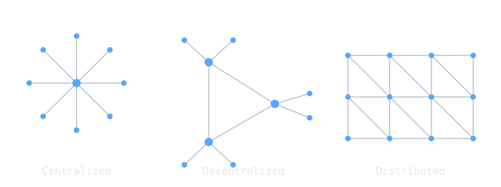

In 1960 the United States had a communications problem with a very specific shape. Its command system depended on long-distance links that funneled through a small number of central switching points. A single nuclear strike on those points could leave the leadership unable to reach its own forces, and a leadership that cannot communicate cannot order a response. The entire logic of deterrence rested on a network that was, physically, easy to behead.

Paul Baran, a young engineer at the RAND Corporation, spent the early 1960s working out an answer. That answer changed how every data network on earth is built.

> [!note] The idea
> Survivability is a property of a network's shape, not its hardware. A distributed mesh with a few links per node, carrying messages split into independently routed packets, has no single point whose loss is fatal.

## Survivability as a design constraint

Baran started from a question about topology, the shape of the connections rather than the equipment hanging off them. He sketched three kinds of network and asked how much damage each could absorb.

A *centralized* network routes everything through one hub. Destroy the hub and the network is gone. A *decentralized* network has several hubs, which helps, but each hub is still a fat target whose loss isolates everything behind it. A *distributed* network has no hubs at all. Every node connects to several neighbors, so between any two points there are many possible paths. Baran calculated that a redundancy level of around three, meaning roughly three links per node on average, let such a network survive the loss of as much as half its nodes and still pass traffic among the survivors.

Redundant topology was half the idea. The other half was what travels across it.

## Message blocks

Traditional telephony built a single dedicated circuit and held it open for the length of a call. That circuit is a fixed path, and a fixed path through a damaged network is exactly the thing that breaks. Baran proposed cutting every message into small pieces of a standard size, which he called message blocks, and sending each piece on its own. Donald Davies, working independently at the National Physical Laboratory in the United Kingdom, reached the same scheme and named the unit it cut messages into: the packet.

Each packet carries its own destination address. The nodes keep no fixed routes. Every node instead behaves like a small post office. It reads a packet's address, checks which of its links are working at that moment, and forwards the packet one hop closer to where it is going. Baran called this hot-potato routing, since no node holds a packet for long. If a link drops mid-transmission, later packets simply take a different sequence of hops. The network reroutes itself, in flight, with no central authority deciding anything.

## A packet finding its way

> [!example] Routing around damage
> Picture a distributed grid with node A in one corner and node B in the opposite corner. A message from A to B is cut into four packets.
>
> The first packet leaves A and follows the shortest working path. Between the second packet and the third, a strike removes two nodes in the middle of the grid. The third packet reaches a node whose usual next hop is now gone, so that node forwards it along a different link, around the gap. The fourth packet sees the same damage and takes a similar detour. All four packets reach B by different routes, possibly out of order. B holds them until it has the full set, puts them back in sequence, and the message is whole again.
>
> Nothing in that story needed a working map of the whole network. Each node made a local decision from local information.

That last property is what makes the system survivable, and it is the same property that lets the modern internet route around a severed undersea cable with no human in the loop.

## What the idea bought, and what it cost

Packet switching delivered three things together. It gave survivability, because no single point is fatal to lose. It gave efficiency, because many conversations share the same links, each link carrying packets from whichever flows happen to have traffic at that instant rather than sitting idle inside a reserved circuit. That sharing is called statistical multiplexing, and it is why a packet network carries far more conversations per wire than a circuit network of the same size.

The cost lands on the receiver. Packets can arrive out of order, can be duplicated, and can be dropped when a node's queue fills. A circuit, once established, hands over a clean ordered stream; a packet network hands over a pile of fragments and makes reassembly and retransmission someone else's problem. Solving that problem is exactly what the transport protocols layered on top, [[dod-model-and-tcp-ip-standardization|TCP]] chief among them, were later built to do.

Baran joined RAND in 1959, and his designs were published as the eleven-volume series On Distributed Communications in 1964, then set aside for a few years. The idea came back at the end of the decade in the network the Defense Department actually built, the ARPANET, whose first node was installed at UCLA in 1969. The line from a Cold War survivability study to the device rendering this page is direct and unbroken.

## Related Notes

- [[arpanet-survivable-communications|ARPANET and Survivable Communications]], the network that put this idea into hardware
- [[network-protocols|Network Protocols]], the layered rules that ride on top of packet switching
- [[history-of-the-internet|History of the Internet]], where the story continues
- [[dijkstras-algorithm|Dijkstra's Algorithm]], one way a node works out which neighbor is closer to a destination
- [[von-neumann-architecture|Von Neumann Architecture]], the kind of machine each node and host actually is
- [[cs/military-computing/index|Computing and the U.S. Military]], the cluster index

## Sources

- Paul Baran, *On Distributed Communications*, RAND Corporation, 1964. The eleven-volume series; Volume I is RM-3420. https://www.rand.org/pubs/research_memoranda/RM3420.html
- "Paul Baran," Wikipedia. https://en.wikipedia.org/wiki/Paul_Baran . Supports his RAND work from 1959, the redundancy-level finding (a level of three survives roughly 50 percent node loss), and hot-potato routing.
- "Packet switching," Wikipedia. https://en.wikipedia.org/wiki/Packet_switching . Supports Davies' independent invention at the National Physical Laboratory, the term packet, and Baran's distributed adaptive message block switching.
- "ARPANET," Wikipedia. https://en.wikipedia.org/wiki/ARPANET . Supports the first node at UCLA in 1969 and the first host-to-host message on 29 October 1969.
