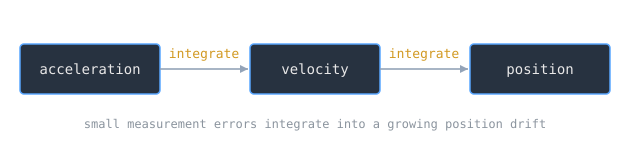

A submarine hiding underwater cannot look at the stars, take a [[gps-and-distributed-time|satellite fix]], or sight a landmark. To launch a ballistic missile accurately it still has to know exactly where it is. Inertial navigation answers that, computing position from nothing but the vehicle's own motion, and it is a clean physical example of what statisticians call [[maximum-likelihood-estimation|state estimation]].

> [!note] The idea
> Dead reckoning from motion alone. Measure acceleration and rotation continuously, and integrate them over time to track velocity and position, with no reference to anything outside the vehicle.

## Sensing motion

An inertial navigation system uses [[cs/systems/io-devices-and-drivers|accelerometers and gyroscopes]], together with a computer, to continuously calculate position, orientation, and velocity without the need for external references. The accelerometers feel how the vehicle speeds up and slows; the gyroscopes feel how it turns. From those two senses, and a known starting point, the system tracks where it is.

## Integrating up to position

The mathematics is [[cs/math/integrals-and-the-fundamental-theorem|integration]]. Acceleration integrated over time gives velocity. Velocity integrated over time gives position. The computer carries that forward moment by moment, turning a stream of motion measurements into a running estimate of location.

## The catch: drift

The method has a built-in weakness. Small errors in measuring acceleration and angular velocity are integrated into progressively larger errors in velocity, which compound into still larger errors in position. This is integration drift, and even excellent systems accumulate tens of meters of error within minutes. That is why inertial navigation is [[cs/statistics/bayesian-inference|periodically reset against an outside fix]] when one is available.

## Why the submarine needs it

Inertial navigation is used in ballistic missiles and in submarines, and a ballistic missile submarine sits at the intersection of both needs. To aim its missiles it must know its own launch position precisely, and inertial navigation is what gives it that knowledge while it stays submerged and silent, buying accuracy at the price of the drift it must keep correcting.

## Related Notes

- [[gps-and-distributed-time|GPS and Distributed Time]], the outside fix that bounds inertial drift
- [[gps-control-segment|The GPS Control Segment]], the system that keeps that fix honest
- [[regression-fundamentals|Regression Fundamentals]], estimating a quantity from noisy measurements
- [[maximum-likelihood-estimation|Maximum Likelihood Estimation]], the statistics of best estimates
- [[cs/military-computing/index|Computing and the U.S. Military]], the cluster index

## Sources

- "Inertial navigation system," Wikipedia. https://en.wikipedia.org/wiki/Inertial_navigation_system . Supports inertial navigation using accelerometers and gyroscopes with a computer to continuously calculate position, orientation, and velocity without external references, the dead-reckoning integration of acceleration into velocity and position, integration drift accumulating tens of meters of error within minutes, and the use of inertial navigation in ballistic missiles and submarines.
