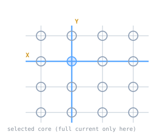

In the late 1940s the U.S. Navy's research lab asked MIT whether a computer could drive a flight simulator realistic enough to train bomber crews. A simulator has a hard requirement that most computers of the day could not meet: it has to respond to the pilot's controls as fast as the pilot moves them. Meeting that requirement produced Whirlwind, one of the first real-time digital computers, and along the way it produced the kind of memory that computers would rely on for the next two decades.

> [!note] The idea
> Magnetic-core memory, the form of random-access memory computers relied on for two decades, came out of the need for storage fast and reliable enough to keep a real-time machine running.

## Real time was the whole point

A batch computer can take its time. A simulator cannot. Whirlwind, built at the MIT Servomechanisms Laboratory, was designed to compute fast enough to feel live, which put it among the first digital machines that operated in real time. That speed demand pushed every part of the design, and it broke on the memory.

## The memory problem, and Jay Forrester's answer

Early storage, such as electrostatic tubes, was slow and unreliable, and it was the part of Whirlwind that kept failing. Jay Forrester, leading the project, worked out a replacement: magnetic-core memory. It stores each bit in a tiny ferrite ring, a core, that can be magnetized in one of two directions.

Selecting one core uses a trick called coincident currents. Run half of the current needed to flip a core along one horizontal wire, and half along one vertical wire. Only the single core sitting at the intersection of those two wires receives the full current, so only that one flips. Any bit in the plane can be reached directly [[cs/dsa/multidimensional-arrays|by choosing its row and column wire]], which makes this random-access memory: [[cs/systems/memory-hierarchy-and-caching|every location costs the same to read]].

## Legacy

Magnetic-core memory was reliable and fast enough that it became [[cs/history/the-mosfet|the standard main memory of computers into the 1970s]], which is why older programmers still say "core" for memory. Whirlwind's design also carried forward directly. Its successor, Whirlwind II, became the basis for the [[sage-and-real-time-systems|SAGE]] air-defense system.

## Related Notes

- [[anfsq7-and-fault-tolerant-hardware|The AN/FSQ-7 and Fault-Tolerant Hardware]], the SAGE machine Whirlwind led to
- [[sage-and-real-time-systems|SAGE and Real-Time Systems]], the system built on this lineage
- [[von-neumann-architecture|Von Neumann Architecture]], the stored-program model the memory serves
- [[virtual-memory|Virtual Memory]], a later layer over physical memory like this
- [[cs/military-computing/index|Computing and the U.S. Military]], the cluster index

## Sources

- "Whirlwind I," Wikipedia. https://en.wikipedia.org/wiki/Whirlwind_I . Supports the MIT Servomechanisms Laboratory origin, the U.S. Navy flight-simulator request, Whirlwind as one of the first real-time digital computers, Jay Forrester's invention of magnetic-core memory for it, and the line from Whirlwind II to SAGE.
