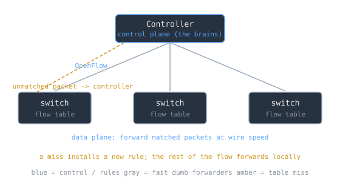

A traditional switch or router is two machines fused into one box. There is a control plane that decides where traffic should go, running [[ospf-and-link-state-routing|routing protocols]], learning topology, and building forwarding tables. And there is a data plane that does the actual forwarding, matching each packet against those tables and pushing it out a port at wire speed. In conventional networking every device carries both, so every box makes its own local decisions, and configuring the network means logging into each one and coaxing its independent brain toward a coherent whole. Software-defined networking starts by prying those two planes apart.

> [!note] The idea
> SDN centralizes network intelligence by disassociating the forwarding of packets (the data plane) from the routing decision (the control plane). The control plane is lifted out of the individual switches into one or more controllers, the "brains" of the network, so the whole network can be configured dynamically and programmatically from a central point. The subtle payoff is that the switch keeps forwarding at wire speed from a local flow table; the controller only writes the rules into that table, and a packet matching no rule is punted up to the controller, which then installs new rules.

## Two planes, pulled apart

The control plane is the part that decides: it computes paths and populates tables. The data plane is the part that acts: it moves packets according to those tables. Fusing them in every device is what makes traditional networks static and awkward to manage, because intelligence is smeared across dozens of independent boxes.

SDN improves on that static architecture by centralizing the intelligence in one component, separating the forwarding process from the routing process. The control plane becomes one or more controllers where the whole intelligence is incorporated, and the switches are demoted to fast, dumb forwarders that do what the controller tells them. The result is a network you program like software rather than configure box by box, which is why the approach feels closer to [[cs/history/cloud-computing-and-virtualization|cloud computing]] than to traditional network management.

## OpenFlow: writing rules into the switches

Separating the planes only helps if the controller has a way to reach down and program the switches, and OpenFlow is the protocol that gives it that reach. OpenFlow is a communications protocol that gives access to the forwarding plane of a switch or router over the network, and it lets a controller, distinct from the switches, determine the path of packets across them. SDN has been commonly associated with OpenFlow since the protocol emerged in 2011, though proprietary systems later adopted the SDN label too.

The mechanism is match-action rules in a flow table. OpenFlow allows remote administration of a switch's packet-forwarding table by adding, modifying, and removing packet-matching rules and actions. Routing decisions are made by the controller and translated into rules with a configurable lifespan, which are deployed to a switch's flow table, leaving the actual forwarding of matched packets to the switch at wire speed for the duration of those rules. [[cs/standards/what-a-standard-actually-is|A single open protocol]] lets the controller manage switches from different vendors that would otherwise each need their own proprietary interface.

The clever bit is what happens on a miss. Packets that are unmatched by the switch can be forwarded to the controller. The controller then decides how to handle them and can install new flow-table rules on one or more switches so that subsequent packets of that flow forward locally without another trip upstairs. The first packet of a new flow teaches the network; the rest ride the rule it created.

> [!warning] Centralization is the feature and the liability
> Putting the intelligence in one place is exactly what makes an SDN programmable, and exactly what makes it fragile. Centralization has drawbacks related to security, scalability, and elasticity: the controller is a high-value target and a potential single point of failure, and one reason earlier attempts to split control from data (the IETF's ForCES work in 2004) failed to gain traction was that many viewed separating control from data as risky given the potential for control-plane failure. The same choke point that gives you one place to program the network gives you one place to lose it.

## Related Notes

- [[ospf-and-link-state-routing|OSPF and Link-State Routing]] - the distributed control-plane logic SDN pulls into a central controller
- [[routing-and-longest-prefix-match|Routing and Longest Prefix Match]] - the data-plane lookup an SDN switch still performs at wire speed
- [[network-protocols|Network Protocols]] - where the control and data planes sit in the layered stack
- [[load-balancing-l4-and-l7|Load Balancing, L4 and L7]] - centralized traffic steering SDN makes programmable

## Sources

- "Software-defined networking," Wikipedia. https://en.wikipedia.org/wiki/Software-defined_networking . Backs SDN as centralizing network intelligence by disassociating the forwarding process (data plane) from the routing process (control plane), the control plane consisting of one or more controllers considered the brains where the whole intelligence is incorporated, centralization's drawbacks in security/scalability/elasticity, the association with OpenFlow since its 2011 emergence, network management more akin to cloud computing, and the 2004 IETF ForCES effort failing partly because separating control from data was viewed as risky given control-plane failure potential.
- "OpenFlow," Wikipedia. https://en.wikipedia.org/wiki/OpenFlow . Backs OpenFlow as a protocol giving access to the forwarding plane of a switch or router over the network, controllers being distinct from switches and determining packet paths, remote administration of forwarding tables by adding/modifying/removing match rules and actions with configurable lifespans deployed to a flow table while matched packets forward at wire speed, unmatched packets being forwarded to the controller, and one open protocol managing multi-vendor switches.
