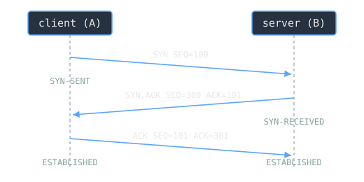

TCP promises a reliable, ordered byte stream over an internet layer that guarantees none of that. Packets can be lost, duplicated, reordered, or damaged in transit. Before TCP can make its promise, the two ends have to agree that a connection exists and settle on the numbering they will use to track every byte. That opening negotiation is the three-way handshake, and it happens before a single byte of your actual data is sent.

> [!note] The idea
> To open a connection, the two hosts exchange three segments using the SYN flag: SYN, then SYN-ACK, then ACK. The connection becomes established once sequence numbers have been synchronized in both directions. The handshake exists to agree those starting numbers, not to move data.

## Why sequence numbers first

TCP recovers from data that is damaged, lost, duplicated, or delivered out of order by assigning a sequence number to each octet transmitted and requiring a positive acknowledgment from the receiver. If an ACK does not arrive within a timeout, the data is retransmitted. At the receiving end the sequence numbers reorder segments that arrived out of order and drop duplicates.

That whole scheme rests on both sides knowing where the other's numbering begins. Each side picks an initial sequence number (ISN) for its own direction of the stream. The SYN flag literally means "synchronize sequence numbers," and when SYN is set, the segment's sequence number is that ISN, with the first real data octet numbered ISN+1. The handshake is how each side tells the other its ISN and confirms it heard the other's.

## The three segments

The procedure uses the SYN control flag and involves an exchange of three messages, which is why it is called a three-way handshake. Using the canonical numbers from the TCP specification:

1. **SYN.** The client sends a segment with SYN set and `SEQ=100`, announcing it will number its stream starting at 100. It enters the SYN-SENT state.
2. **SYN-ACK.** The server replies with SYN set and its own `SEQ=300`, plus `ACK=101`. The acknowledgment field says the server is now expecting sequence 101, which acknowledges the SYN that occupied sequence 100. The server enters SYN-RECEIVED.
3. **ACK.** The client sends `SEQ=101 ACK=301`, acknowledging the server's SYN. Both ends are now ESTABLISHED and data can flow.

The connection reaches "established" precisely when sequence numbers have been synchronized in both directions, which is the state after that third segment. Each side has now announced its ISN and seen its own ISN acknowledged.

> [!example] Why 101 and not 102
> The SYN consumes one sequence number even though it carries no data. The client's SYN sat at 100, so the next expected number is 101, and that is what the server acknowledges. A bare ACK, by contrast, does not consume a sequence number, so the client's data can begin at 101 without wasting a slot. As the specification notes, if the ACK occupied sequence space you would end up acknowledging ACKs forever.

> [!warning] The handshake is an attack surface
> Because the server allocates connection state on receiving a SYN, a flood of SYN segments with no final ACK can exhaust that state. This is the SYN-flood [[denial-of-service-and-ddos|denial-of-service]] technique, mitigated by SYN cookies that defer state allocation until the handshake completes.

## Related Notes

- [[network-protocols|Network Protocols]] - TCP versus UDP and where the handshake sits in the stack
- [[osi-and-tcp-ip-models|OSI and TCP/IP Models]] - TCP is the transport layer of the suite
- [[tls-and-the-https-handshake|TLS and the HTTPS Handshake]] - the encryption negotiation that rides on top of this TCP handshake
- [[ip-addressing-and-subnetting|IP Addressing and Subnetting]] - how the two hosts are addressed before they connect

## Sources

- "RFC 793: Transmission Control Protocol," IETF / RFC Editor. https://www.rfc-editor.org/rfc/rfc793.txt . Supports the three-way handshake using the SYN flag and an exchange of three messages, the connection becoming established when sequence numbers are synchronized in both directions, the SYN flag meaning "synchronize sequence numbers," the initial sequence number with first data octet at ISN+1, reliability via per-octet sequence numbers and positive acknowledgments with retransmission on timeout, the Figure 7 values (SEQ=100 SYN; SEQ=300 ACK=101 SYN,ACK; SEQ=101 ACK=301 ACK), and the note that a bare ACK does not occupy sequence number space.
- "Transmission Control Protocol," Wikipedia. https://en.wikipedia.org/wiki/Transmission_Control_Protocol . Supports the general description of TCP as connection-oriented reliable in-order byte-stream delivery established via the three-way handshake.
