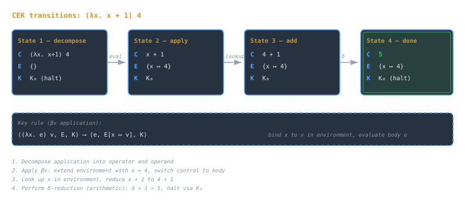
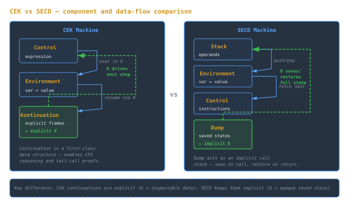

## Overview
Abstract machines are **executable semantic models**. They show *how* a language’s semantics can be realized through explicit computation states.  
Where operational semantics specifies transitions symbolically, abstract machines **simulate execution concretely** using environments, continuations, and stacks.

> [!note]
> Think of abstract machines as interpreters that are minimal enough to prove properties about, yet concrete enough to compile toward.

---

## Components

### CEK (Control, Environment, Kontinuation)
The **CEK Machine** models **call-by-value** evaluation in functional languages.  
It replaces textual substitution with **environment lookups**, capturing how closures maintain variable bindings.

| Component | Description |
|------------|-------------|
| **C (Control)** | Current expression being evaluated |
| **E (Environment)** | Maps variables to values or closures |
| **K (Kontinuation)** | Describes what to do next (pending computation) |

#### CEK example (from original)
**Evaluating `(λx. x + 1) 4`**  
1) Initial state: ⟨`(λx. x + 1) 4`, `{}`, `K₀`⟩ → decompose application.  
2) Obtain closure, bind `x → 4` in the environment.  
3) Evaluate `x + 1` under this environment, then perform addition when operands are values.

Rule sketch:
```

⟨(λx. e) v, E, K⟩ → ⟨e, E[x ↦ v], K⟩

```

> [!example] CEK state transitions for `(λx. x + 1) 4`
> 

### SECD (Stack, Environment, Control, Dump)
The **SECD Machine** predates CEK but expresses similar principles (Peter Landin, 1960s).

| Component | Description |
|------------|-------------|
| **S (Stack)** | Intermediate results |
| **E (Environment)** | Variable bindings or closures |
| **C (Control)** | Remaining code or instructions |
| **D (Dump)** | Saved machine states during function calls (a call stack) |

**Intuitive flow.** (1) Push operands to **S**; (2) execute next instruction from **C**; (3) on call, push current state to **D**; (4) on return, pop and resume.

> [!tip]
> SECD’s design anticipates modern **stack-based bytecode interpreters** (e.g., Python, JVM).

### CEK vs SECD (from original comparison)
| Feature | CEK Machine | SECD Machine |
|----------|--------------|--------------|
| State Shape | ⟨Control, Environment, Continuation⟩ | ⟨Stack, Environment, Control, Dump⟩ |
| Substitution Handling | Via closures in the environment | Via stack frames and lexical environments |
| Continuations | Explicit data structure (`K`) | Implicit via `D` dump |
| Emphasis | Formal reasoning (proofs) | Implementation modeling |
| Influence | Denotational and CPS-based semantics | Early interpreter and compiler design |

> [!example] CEK vs SECD component comparison
> 

---

## Transition Rules
A program’s behavior is a sequence of *state transitions*:
```

⟨expression, environment, continuation⟩ → ⟨expression', environment', continuation'⟩

```
Each state captures **expression**, **environment**, and **continuation**; the machine’s rules define how constructs (application, variable lookup, arithmetic, …) transform one state into another (small-step computation).

**CEK rule (application, call-by-value):**
```

⟨(λx. e) v, E, K⟩ → ⟨e, E[x ↦ v], K⟩

```

**SECD flow (intuitive):**
1) Push operands to stack **S**,  
2) execute instruction from **C**,  
3) push current state to **D** on call,  
4) pop and resume on return.

> [!tip] Environments and closures
> Ensure closures capture the **environment** at the point of abstraction; variable lookup should consult that environment on application.

---

## Evaluation Strategies
### Relation to λ-Calculus and CPS (from original)
- **CEK** corresponds to **call-by-value β-reduction**.  
- **SECD** corresponds to a **stack-based CPS** execution style.

A CPS transform explicitly passes continuations as functions, mirroring what CEK represents structurally.  
CEK often bridges *theory* ([[lambda-calculus-syntax-substitution|λ-calculus]]) and *implementation* (interpreter loops).

### Relation to Modern Runtimes (from original)
- The **call stack** plays the role of `K` or `D`.  
- **Frames/closures** store environments.  
- The **interpreter loop** corresponds to the machine’s transition function.

Examples: Python’s [[cs/languages/Python/the-bytecode-and-the-eval-loop|evaluation loop]] resembles SECD; OCaml’s bytecode interpreter is CEK-like; JS engines use CEK-like continuations to [[cs/languages/Racket/proper-tail-calls-and-the-loop-question|optimize tail calls]].

---

## Examples
### CEK tiny walkthrough (from original)
Evaluating `(λx. x + 1) 4` via the CEK rules (see Components → CEK example and diagram).

### SECD tiny walkthrough (from original)
Operand pushes to **S**, code in **C**, and call/return via **D**; mirrors a stack-based bytecode interpreter.

> [!example] Single-step CEK sketch
> ```
> <(λx. x) (λy. y), ∅, •>  ⟶  <λx. x, ∅, •>  ⟶  <x, {x ↦ λy. y}, •>  ⟶  <λy. y, ∅, •>
> ```
> (Tiny, illustrative; use your house CEK notation.)

> [!example] Tiny SECD trace
> ```
> Code: (λx. x) (λy. y)
> (S,E,C,D) steps through pushing λy.y, λx.x, APPLY; stack ends with λy.y
> ```

---

## Pitfalls
> [!warning]
> - **Confusing substitution with copying:** CEK performs *lookup*, not textual replacement.  
> - **Neglecting continuations:** removing or flattening `K` breaks correct control flow.  
> - **Overloading SECD terms:** `D` (dump) ≠ CEK continuation; both sequence computation differently.  
> - **Forgetting determinism:** every machine step must be defined for every well-formed state.

> [!tip]
> When debugging abstract machine traces, track all state components; missing one leads to apparent “nondeterminism.”

> [!warning] Common pitfalls
> - Mishandling environment capture leads to free-variable errors.
> - Misusing the dump in SECD can leak continuation state or loop.

---

## See also
- [[operational-semantics-big-step-small-step|Operational Semantics]]
- [[lambda-calculus-encodings-booleans-pairs-church-numerals|Lambda Calculus: Basics]]
- [[cs/pl/continuations-cps|Continuations & CPS]]

## Sources

- "CEK Machine," Wikipedia. https://en.wikipedia.org/wiki/CEK_Machine . Supports the CEK machine modeling call-by-value evaluation with Control, Environment, and Continuation components, its invention by Matthias Felleisen and Daniel P. Friedman, its use of environment lookups and closures instead of textual substitution, and its derivation as a simplified form of the SECD machine.
- "SECD machine," Wikipedia. https://en.wikipedia.org/wiki/SECD_machine . Supports the SECD machine's four components (Stack, Environment, Control, Dump), its origin with Peter Landin, and its use of the dump as a call stack saved during function calls.
- "Abstract machine," Wikipedia. https://en.wikipedia.org/wiki/Abstract_machine . Supports the framing of abstract machines as models of computation used to analyze and implement programming language semantics independently of specific hardware.