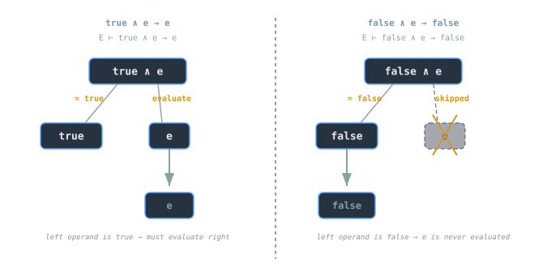
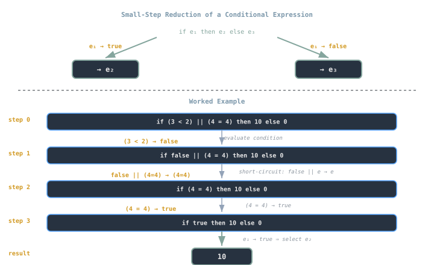
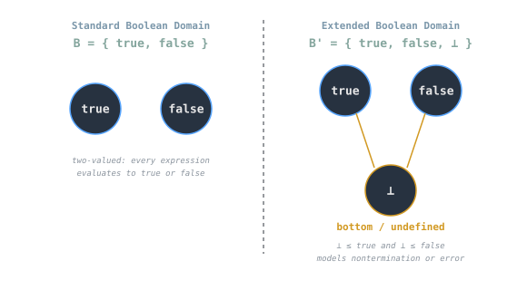

## Overview
Booleans form the logical foundation of decision-making in programming languages.  
Though represented by only two values (`true` and `false`), they define the branching behavior that determines how every computation proceeds.  
Their semantics specify not only what constitutes truth, but *how* truth is computed and propagated through control structures.

> [!note]
> Boolean semantics is not about syntax (`&&`, `||`, `!`), but about **how truth values drive evaluation**, the basis for understanding control flow, optimization, and type soundness.

---

## Boolean Domains and Representations
Formally, the Boolean domain is:
```

B = { true, false }

```
However, implementation varies by language:

| Language | Representation | Notes |
|-----------|----------------|-------|
| **C / Java** | Integers (`0`, `1`) | Boolean-as-int; coercion may blur semantics |
| **Python / Haskell** | Distinct `Bool` type | Strict typing, no implicit conversion |
| **Lisp / Scheme** | Anything not `#f` is “truthy” | Semantics extend to all non-false values |
| **SQL** | `{ TRUE, FALSE, UNKNOWN }` | Ternary logic (three-valued semantics) |

This distinction matters for evaluation: in permissive systems (like JavaScript), coercion can produce unpredictable “truthiness” behavior; in strict systems, the Boolean domain is closed and well-defined.

---

## Evaluation Rules
[[cs/math/boolean-algebra|Boolean operations]] (`and`, `or`, `not`) follow **short-circuit semantics**: the minimal evaluation needed to determine a result.

Formal rules (small-step form):
```

E ⊢ true ∧ e → e  
E ⊢ false ∧ e → false  
E ⊢ true ∨ e → true  
E ⊢ false ∨ e → e

```
These express that:
- In `and`, if the left operand is `false`, evaluation halts immediately.  
- In `or`, if the left operand is `true`, no further computation is needed.



Short-circuiting reduces unnecessary computation and supports side-effect control, one reason Boolean semantics is often the first topic in operational semantics courses.

---

## Conditionals as Semantic Constructs
A conditional expression has the form:
```

if e1 then e2 else e3

```
Semantically:
```

E ⊢ e1 → true ⇒ E ⊢ if e1 then e2 else e3 → e2  
E ⊢ e1 → false ⇒ E ⊢ if e1 then e2 else e3 → e3

````

Conditionals therefore act as **branching evaluators** over Boolean domains.

- In **strict languages**, the condition `e1` must evaluate completely before the branch executes.  
- In **non-strict languages** (Haskell, ML), branch evaluation is *deferred* until chosen.

> [!tip]
> Treating `if` as an *expression* (not a statement) aligns semantics with pure λ-calculus: `if` returns a value.

---

## Derived Constructs
All control flow can be expressed using Booleans and `if`:
- **Loops:** `while e1 do e2` ≈ `if e1 then (e2; while e1 do e2) else skip`
- **Guards:** condition-action pairs (`if cond then action`)
- **Pattern matching:** extends conditional branching over structured data

Thus, conditionals serve as the *semantic base case* for more complex control mechanisms.

---

## Step-by-Step Example
```ocaml
if (3 < 2) || (4 = 4) then 10 else 0
````

1. Evaluate `(3 < 2)` → `false`
    
2. Apply short-circuit rule for `||`: first operand `false`, so evaluate `(4 = 4)` → `true`
    
3. Expression `(3 < 2) || (4 = 4)` → `true`
    
4. Apply conditional rule → branch yields `10`
    

Each step corresponds to a transition in small-step semantics, showing how truth determines evaluation order.



---

## Extended Boolean Domains

Not all semantics are binary.  
Some systems model _undefined_ or _unknown_ truth values to capture partial information or error states.

```
B' = { true, false, ⊥ }
```

(`⊥` meaning “bottom” or undefined)

|System|Third Value|Meaning|
|---|---|---|
|SQL|`UNKNOWN`|Missing data|
|Domain Theory|`⊥`|Nontermination or error|
|Three-Valued Logic|`N`|Indeterminate truth|

Rule adjustments handle these:

```
E ⊢ ⊥ ∧ e → ⊥
E ⊢ ⊥ ∨ e → e
```

> [!warning]  
> Undefined truth can propagate: a single `⊥` may halt evaluation entirely unless language rules specify continuation.



---

## Booleans in Operational Models

In abstract machines, Booleans determine control transitions.

**Example (CEK Machine):**

```
⟨ if e1 then e2 else e3, E, K ⟩ → ⟨ e1, E, IF(e2, e3, K) ⟩
```

When `e1` evaluates:

- If it yields `true`, continue with `e2`
    
- If `false`, continue with `e3`
    
- If undefined (`⊥`), halt or raise error depending on semantics
    

This explicit environment + continuation form is crucial for modeling control constructs, exceptions, and non-local returns.

---

## Practical Implications

- **Optimization:** compilers simplify [[cs/languages/Cpp/constexpr-and-compile-time-computation|constant Boolean expressions]] (e.g., `if true then e1 else e2 → e1`).
    
- **Analysis:** static analyzers reason over possible truth values for safety checks.
    
- **Parallelism:** understanding Boolean dependencies enables branch prediction and speculative execution.
    
- **Language Design:** whether conditionals are expressions or statements determines compositionality.
    

---

## Summary

|Concept|Role|
|---|---|
|**Booleans**|Represent binary truth values controlling program flow|
|**Conditionals**|Branch evaluators driven by Boolean semantics|
|**Short-circuiting**|Optimizes evaluation and controls side effects|
|**Three-valued logic**|Models undefined or partial information|
|**Operational relevance**|Core to semantic modeling and runtime evaluation|

> [!tip]  
> Booleans are not “simple primitives”; they are _control mechanisms encoded as values_.

---

## Diagram Concepts

- `bool-short-circuit.svg`: Evaluation halting diagrams for `∧` and `∨`.
    
- `bool-conditional-reduction.svg`: Conditional reduction trace for `if` evaluation.
    
- `bool-truth-domains.svg`: Two-valued vs three-valued truth lattice.
    

---

## See also

- [[cs/pl/operational-semantics-big-step-small-step|Operational Semantics: Big-Step & Small-Step]]
    
- [[abstract-machines-cek-secd|Abstract Machines: CEK and SECD]]
    
- [[cs/pl/evaluation-order-and-strictness|Evaluation Order & Strictness]]

## Sources

- "Boolean data type," Wikipedia. https://en.wikipedia.org/wiki/Boolean_data_type . Supports the Boolean domain of two values (true and false), the variation in how languages represent Booleans (distinct types versus integers), and the truthiness behavior in permissive languages.
- "Short-circuit evaluation," Wikipedia. https://en.wikipedia.org/wiki/Short-circuit_evaluation . Supports short-circuit semantics for the logical and/or operators, where the second operand is evaluated only when the first does not already determine the result.
- "Conditional (computer programming)," Wikipedia. https://en.wikipedia.org/wiki/Conditional_%28computer_programming%29 . Supports conditionals as branching constructs that select among alternatives based on a Boolean condition, including if-then-else forms.