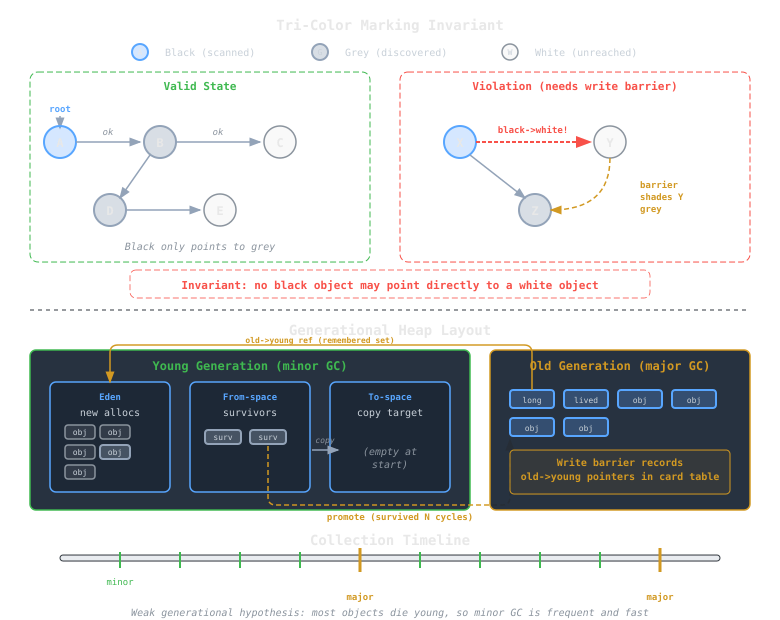

## Overview
Garbage collection is more than freeing unused memory. It’s about managing **time, space, and safety** while keeping performance predictable.  
Different algorithms optimize for different workloads: responsiveness, throughput, or simplicity.  
This note summarizes how the most common collectors work and the principles that make them correct and efficient.

> [!note]
> The algorithms below can be mixed. Most modern runtimes combine generational copying with concurrent marking or regional compaction.

---

## Mark–Sweep Collection
This is the classic tracing algorithm and the foundation for most others.

1. **Mark phase:** Start from root references (globals, stacks, registers). Traverse every reachable object and mark it as *live*.  
2. **Sweep phase:** Scan the entire heap, reclaiming unmarked (unreachable) objects.

### Pros
- Simple and space-efficient (no copying).  
- Works with large, complex object graphs.

### Cons
- Leaves **fragmentation**: free memory scattered in small chunks.  
- Full-heap traversal pauses the program.  

> [!example]
> Suppose an application allocates 1 GB of objects but only 200 MB remains live.  
> Mark–sweep reclaims the rest, but allocation may still fail if no contiguous 50 MB block exists (fragmentation).

---

## Tri-Color Invariant
Incremental and concurrent GCs extend mark–sweep using the **tri-color abstraction**.

Objects are divided into three sets:
- **White:** not yet reached (potential garbage).  
- **Grey:** discovered but not fully scanned.  
- **Black:** scanned completely.

The critical invariant is:  
> **No black object points to a white one.**

Maintaining this prevents reachable objects from being lost during concurrent marking.  
Write barriers ensure that if a black object writes a pointer to a white object, the white one is shaded grey.

> [!note]
> Barriers are small snippets of code the compiler or runtime inserts automatically to preserve correctness during mutation.

---

## Copying Collection
The **copying collector** eliminates fragmentation by compacting live data as it collects.

### How It Works
1. Divide the heap into two equal halves: **from-space** and **to-space**.  
2. During collection, copy every reachable object from from-space into to-space.  
3. Update references to point to the new locations.  
4. Swap roles: to-space becomes the new from-space.

### Benefits
- Always leaves a contiguous free region, so no fragmentation.  
- Naturally compacts memory and improves cache locality.  
- Collection time proportional to the number of *live* objects, not heap size.

### Costs
- Requires 2× memory (half the heap unused at a time).  
- Copying overhead for large object graphs.  
- Relocation invalidates pointers, so GC must patch all references.

> [!tip]
> Copying collection shines when most objects are short-lived, typical in functional and object-oriented programs.

---

## Generational Collection
Empirical studies show most objects die young, a principle known as the **weak generational hypothesis**.  
Generational collectors exploit this by dividing the heap into **young** and **old** regions.

### Mechanism
1. **Minor collection:** runs frequently on the young generation.  
   - Copies survivors into a *survivor space* or promotes them to the old generation.  
2. **Major collection:** scans the entire heap, including the old generation.  
   - Occurs rarely.

Objects that survive several minor collections are assumed long-lived and promoted.

### Write Barriers
Since old objects can reference young ones, the collector must track these links.  
Write barriers record such updates to a *remembered set* or *card table*, ensuring the GC doesn’t miss reachable young objects during a minor collection.

> [!example]
> When an old object assigns a pointer into the young heap:
> ```c
> old->child = new_young;
> ```
> The write barrier notes this so the young generation collector treats `new_young` as reachable.

---



---

## Pitfalls and Tuning
> [!warning]
> - **Barrier bugs** break invariants, causing live objects to be reclaimed.  
> - **Promotion heuristics** affect pause time and memory usage.  
> - **Large objects** often bypass copying spaces and are managed separately.  
> - **Tenuring thresholds** that are too short cause thrashing between generations.

Proper GC tuning balances:
- **Pause time** (responsiveness)
- **Throughput** (total work done)
- **Memory footprint**

---

## In Practice
- **[[cs/languages/Java/hotspot-garbage-collectors|JVM (HotSpot)]]:** generational, multi-threaded collectors (G1, ZGC, Shenandoah).  
- **.NET CLR:** generational mark–compact with concurrent phases.  
- **Go:** concurrent mark–sweep with [[cs/languages/Go/the-go-garbage-collector|small heap fragments]], tuned for low pause times.  
- **Rust:** none; [[cs/languages/Rust/ownership-and-moves|relies on ownership for deterministic lifetime management]].

> [!tip]
> Even in non-GC languages, these principles influence *memory-safe ownership systems*, reasoning about reachability and lifetime statically rather than dynamically.

---

## See also
- [[cs/pl/garbage-collection-concepts|Garbage Collection: Concepts]]
- [[abstract-machines-cek-secd|Abstract Machines: CEK and SECD]]
- [[cs/pl/evaluation-order-and-strictness|Evaluation Order & Strictness]]

## Sources

- "Tracing garbage collection," Wikipedia. https://en.wikipedia.org/wiki/Tracing_garbage_collection . Supports the mark phase tracing reachable objects from roots and the sweep phase reclaiming the rest, the tri-color marking abstraction (white/grey/black sets), the invariant that no black object points to a white one, and write barriers that preserve correctness during concurrent marking.
- "Cheney's algorithm," Wikipedia. https://en.wikipedia.org/wiki/Cheney%27s_algorithm . Supports the copying collector dividing the heap into two semispaces (from-space and to-space), copying live objects between them, updating references to new locations, and its connection to grey objects in the tri-color terminology.
- "Mark–compact algorithm," Wikipedia. https://en.wikipedia.org/wiki/Mark%E2%80%93compact_algorithm . Supports mark-sweep leaving a fragmented heap, compaction relocating live objects to eliminate fragmentation, and the requirement to correctly update all pointers to moved objects.