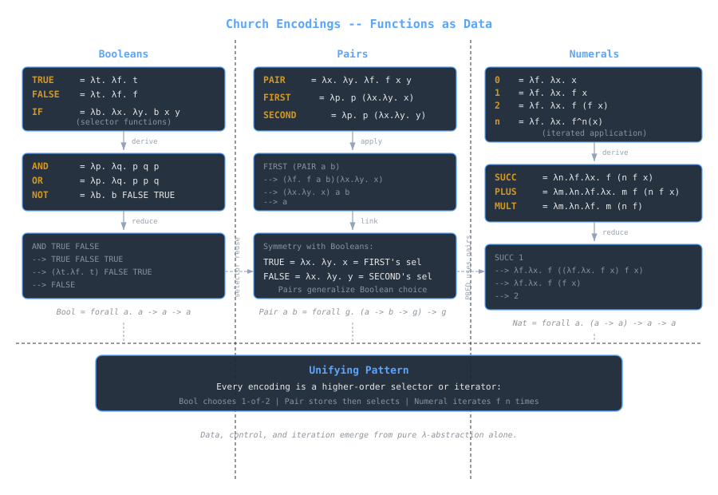

## Overview
Lambda calculus models computation using only **functions**: no built-in data, no primitives.  
Yet from pure λ-abstraction, we can encode all familiar constructs: Booleans, pairs, and even numbers.

These encodings, called **[[cs/history/hilbert-godel-church-computability|Church encodings]]**, show that functions alone are sufficient to represent any computable data structure or operation.  
They provide the theoretical foundation for [[cs/history/lisp-and-functional-programming|functional languages]], typed lambda calculi, and type systems like those behind ML and Haskell.

> [!note]
> Every construct here is a *function of functions*, meaning its meaning arises only through how it is applied.

---

## Preliminaries
### Syntax (review)
```

M, N ::= x | λx. M | M N

```
- **Variables** (`x`) represent identifiers.  
- **Abstraction** (`λx. M`) defines a function taking `x` and returning `M`.  
- **Application** (`M N`) applies function `M` to argument `N`.

### Reduction
Computation proceeds by **β-reduction**:
```

(λx. M) N → M[x := N]

```
Substitute all occurrences of `x` in `M` with `N`.

> [!tip]
> Evaluation in λ-calculus is substitution-based: there is no assignment or mutation.

---

## Boolean Logic

### Definitions
Booleans are encoded as *choice functions*:  
they select between two options.

```

TRUE ≡ λt. λf. t  
FALSE ≡ λt. λf. f

```

Each Boolean is a two-argument function that chooses one of its parameters.

### Conditional
```

IF ≡ λb. λx. λy. b x y

```
Applying `IF` to `TRUE` or `FALSE` selects the corresponding branch.

#### Example
```

IF TRUE a b  
→ (λb. λx. λy. b x y) TRUE a b  
→ TRUE a b  
→ (λt. λf. t) a b  
→ a

```
Similarly:
```

IF FALSE a b → b

```

> [!note]
> Booleans thus act as *control abstractions*: their behavior defines the notion of branching.

---

## Logical Operators
Each operator is defined as a higher-order function over Boolean encodings.

```

AND ≡ λp. λq. p q p  
OR ≡ λp. λq. p p q  
NOT ≡ λb. b FALSE TRUE

```

### Verification
```

AND TRUE FALSE  
→ (λp. λq. p q p) TRUE FALSE  
→ TRUE FALSE TRUE  
→ (λt. λf. t) FALSE TRUE  
→ FALSE

OR FALSE TRUE  
→ (λp. λq. p p q) FALSE TRUE  
→ FALSE FALSE TRUE  
→ (λt. λf. f) FALSE TRUE  
→ TRUE

```

> [!tip]
> In this encoding, `TRUE` and `FALSE` are *control contexts*, not data labels.  
> They govern evaluation by choosing which branch of a function survives.

---

## Pairs (Products)
### Motivation
A **pair** `(a, b)` can be represented as a function that receives a selector and applies it to its two components.

### Definition
```

PAIR ≡ λx. λy. λf. f x y  
FIRST ≡ λp. p (λx. λy. x)  
SECOND ≡ λp. p (λx. λy. y)

```

### Example
```

FIRST (PAIR a b)  
→ (λp. p (λx. λy. x)) (λx. λy. λf. f x y) a b  
→ (λx. λy. x) a b  
→ a

```
and
```

SECOND (PAIR a b) → b

```

> [!note]
> A pair is *its own eliminator*.  
> It doesn’t store two values; it encapsulates how to choose between them.

### Relation to Booleans
Notice the symmetry:
```

TRUE ≡ λx. λy. x  
FALSE ≡ λx. λy. y

```
A pair can be viewed as a generalization of Boolean choice: the Boolean simply selects between two arguments.

---

## Church Numerals

### Definition
Natural numbers can be encoded as higher-order functions that represent *repeated application*.

```

0 ≡ λf. λx. x  
1 ≡ λf. λx. f x  
2 ≡ λf. λx. f (f x)  
3 ≡ λf. λx. f (f (f x))

```

In general:
```

n ≡ λf. λx. fⁿ(x)

```

Each numeral takes a function `f` and applies it `n` times to `x`.

### Intuition
`n` represents the *iteration count* of a computation, rather than a quantity.

> [!tip]
> This functional view connects naturally to recursion and fixed points: numbers define repeated transformations.

---

## Arithmetic via Function Composition
Because Church numerals are higher-order functions, arithmetic becomes composition of applications.

### Successor
```

SUCC ≡ λn. λf. λx. f (n f x)

```

Example:
```

SUCC 1  
→ (λn. λf. λx. f (n f x)) (λf. λx. f x)  
→ λf. λx. f ((λf. λx. f x) f x)  
→ λf. λx. f (f x)  
→ 2

```

### Addition
```

PLUS ≡ λm. λn. λf. λx. m f (n f x)

```

Reduction sketch:
```

PLUS 2 3  
→ λf. λx. 2 f (3 f x)  
→ λf. λx. (λf. λx. f (f x)) f (3 f x)  
→ λf. λx. f (f (3 f x))  
→ λf. λx. f (f (f (f (f x))))  
→ 5

```

### Multiplication
```

MULT ≡ λm. λn. λf. m (n f)

```
The intuition: apply `n f` repeatedly, equivalent to `n × m` applications.

```

MULT 2 3  
→ λf. 2 (3 f)  
→ λf. (3 f) ∘ (3 f)  
→ six total applications of f  
→ 6

```

### Exponentiation
```

EXP ≡ λm. λn. n m

```
Read as “apply `m` n-times,” the purest possible definition.

---

## Predicates and Zero Check
### IsZero
```

ISZERO ≡ λn. n (λx. FALSE) TRUE

```
- If `n` applies its function zero times, return `TRUE`.
- Otherwise, at least one application flips the result to `FALSE`.

#### Example
```

ISZERO 0  
→ (λn. n (λx. FALSE) TRUE) 0  
→ 0 (λx. FALSE) TRUE  
→ (λf. λx. x) (λx. FALSE) TRUE  
→ TRUE

ISZERO 2  
→ (λn. n (λx. FALSE) TRUE) 2  
→ 2 (λx. FALSE) TRUE  
→ (λf. λx. f (f x)) (λx. FALSE) TRUE  
→ (λx. FALSE) ((λx. FALSE) TRUE)  
→ FALSE

```

> [!note]
> `ISZERO` uses Church numeral iteration as a control signal: each iteration overwrites the current value with `FALSE`.

---

## Predecessor and Subtraction
Unlike successor, predecessor requires *state*.  
We track `(n, n−1)` pairs and extract the second component after iteration.

### Definition
```

PRED ≡ λn. λf. λx.  
n (λg. λh. h (g f))  
(λu. x)  
(λu. u)

```

High-level intuition:
1. The initial pair `(x, x)` starts the chain.
2. Each iteration shifts `(current, previous)`.
3. The final projection extracts the predecessor.

#### Example (conceptually)
```

PRED 3  
→ 2  
PRED 0  
→ 0

```

Though tedious to reduce by hand, this encoding works purely through substitution and functional state passing.

---

## Recursion and Fixed Points
### The Y Combinator
To define recursive functions in λ-calculus, we need a *fixed-point combinator*.

```

Y ≡ λf. (λx. f (x x)) (λx. f (x x))

```

This satisfies:
```

Y F → F (Y F)

```

Example (factorial sketch):
```

FACT ≡ Y (λf. λn.  
IF (ISZERO n)  
1  
(MULT n (f (PRED n))))

```

> [!note]
> The Y combinator expresses recursion without named functions, a cornerstone for reasoning about self-reference and termination.

---

## Connections to Type Systems
While the untyped λ-calculus allows all encodings, typed variants restrict expressiveness to guarantee safety.

| Encoding | Typed Version |
|-----------|----------------|
| Booleans | `Bool = ∀α. α → α → α` |
| Pairs | `∀α β. (α → β → γ) → γ` |
| Numerals | `∀α. (α → α) → α → α` |

In typed lambda calculi (like System F), these polymorphic encodings become *universal data types*, a foundation for typed functional programming.

> [!tip]
> System F’s universal quantification (`∀α`) formalizes Church encodings as parametric polymorphism, the same mechanism that powers generics in ML, Haskell, and Rust.

---

## Equivalence and Extensionality
Two λ-terms are **extensionally equal** if they behave identically under all applications.  
For example:
```

λx. (λy. y) x ≡ λx. x

```
because both yield the same result under βη-normalization.

### η-Conversion
Extends equality:
```

λx. f x ⇔ f (if x not free in f)

```

This matters for Church encodings: many definitions differ syntactically but remain equivalent extensionally.

> [!note]
> Distinct encodings for the same concept (e.g., different `AND` formulations) may be βη-equivalent, meaning they compute identically.

---

## Reduction Order and Normal Forms
Lambda calculus supports multiple reduction strategies:
- **Normal order:** reduce leftmost, outermost first (guarantees normalization if it exists).
- **Applicative order:** reduce arguments first (like eager evaluation).

For Church encodings, both reach normal forms, but reduction cost varies:
- Booleans and pairs normalize quickly.
- Numeral arithmetic grows linearly in `n`.

> [!warning]
> Encodings model computation, not efficiency.  
> Even simple arithmetic expands exponentially in reduction steps.

---

## Conceptual Summary
| Construct | Encoding | Conceptual Role |
|------------|-----------|----------------|
| `TRUE` / `FALSE` | Selectors (`λx. λy. x/y`) | Conditional branching |
| `PAIR` | `λx. λy. λf. f x y` | Compound structure |
| `n` | `λf. λx. fⁿ(x)` | Iteration count |
| `PLUS`, `MULT` | Composition | Derived operations |
| `ISZERO`, `PRED` | Conditional and state | Derived predicates |

Each builds upon simpler encodings: Boolean control enables pairing; pairing enables numeric iteration and state passing.

> [!tip]
> This cumulative hierarchy is what makes λ-calculus *expressively complete*.  
> Data, control, and iteration emerge from functions alone.

---



---

## See also
- [[cs/pl/lambda-calculus-syntax-substitution|Lambda Calculus: Syntax & Substitution]]
- [[cs/pl/hindleymilner-type-inference|Hindley–Milner & Type Inference]]
- [[cs/pl/evaluation-order-and-strictness|Evaluation Order & Strictness]]
- [[cs/pl/programming-paradigms-models-of-computation|Programming Paradigms & Models of Computation]]

## Sources

- "Church encoding," Wikipedia. https://en.wikipedia.org/wiki/Church_encoding . Supports Church encoding as a way of representing data (Booleans, pairs, numerals, and other types usually considered primitive) in the untyped lambda calculus, where the only primitive data type is the function.
- "Lambda calculus," Wikipedia. https://en.wikipedia.org/wiki/Lambda_calculus . Supports lambda calculus being a formal system for computation based on function abstraction and application with variable binding and substitution, its universality as a model of computation, and beta-reduction as the core transformation rule.
- "Fixed-point combinator," Wikipedia. https://en.wikipedia.org/wiki/Fixed-point_combinator . Supports a fixed-point combinator being a higher-order function that returns a fixed point of its argument, the basis for the Y combinator and defining recursion without named functions.