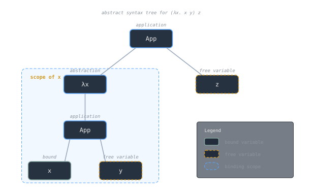
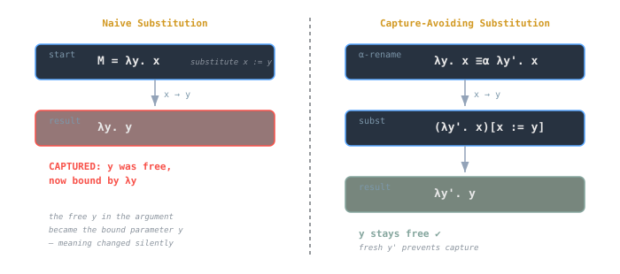
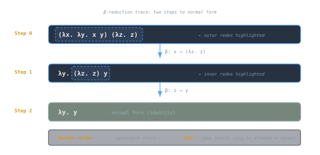

## Overview
The untyped λ-calculus is a minimal calculus of functions. It has only three syntactic forms (**variables**, **abstractions**, and **applications**) yet it can express [[cs/history/hilbert-godel-church-computability|every computable function]]. Computation is modeled by **β-reduction**, which in turn depends on **substitution**. Getting substitution right (especially avoiding **[[cs/languages/Racket/hygienic-macros-and-syntax-rules|variable capture]]**) is the essential technical detail that makes the calculus coherent.

> [!note]
> The λ-calculus is a rewriting system. Its results and meta-theory (confluence, normalization properties for certain fragments, etc.) rely on a precise definition of substitution and α-equivalence.

---

## Syntax
We write λ-terms (`M, N, L`) via the grammar:
```

M, N ::= x (variable)  
| λx. M (abstraction)  
| M N (application)

```
- **Variables**: drawn from a countably infinite set (`x, y, z, ...`).
- **Abstraction**: `λx. M` binds `x` in `M`.
- **Application**: left-associative; we write `M N P` for `(M N) P`.

Parentheses associate as usual. The λ binds most tightly: `λx. M N` means `λx. (M N)`.



---

## Free and Bound Variables
The set of **free variables** `FV(M)` of a term `M` are those not captured by any surrounding binder:
- `FV(x) = {x}`
- `FV(λx. M) = FV(M) \ {x}`
- `FV(M N) = FV(M) ∪ FV(N)`

A variable occurrence is **bound** if it lies in the scope of a corresponding `λ`; otherwise it is **free**.

> [!tip]
> Free variables behave like parameters supplied by the surrounding context; bound variables are placeholders introduced by λ-abstractions.

---

## α-Equivalence (Renaming Bound Variables)
Terms that differ only by renaming bound variables are **α-equivalent**:
```

λx. x ≡α λy. y  
λx. λy. x ≡α λa. λb. a

```
We treat α-equivalent terms as the *same* term for all semantic purposes.

> [!note]
> α-equivalence allows us to **rename bound variables to avoid capture** prior to substitution, the key step that keeps β-reduction well-defined.

---

## Substitution: Intuition and Notation
We write `M[x := N]` for the term obtained by **substituting** `N` for **free** occurrences of `x` in `M`. This operation is defined recursively on the structure of `M`, with special care at binders.

High-level rules:
1. **Variables**
   - `x[x := N] = N`
   - `y[x := N] = y` if `y ≠ x`
2. **Application**
   - `(M1 M2)[x := N] = (M1[x := N]) (M2[x := N])`
3. **Abstraction**
   - `(λx. M)[x := N] = λx. M` (the inner `x` is bound; do not substitute)
   - `(λy. M)[x := N] = λy. M[x := N]` if `y ∉ FV(N)`
   - If `y ∈ FV(N)`, **rename** `y` to a fresh variable `y'` first:
     - `(λy. M)[x := N] = λy'. (M[y := y'])[x := N]`

The last case is the heart of **capture-avoiding substitution**.

---

## Variable Capture and α-Renaming
**Variable capture** occurs when a free variable of the substituting term becomes accidentally bound.

> [!warning]
> Naive substitution that ignores binding can silently change the meaning of a term.

### Worked Counterexample (Naive)
Let `M = λy. x` and we substitute `x := y`:
- If we naively apply inside the λ, we get `λy. y`, but the original free `y` in the argument would now be **bound**. Incorrect!

### Correct (Capture-Avoiding)
Rename the binder first:
```

λy. x ≡α λy'. x  
(λy'. x)[x := y] = λy'. y

```
Now the `y` in the result is free (as intended). No capture.



---

## β-Reduction
The **β-redex** is an application of a λ-abstraction to an argument:
```

(λx. M) N →β M[x := N]

```
Reduction replaces the formal parameter `x` by the actual argument `N` in the body `M`, using capture-avoiding substitution.

### Examples
1. `(λx. x) z   →  z`
2. `(λx. λy. x) N   →  λy. N`  (assuming `y ∉ FV(N)`)
3. `(λx. x x) (λx. x x)`, the classic diverging term (Ω): it β-reduces to itself.

---

## Reduction Strategies (Where Substitution Happens)
Although β-reduction is a single rule, we can apply it at many positions in a term. **Evaluation strategies** specify which redex to reduce first:
- **Call-by-value (CBV)**: Reduce arguments to values before applying.
- **Call-by-name (CBN)**: Substitute arguments without evaluating them.
- **Normal-order**: Always reduce the **leftmost, outermost** redex.
- **Call-by-need**: Like CBN but share (memoize) the first evaluation result.

> [!note]
> **Normal-order** is standard: if a term has a normal form, normal-order reduction will reach it.

See the dedicated note on **Lambda Calculus: Evaluation Strategies** for a deeper comparison.

---

## Confluence (Church–Rosser)
The λ-calculus is **confluent**: if a term reduces (by any sequence) to `M1` and to `M2`, there exists a term `N` that both `M1` and `M2` can further reduce to.

Intuition: the order of **β-reduction** does not change the **final** result (when it exists). This property critically depends on **α-equivalence** and the **capture-avoiding** definition of substitution.

---

## Normal Forms and Reduction Properties
A term is in **β-normal form** if it contains **no** β-redexes. Some terms have a normal form, some diverge, and some reduce forever without reaching a redex-free shape.

- Example with normal form:
```

(λx. z) ((λy. y) w) → (λx. z) w → z

```
- Divergence:
```

Ω = (λx. x x) (λx. x x) → Ω → Ω → …

```

> [!tip]
> Normal-order reduction finds a normal form if one exists; CBV may get stuck reducing an argument that is not needed.

---

## Substitution Lemmas (Core Facts)
[[cs/math/proof-techniques|Substitution is central to proofs]] about the λ-calculus. Two standard lemmas are used everywhere.

### 1) Free Variable Lemma
If `z ∉ FV(N)`, then substitution does not introduce new free variables unrelated to `N`:
```

FV(M[x := N]) ⊆ (FV(M) \ {x}) ∪ FV(N)

```

### 2) Substitution Composition (Key Lemma)
For variables `x ≠ y` and provided no capture occurs:
```

M[x := N][y := L] ≡α M[y := L][x := N[y := L]]

```
This ensures that performing substitutions in different orders yields α-equivalent results when side conditions are met.

> [!note]
> These lemmas justify that β-reduction is well-behaved under contexts and that reduction sequences commute up to α-equivalence.

---

## Barendregt’s Variable Convention
A common practice in formal proofs: assume all bound variables are chosen **fresh** and distinct from free variables of interest. Under this **convention**, one can omit explicit α-renamings mid-proof, writing cleaner derivations.

> [!tip]
> Think “pick names so that nothing accidentally captures anything.” It’s a disciplined shorthand used in textbooks and papers.

---

## Worked Substitution Examples

### Example 1: Simple Application
```

(λx. x y) z →β z y

```
- `x` is replaced by `z`; `y` remains free.

### Example 2: Binder with Potential Capture
```

(λy. λx. y) x →β λx. x (WRONG if done naively)

```
Correct approach:
1. α-rename `λy. λx. y  ≡α  λy'. λx. y'`
2. Now substitute `x` for `y'`:
```

(λy'. λx. y') x →β λx. x

```
Here the result is the same, but only after α-renaming to avoid capture.

### Example 3: Nested Abstractions
```

(λx. λy. x y) (λz. z)  
→β λy. (λz. z) y  
→β λy. y

```



---

## Contextual Closure and Congruence
β-reduction is closed under contexts: if `M →β N`, then
- `λx. M →β λx. N`
- `M L →β N L`
- `L M →β L N`

This **congruence** allows local rewriting inside larger terms without changing the global meaning.

---

## De Bruijn Indices (Brief Aside)
A popular alternative to named variables is **De Bruijn indices**, which replace variable names with integers indicating the distance to the binding λ. For example:
```

λ. 0 -- λx. x  
λ. λ. 1 -- λx. λy. x

```
Advantages:
- Substitution becomes mechanical (no α-renaming needed).
- Avoids name capture by construction.

Trade-off: terms are less readable to humans.

> [!note]
> Many proof assistants and compilers use De Bruijn indices or related representations (locally nameless, HOAS) internally to simplify substitution machinery.

---

## From Substitution to Semantics
Everything in the untyped λ-calculus flows from substitution:
- **β-reduction** is substitution.
- **Equational reasoning** (βη-equality) depends on α-conversion and capture avoidance.
- **Operational semantics** for functional languages mirror β-reduction rules but use environments (CEK/SECD machines) to model substitution efficiently.

> [!tip]
> Abstract machines *simulate substitution* with environments and closures. This preserves meaning while improving implementation efficiency.

---

## Common Pitfalls
> [!warning]
> - **Forgetting α-renaming** before substitution into a binder → variable capture.  
> - **Assuming CBV finds normal forms**: it may diverge when normal-order would terminate.  
> - **Mixing free and bound variables** in proofs without checking side conditions.  
> - **Over-reducing under lambdas** in a strategy that forbids it (e.g., CBV evaluators).  
> - **Ignoring FV side conditions** in substitution lemmas, breaking proofs.

---

## Checklist: Substitution in Practice
1. Compute `FV` to understand which names matter.
2. Before substituting into `λy. M`, check if `y ∈ FV(N)`.
3. If yes, **α-rename** `y` to a fresh `y'`.
4. Perform recursive substitution structurally.
5. Use α-equivalence to simplify results.

Following this discipline avoids capture and keeps reductions valid.

---

## See also
- [[cs/pl/lambda-calculus-evaluation-strategies|Lambda Calculus: Evaluation Strategies]]
- [[abstract-machines-cek-secd|Abstract Machines: CEK and SECD]]
- [[cs/pl/continuations-cps|Continuations & CPS]]
- [[cs/pl/evaluation-order-and-strictness|Evaluation Order & Strictness]]

---

## Sources

- "Lambda calculus," Wikipedia. https://en.wikipedia.org/wiki/Lambda_calculus . Supports lambda calculus as a formal system for computation built on function abstraction and application using variable binding and substitution, and the untyped calculus as a universal model of computation.
- "Lambda calculus," Stanford Encyclopedia of Philosophy. https://plato.stanford.edu/entries/lambda-calculus/ . Supports the treatment of alpha-equivalence, substitution, reduction, normal forms, and the Church-Rosser property as core meta-theory of the calculus.