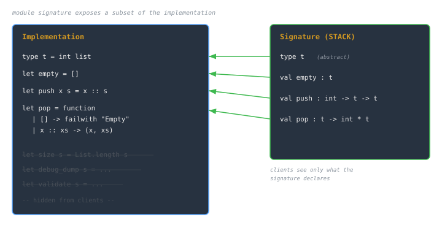
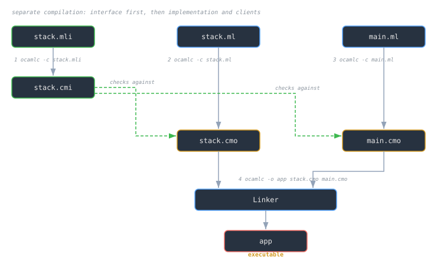

## Overview
Large software systems rely on **modular design**: dividing programs into components that can be developed, tested, and compiled independently.  
Programming languages formalize this through **modules**, **signatures**, and **separate compilation**.

Together, these mechanisms enable:
- **Encapsulation**: hiding implementation details.
- **Abstraction**: exposing only conceptual interfaces.
- **Reusability**: compiling and linking components without re-analyzing the whole system.
- **Safety**: type checking across module boundaries.

> [!note]
> The module system generalizes the idea of *scope* from single files to entire components.  
> Where functions provide *control abstraction*, modules provide *data and structural abstraction*.

---

## Modules
A **module** is a named collection of related definitions: values, types, functions, and submodules.  
It is both a **namespace** and a **compilation unit**.

### Example (OCaml-style)
```ocaml
module Stack = struct
  type t = int list
  let empty = []
  let push x s = x :: s
  let pop = function
    | [] -> failwith "Empty stack"
    | x :: xs -> (x, xs)
end
````

- `Stack.t` defines the abstract type of stacks.
    
- Functions `push`, `pop`, and `empty` belong to the module’s namespace.
    
- Access via `Stack.push`, `Stack.pop`, etc.
    

> [!tip]  
> Modules can group any collection of types and functions, beyond ADTs alone.  
> They act as logical boundaries for **cohesion** and **reuse**.

---

## Signatures: The Interface Layer

A **signature** specifies _what_ a module exposes: the types and values that form its **public contract**.  
It hides private details, ensuring clients depend only on the interface, not the implementation.

### Example

```ocaml
module type STACK = sig
  type t
  val empty : t
  val push : int -> t -> t
  val pop : t -> int * t
end
```

### Key Points

- **Abstract types:** `type t` hides its concrete definition.
    
- **Exposed operations:** define how users interact with the abstract type.
    
- **Interface stability:** as long as the signature stays the same, implementation can change freely.
    

### Matching Implementation to Signature

```ocaml
module Stack : STACK = struct
  type t = int list
  let empty = []
  let push x s = x :: s
  let pop s = (List.hd s, List.tl s)
end
```

Here, the compiler ensures the implementation _matches_ the signature: every declared value and type must be defined with the correct type.

> [!note]  
> In ML-family languages, **signature matching** is statically verified, not at runtime.  
> This is essential for **separate compilation**.

---

## Abstraction and Encapsulation

Signatures create **abstraction barriers**: the user knows how to use a module but not how it works internally.

- Internal types, helper functions, and optimizations remain private.
    
- The compiler enforces the interface boundary.
    

Example:

```ocaml
module Counter : sig
  type t
  val new : unit -> t
  val inc : t -> unit
  val get : t -> int
end = struct
  type t = int ref
  let new () = ref 0
  let inc c = c := !c + 1
  let get c = !c
end
```

Here, users cannot access the underlying `int ref`.  
They interact only through `new`, `inc`, and `get`.

> [!warning]  
> Exposing concrete types accidentally (e.g., `type t = int list` instead of `type t`) breaks encapsulation and ties clients to internal design choices.

---

## Functors: Parameterized Modules

Modules can be **parameterized** by other modules, analogous to functions operating on modules instead of values.

### Example

```ocaml
module type STACK = sig
  type t
  val empty : t
  val push : int -> t -> t
  val pop : t -> int * t
end

module StackArray () : STACK = struct
  type t = int list
  let empty = []
  let push x s = x :: s
  let pop s = (List.hd s, List.tl s)
end
```

Or, more generally:

```ocaml
functor MakeStack (Element : sig type t end) : sig
  type t
  val empty : t
  val push : Element.t -> t -> t
  val pop : t -> Element.t * t
end = struct
  type t = Element.t list
  let empty = []
  let push x s = x :: s
  let pop s = (List.hd s, List.tl s)
end
```

> [!tip]  
> Functors allow **generic programming** without inheritance: each instantiation produces a specialized module.

---

## Separate Compilation

With modules and signatures, compilers can check and compile each module **independently**:

1. Parse and type-check against its signature.
    
2. Generate compiled code (`.cmo`, `.o`, or equivalent).
    
3. Link precompiled modules later.
    

### Example Flow

```
stack.ml
stack.mli
main.ml
```

Steps:

1. Compile interface: `ocamlc -c stack.mli` → `stack.cmi`
    
2. Compile implementation: `ocamlc -c stack.ml`
    
3. Compile main: `ocamlc -c main.ml`
    
4. Link: `ocamlc -o app stack.cmo main.cmo`
    

> [!note]  
> The `.mli` file (signature) is compiled first, guaranteeing other modules can compile against it without needing implementation details.

---

## Benefits of Separate Compilation

|Benefit|Description|
|---|---|
|**Scalability**|Large projects compile faster; only changed modules rebuild.|
|**Safety**|Type-checked module boundaries prevent interface mismatches.|
|**Encapsulation**|Private data remains hidden, protecting invariants.|
|**Reusability**|Common libraries are linked, not recompiled.|

> [!tip]  
> Separate compilation is foundational for modular systems like **Standard ML**, **OCaml**, **Ada**, and **Modula-3**, and conceptually underpins package systems in languages like Rust and Go.

---

## Common Pitfalls

> [!warning]
> 
> - **Leaky abstraction:** exposing concrete types or constructors in a public signature.
>     
> - **Circular dependencies:** modules referring to each other without explicit functorization.
>     
> - **Incomplete signatures:** missing declarations prevent consistent type-checking.
>     
> - **Name collisions:** improper namespace scoping leads to ambiguous symbols.
>     

---

## Diagram Concepts






---

## See also

- [[cs/pl/records-variants-and-pattern-matching|Records, Variants, and Pattern Matching]]
    
- [[cs/pl/type-systems-goals-guarantees|Type Systems: Goals & Guarantees]]
    
- [[abstract-machines-cek-secd|Abstract Machines: CEK & SECD]]
    
- [[cs/pl/compilation-vs-interpretation|Compilation vs Interpretation]]

---

## Sources

- "Modular programming," Wikipedia. https://en.wikipedia.org/wiki/Modular_programming . Supports modular programming as organizing a codebase into independent modules, each with a module interface expressing what it provides and requires.
- "Standard ML," Wikipedia. https://en.wikipedia.org/wiki/Standard_ML . Supports Standard ML as a modular functional language with compile-time type checking and type inference, grounding the ML-family signature/structure/functor examples in this note.
- "Abstraction (computer science)," Wikipedia. https://en.wikipedia.org/wiki/Abstraction_%28computer_science%29 . Supports abstraction as providing access while hiding details, including the abstract data type that separates use from data representation.