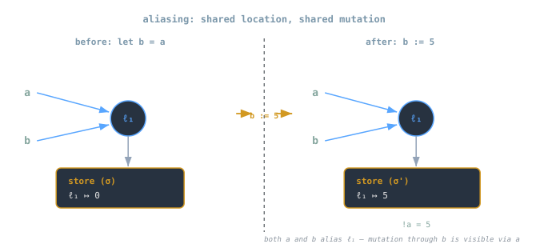

## Overview
Pure functional languages describe computation as **expression → value** mappings, independent of time or state.  
However, real-world programming requires **mutation**: variables that change, data that updates, and effects that persist.  
To reason about this, programming languages extend their semantics with **locations** and a **store (σ)**.

> [!note]
> Mutable state introduces *time* into semantics — expressions no longer evaluate to a single value, but to a value **and a new store**.

---

## Core Concepts
### Values, Locations, and the Store
- **Values** — immutable entities (integers, booleans, closures).
- **Locations (ℓ)** — addresses in memory where values reside.
- **Store (σ)** — mapping of locations to values:  
```

σ : Location → Value

```

When an expression mutates state, it returns both a result and a new store:
```

⟨e, σ⟩ ⇓ ⟨v, σ'⟩

```

### Motivation
Mutable state allows:
- Persistent data (e.g., object fields, variables, arrays)
- Efficient algorithms (in-place updates)
- Controlled I/O and interaction
- Sequencing of dependent computations

But it also introduces:
- **Aliasing:** multiple references to the same location.
- **Order dependence:** evaluation results depend on timing.

---

## Syntax
We extend the λ-calculus with reference primitives:
```

t ::= ...  
| ref t -- allocate reference  
| !t -- dereference  
| t1 := t2 -- assignment  
| t1 ; t2 -- sequencing

```

### Informal Behavior
| Construct | Meaning | Example |
|------------|----------|----------|
| `ref t` | allocate a new location containing `t` | `let x = ref 5` |
| `!t` | read the value stored in the location | `!x` → `5` |
| `t1 := t2` | update location from `t1` with value of `t2` | `x := 7` |
| `t1 ; t2` | sequence: evaluate `t1`, then `t2` | `x := 3; !x` |

> [!tip]
> The sequencing operator `;` explicitly orders effects, ensuring that `t1` is evaluated before `t2`.

---

## Operational Semantics
Small-step rules capture how state evolves step by step.

### Allocation
```

⟨ref v, σ⟩ → ⟨ℓ, σ[ℓ ↦ v]⟩ (ℓ fresh)

```
- `ref v` allocates a new location `ℓ`.
- The store is extended with a mapping from `ℓ` to `v`.

### Dereference
```

⟨!ℓ, σ⟩ → ⟨σ(ℓ), σ⟩

```
- Reading a reference returns the stored value, leaving the store unchanged.

### Assignment
```

⟨ℓ := v, σ⟩ → ⟨unit, σ[ℓ ↦ v]⟩

```
- Updates the existing mapping at `ℓ`.
- Returns a `unit` value to indicate sequencing, not computation.

### Sequencing
```

⟨t1 ; t2, σ⟩ → ⟨t1', σ'⟩ ; t2

````
until `t1` reduces to `unit`, then continue with `t2`.

> [!example]
> **Diagram idea (`store_evolution.svg`)**  
> Show σ as a table evolving from `{}` → `{ℓ1: 5}` → `{ℓ1: 7}` as evaluation proceeds:
> ```
> let r = ref 5 in
> r := 7;
> !r
> ```

---

## Example Walkthrough
Consider:
```ml
let x = ref 0 in
x := !x + 1;
!x
````

**Step-by-step:**

1. `ref 0` allocates ℓ₁, σ₁ = {ℓ₁ ↦ 0}.
    
2. `!x` reads σ₁(ℓ₁) = 0.
    
3. `x := 0 + 1` updates σ₂ = {ℓ₁ ↦ 1}.
    
4. `!x` now reads σ₂(ℓ₁) = 1.
    

Final result:

```
⟨!x, σ₂⟩ ⇓ ⟨1, σ₂⟩
```

> [!tip]  
> This pattern — read, modify, write — is fundamental in imperative programming.  
> In semantics, it manifests as _store-passing_ between expressions.

---

## Aliasing

Two variables can reference the same location.  
Changing one affects the other.

### Example

```ml
let a = ref 0 in
let b = a in
b := 5;
!a
```

Result:

```
⟨!a, σ'⟩ ⇓ ⟨5, σ'⟩
```

because both `a` and `b` point to the same ℓ.



Aliasing is powerful but dangerous — it couples parts of a program through shared state.  
Optimizations and reasoning become harder because order now matters.

---

## Side Effects and Sequencing

### Sequential Composition

```
t1 ; t2
```

ensures `t1` executes before `t2`, even if `t1` returns no useful value.

### Example

```ml
x := 1;
print (!x);
x := !x + 1;
```

Each step mutates the shared store.  
Effects compose _through time_, not through function return values.

> [!tip]  
> Effects break referential transparency — two identical expressions may yield different results depending on σ.

---

## Referential Transparency and Effects

|Expression|Without Effects|With Effects|
|---|---|---|
|`let y = 1 + 1`|always 2|always 2|
|`let y = ref 1`|immutable|allocates new memory|
|`!r`|same result for same r|may differ if store changes|

A pure function `f(x)` always yields the same result for the same input.  
With mutable state, the meaning depends on σ — the _state of the world_.

> [!warning]  
> Mutation makes equational reasoning (substitution, simplification) invalid unless effects are controlled or isolated.

---

## Modeling State Formally

We now evaluate expressions as **store-transforming computations**:

```
⟦t⟧ : Store → (Value × Store)
```

In λ-calculus terms, this means:

```
⟦ref t⟧ σ = let (v, σ') = ⟦t⟧ σ in (ℓ, σ'[ℓ ↦ v])
```

and similarly for `!t` and `t1 := t2`.

> [!note]  
> This model is the foundation for **monadic state** in functional languages like Haskell.

---

## Monadic View (Optional Bridge)

Haskell’s `State` monad captures store-passing explicitly:

```haskell
type State σ α = σ -> (α, σ)

ref x       ↦  newRef x
!r          ↦  readRef r
r := v      ↦  writeRef r v
```

This bridges imperative effects and functional purity — making mutations _explicit in type signatures_.

---

## Common Pitfalls

> [!warning]
> 
> - **Aliasing:** accidental shared references lead to unexpected updates.
>     
> - **Order dependence:** swapping statements changes meaning.
>     
> - **Memory leaks:** lost references keep values alive in σ.
>     
> - **Hidden coupling:** side effects across modules break modular reasoning.
>     

---

## Diagram Concepts

- `store_evolution.svg`: stepwise state updates through evaluation.
    
- `aliasing_effects.svg`: shared location aliasing between identifiers.
    
- `sequencing_flow.svg`: sequential control flow over time with σ progression.
    

---

## See also

- [[cs/pl/language-design-values-variables-environments|Language Design — Values, Variables & Environments]]
    
- [[cs/pl/scoping-binding-and-closures|Scoping, Binding, and Closures]]
    
- [[cs/pl/operational-semantics-big-step-small-step|Operational Semantics — Big-Step & Small-Step]]
    
- [[evaluation-order-and-strictness | Evaluation Order & Strictness]]