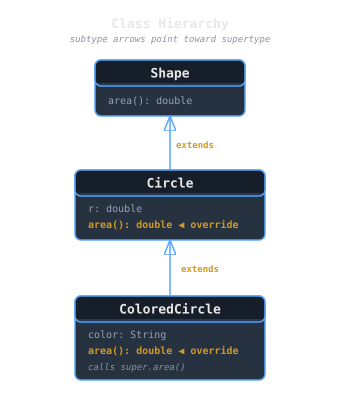
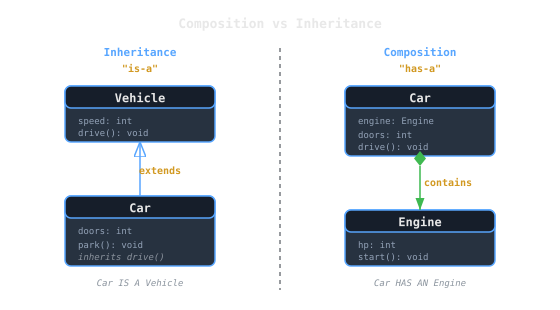
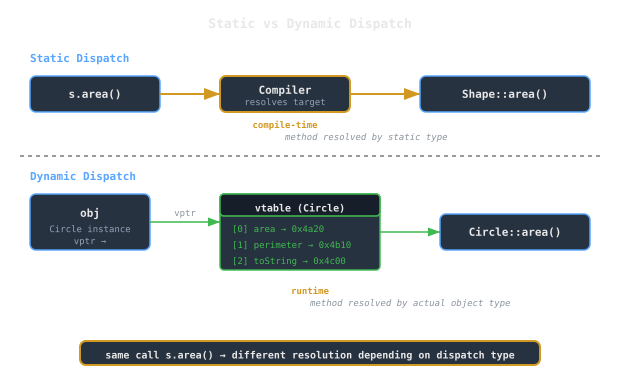

## Overview
Object-oriented programming (OOP) organizes software around **objects**: entities that combine data (*state*) and functions (*behavior*).  
Languages like Java, C++, and Python implement OOP through **classes**, **inheritance**, and **method dispatch** systems.

While OOP is sometimes treated as a paradigm shift, it’s fundamentally a set of **language-level abstractions for modularity, polymorphism, and code reuse**.

> [!note]
> Objects ≈ *records with attached procedures*.  
> Classes define blueprints; objects are instances with runtime identity.

---

## Classes and Objects
A **class** defines:
- Fields (state)
- Methods (behavior)
- Visibility and access rules
- Optionally, inheritance relationships

An **object** is an instance of a class:
- Has its own field values.
- Shares method definitions with others of the same class.

### Example
```java
class Shape {
  double area() { return 0.0; }
}

class Circle extends Shape {
  double r;
  Circle(double r) { this.r = r; }
  double area() { return Math.PI * r * r; }
}
````

`Circle` inherits `area()` from `Shape` but overrides it with a specialized implementation.



> [!tip]  
> In OOP terms: `Shape` defines an _interface_; `Circle` provides a _concrete realization_.

---

## Inheritance

Inheritance allows a new class to **reuse and extend** the definition of an existing class.

### Single Inheritance

Most languages (Java, Python) allow only one direct superclass:

```
Shape
  └── Circle
```

### Multiple Inheritance

Some languages (C++, Eiffel) allow multiple:

```
class FlyingFish extends Animal, Swimmer, Flyer
```

> [!warning]  
> Multiple inheritance introduces the **diamond problem**: ambiguity when two superclasses define the same method or field.

### Composition vs Inheritance

- **Inheritance** models an “is-a” relationship (`Circle` _is a_ `Shape`).

- **Composition** models a “has-a” relationship (`Car` _has an_ `Engine`).



---

## Subtyping and Polymorphism

### Nominal vs Structural Subtyping

- **Nominal:** based on declared inheritance (`class Circle extends Shape`).
    
- **[[cs/languages/common/structural-versus-nominal-typing|Structural]]:** based on member compatibility (as in Go or TypeScript).
    

### Subtype Polymorphism

A subclass instance can be used where a superclass is expected:

```java
Shape s = new Circle(5);
System.out.println(s.area());
```

The method invoked depends on the **runtime type**, not the static type. That’s **[[cs/languages/common/dispatch-vtables-fat-pointers-and-dictionaries|dynamic dispatch]]**.

---

## Method Dispatch

**Dispatch** determines _which implementation of a method to call_.

### Static Dispatch

Chosen at compile time (e.g., function overloading):

```cpp
void draw(Shape s);
void draw(Circle c);
```

### Dynamic Dispatch (Single Dispatch)

Chosen at runtime based on the **receiver object**’s class:

```cpp
Shape* s = new Circle();
s->area(); // Circle::area() called dynamically
```

Implementation detail:

- Each class stores a **[[cs/languages/Cpp/virtual-dispatch-vtables-and-object-layout|vtable]]** (virtual method table).
    
- Objects carry a hidden pointer to their class’s vtable.
    
- Method calls lookup entries in that table.
    



---

## Overriding and `super`

A subclass can **override** inherited methods to refine behavior:

```java
class ColoredCircle extends Circle {
  String color;
  double area() {
    System.out.println("Computing area for " + color);
    return super.area(); // call parent method
  }
}
```

Rules vary by language:

- **Java/C#:** require `@Override` annotation or equivalent.
    
- **C++:** uses `virtual` keyword to mark dispatchable methods.
    
- **Python:** all methods are virtual by default.
    

---

## Encapsulation

Encapsulation restricts access to an object’s internal state through:

- **Visibility modifiers** (`private`, `protected`, `public`)
    
- **Accessors** and **mutators** (getters/setters)
    
- **Immutability** or controlled mutation
    

This hides representation details and prevents direct external modification:

```java
class BankAccount {
  private double balance;
  public void deposit(double x) { balance += x; }
  public double getBalance() { return balance; }
}
```

> [!warning]  
> Violating encapsulation leads to tight coupling and fragile dependencies.

---

## Multiple Dispatch

In **single dispatch**, method choice depends on one receiver’s type.  
**Multiple dispatch** generalizes this to depend on all argument types.

Example (Julia):

```julia
area(x::Circle, y::Circle) = ...
area(x::Rectangle, y::Circle) = ...
```

Dispatching is based on the _tuple of argument types_.

> [!note]  
> Multiple dispatch better supports _symmetric operations_ (e.g., geometry, algebra), where no single argument should dominate.

---

## Object Identity

Objects have **identity**, even if they contain the same data:

```python
a = [1, 2]; b = [1, 2]
a == b    # true  (structural equality)
a is b    # false (distinct objects)
```

Identity allows mutable state tracking, essential for references and effects.

---

## Common Pitfalls

> [!warning]
> 
> - **Fragile base class problem:** subclass changes invalidate parent assumptions.
>     
> - **Slicing:** assigning derived objects to base by value (C++).
>     
> - **Inheritance abuse:** using subclassing instead of composition.
>     
> - **Tight coupling:** dependent modules break when hierarchy changes.
>     

---

## Type Systems and OOP

Languages differ in how they express object and class relationships:

|Language|Type Relation|Dispatch|Notes|
|---|---|---|---|
|Java|Nominal subtyping|Single|Interfaces as structural contracts|
|Python|Dynamic structural|Single|Duck typing at runtime|
|C++|Nominal|Single or static|Virtual vs non-virtual|
|Julia|Structural|Multiple|Efficient multimethods|
|Scala|Nominal + structural|Single|Traits support composition|

> [!note]  
> Some modern systems (Rust, Go) avoid classes entirely but still provide _method dispatch via traits/interfaces_.

---

## Design Perspective

Classes aren’t just technical. They define **modularity boundaries**:

- Abstract data types (ADTs) evolved into objects.
    
- OOP shifts from _functions over data_ → _data with functions attached_.
    
- Dispatch generalizes polymorphism to runtime decision-making.
    

> [!tip]  
> When designing APIs, prefer _composition first, inheritance only if necessary_.  
> Interfaces and traits often provide cleaner, more flexible reuse.

---

## See also

- [[cs/pl/subtyping-variance-type-constraints|Subtyping & Variance]]
    
- [[cs/pl/records-variants-and-pattern-matching|Records, Variants, and Pattern Matching]]
    
- [[cs/pl/language-design-values-variables-environments|Language Design: Values, Variables & Environments]]
    
- [[cs/pl/compilation-vs-interpretation|Compilation vs Interpretation]]

---

## Sources

- "Object-oriented programming," Wikipedia. https://en.wikipedia.org/wiki/Object-oriented_programming . Supports OOP as a paradigm based on objects that encapsulate data and functions, with programs built from interacting objects.
- "Inheritance (object-oriented programming)," Wikipedia. https://en.wikipedia.org/wiki/Inheritance_%28object-oriented_programming%29 . Supports inheritance as deriving new subclasses from existing super/base classes while retaining and extending implementation.
- "Dynamic dispatch," Wikipedia. https://en.wikipedia.org/wiki/Dynamic_dispatch . Supports dynamic dispatch as selecting which implementation of a polymorphic method to call at run time, a defining characteristic of OOP languages.
- "Multiple dispatch," Wikipedia. https://en.wikipedia.org/wiki/Multiple_dispatch . Supports multiple dispatch as dispatching a function based on the runtime types of more than one argument, generalizing single-dispatch polymorphism.