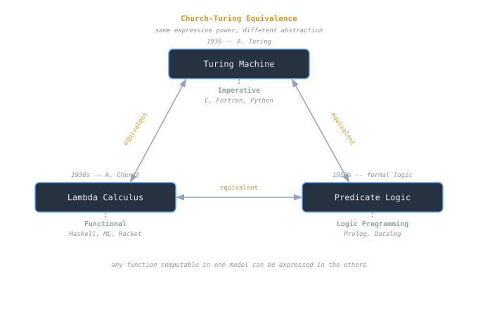
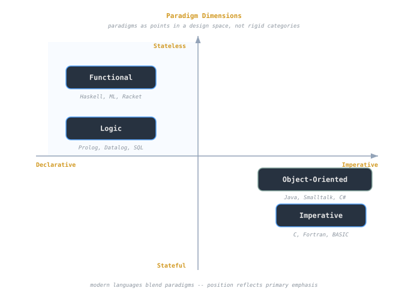

## Overview
Programming paradigms describe *how we think about programs* — the principles that shape how computation is expressed and reasoned about.  
A **model of computation** gives the *mathematical foundation* underlying those paradigms.

Together, they define what a language can express, how it behaves, and how we prove its correctness.

> [!note]
> Paradigms describe *styles of programming*; models of computation describe *what computation means*.

---

## Layers of Computation
Languages, regardless of paradigm, rest on three conceptual layers:

1. **Atomic computation** — the smallest evaluable operations (arithmetic, assignment, comparison).  
2. **Composition** — rules for combining atomic parts (sequencing, conditionals, recursion).  
3. **Abstraction** — mechanisms for naming, reusing, and hiding complexity (functions, objects, modules).

> [!tip]
> The “Three C’s” of programming: **Compute → Compose → Conceal.**

These layers recur in every paradigm — from procedural loops to functional recursion to logic inference.

---

## Classical Models of Computation

| Model | Origin | Foundation | Paradigm Connection |
|--------|---------|-------------|---------------------|
| **[[cs/history/turing-and-computability|Turing Machine]]** | 1936 – A. Turing | Stepwise state transitions on tape | Imperative & procedural languages |
| **[[cs/pl/lambda-calculus-syntax-substitution|Lambda Calculus]]** | 1930s – Alonzo Church | Function abstraction and application | Functional languages |
| **Predicate Logic** | 1950s | Rule-based inference and unification | Logic programming (Prolog, Datalog) |

All three are **computationally equivalent** (Church–Turing thesis) — any function computable in one can be expressed in the others — but each emphasizes a different *style of reasoning*.



---

## Major Programming Paradigms

### 1. Imperative
Programs are **sequences of commands** that update shared state.
```python
x = 0
while x < 5:
    x += 1
````

- Directly mirrors hardware and CPU execution.
    
- Easy to reason about control flow, harder to reason about correctness.
    
- Examples: C, Fortran, Python (in its mutable form).
    

### 2. Functional

Programs are **evaluations of expressions** without side effects.

```racket
(define (count n) (if (= n 5) 'done (count (+ n 1))))
```

- Centered on _pure functions_ and _immutability_.
    
- Derived from lambda calculus.
    
- Easier reasoning via referential transparency.
    

### 3. Logic

Programs specify **what** must be true, not **how** to compute it.

```prolog
ancestor(X, Y) :- parent(X, Y).
ancestor(X, Y) :- parent(X, Z), ancestor(Z, Y).
```

- Computation as _proof search_.
    
- Supports symbolic reasoning and knowledge representation.
    

### 4. Object-Oriented

Programs organize behavior around **objects** — entities combining data and methods.

```java
class Counter {
  int n = 0;
  void inc() { n++; }
}
```

- Promotes encapsulation and modularity.
    
- Implements _abstraction via identity and message passing._
    

---

## Paradigm Comparison

|Paradigm|Conceptual Core|Advantages|Tradeoffs|
|---|---|---|---|
|**Imperative**|Mutable state, control flow|Efficient, intuitive|Harder to reason about correctness|
|**Functional**|Pure functions, recursion|Predictable, composable|Difficult for side effects|
|**Logic**|Inference and unification|Declarative, concise|Limited control and efficiency|
|**Object-Oriented**|Identity, encapsulation|Modular, extensible|Complexity in hierarchies|

> [!tip]  
> Paradigms aren’t mutually exclusive — modern languages combine them.  
> Python, Scala, and Rust blend imperative, functional, and OO ideas.

---

## Composition and Abstraction

The hallmark of good language design is **compositional semantics** — the meaning of the whole is determined by the meaning of its parts.

A well-designed language:

- Keeps semantics simple and orthogonal.
    
- Promotes consistent combination of constructs.
    
- Avoids redundant features that overlap in purpose.
    

Example of abstraction layering:

1. **Atomic:** Arithmetic operations
    
2. **Composition:** Functions combining expressions
    
3. **Abstraction:** Higher-order functions generalizing control flow
    

---

## Paradigms as Cognitive Tools

Each paradigm provides a _mental model_ of computation:

- Imperative → _execution trace and state transitions_
    
- Functional → _evaluation of mathematical expressions_
    
- Logic → _constraint satisfaction and inference_
    
- OO → _interacting agents with hidden state_
    

> [!note]  
> Paradigms are not just technical; they’re pedagogical — they shape how programmers think about problems.

---

## Why Study Functional and Logical Ideas

Even for imperative programmers, these ideas offer concrete benefits:

- **Immutability →** predictable, parallelizable code.
    
- **Recursion →** simpler reasoning than loops.
    
- **Declarative style →** less focus on “how,” more on “what.”
    
- **Compositional semantics →** formal verification and proofs.
    

> [!example]  
> Functional abstractions inspired modern tools — from query languages (SQL, LINQ) to parallel frameworks (MapReduce).

---

## Paradigm Unification

In practice, languages adopt hybrid designs:

- **Scala / OCaml:** functional + OO
    
- **Rust:** imperative + functional + ownership model
    
- **Prolog + CLP:** logic + constraint solving
    

A modern perspective views paradigms as **dimensions** rather than categories.  
A single language can balance multiple axes:

- **Stateful vs. Stateless**
    
- **Declarative vs. Procedural**
    
- **Static vs. Dynamic**
    



---

## Evaluation Models and Abstract Machines

Every paradigm corresponds to a computational model or _abstract machine_:

- Imperative → **[[cs/history/turing-and-computability|Turing Machine]]**, **RAM model**

- Functional → **[[cs/pl/lambda-calculus-syntax-substitution|Lambda Calculus]]**, **[[abstract-machines-cek-secd|CEK/SECD machine]]**
    
- Logic → **Resolution engine**, **SLD tree**
    

These machines provide formal grounding for reasoning about correctness, equivalence, and optimization.

---

## Conceptual Summary

|Concept|Description|
|---|---|
|**Paradigm**|Style of expressing computation|
|**Model of Computation**|Abstract mathematical basis|
|**Atomic / Composition / Abstraction**|Layers of language semantics|
|**Church–Turing Thesis**|All effective computation is equivalent in power|
|**Compositional Semantics**|Meaning of a program = meaning of its parts|

> [!tip]  
> Understanding multiple paradigms isn’t about syntax — it’s about _mental flexibility_ and _semantic precision._

---

## See also

- [[cs/pl/language-overview-syntax-semantics|Language Overview — Syntax vs Semantics]]
    
- [[cs/pl/lambda-calculus-syntax-substitution|Lambda Calculus — Syntax & Substitution]]
    
- [[abstract-machines-cek-secd|Abstract Machines — CEK & SECD]]
    
- [[cs/pl/history-genealogy-of-languages|History & Genealogy of Languages]]