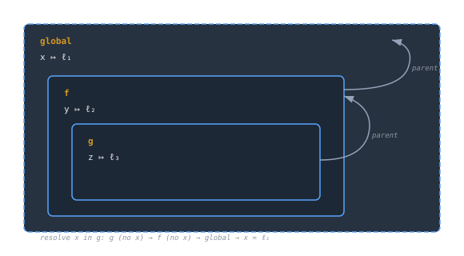
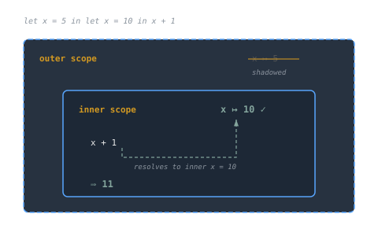
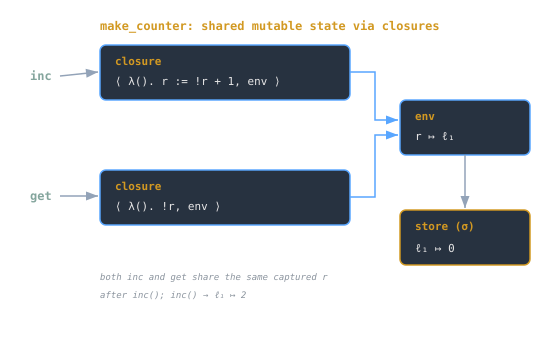

## Overview
Scoping defines **where variables are visible** and **how names resolve to values** during program execution.  
Closures extend this by capturing the environment where a function was defined, enabling persistent state and first-class functions.

> [!note]
> **Scope** answers *where* a name is valid.  
> **Binding** answers *to what* that name refers.  
> **Closures** preserve both across time and function boundaries.

---

## Lexical vs Dynamic Scope
### Lexical (Static) Scope
Under **lexical scope**, a variable’s meaning depends on *where it’s written* in the source code, not where it’s called.

Example (ML-like pseudocode):
```ml
let x = 10
let f = (λy. x + y)
let x = 20
f 5  (* result: 15 *)
````

`x` resolves to 10 because `f` was _defined_ when `x = 10`.

Lexical scope uses the **environment at definition time** to resolve names. Most modern languages (ML, Python, JavaScript, Rust) follow this rule.

### Dynamic Scope

Dynamic scope resolves names based on **call order**, using the _runtime_ environment.

```lisp
(setq x 10)
(defun f (y) (+ x y))
(let ((x 20)) (f 5))  ; ⇒ 25 (uses caller’s x)
```

> [!warning]  
> Dynamic scope can cause unpredictable behavior because variable references depend on the **call stack** rather than static structure.

---

## Environments and Bindings

An **environment** (ρ) maps variable names to memory locations; a **store** (σ) maps locations to values.

```
ρ = { x ↦ ℓ₁, y ↦ ℓ₂ }
σ = { ℓ₁ ↦ 10, ℓ₂ ↦ 20 }
```

Evaluation looks up names through these structures:

```
lookup(x, ρ, σ) = σ(ρ(x))
```

Lexical scoping creates an **environment chain**: each new function introduces a new environment linked to its parent.



---

## Binding: Creation and Rebinding

A **binding** associates a variable with a value (or a location).

- **Static binding:** determined at compile-time.
    
- **Dynamic binding:** can change at runtime via assignment.
    

Example:

```ml
let x = 5
let y = x + 1
```

Here, `x` → 5 is a _binding_. If `x` is mutable (`ref` in ML), rebinding modifies the store, not the environment.

### Shadowing

When a new variable hides a previous binding with the same name:

```ml
let x = 5 in
  let x = 10 in x + 1  (* inner x shadows outer *)
```

> [!tip]  
> Shadowing is harmless if deliberate, but often hides bugs when used accidentally in nested scopes.



---

## Closures: Capturing the Environment

A **[[cs/languages/Rust/closures-fn-fnmut-fnonce|closure]]** is a pair ⟨function, environment⟩: it remembers the bindings present when it was created.

Example:

```ml
let make_counter =
  let r = ref 0 in
  (λ(). r := !r + 1, λ(). !r)

let (inc, get) = make_counter()
inc(); inc(); get()  (* ⇒ 2 *)
```

Here, both `inc` and `get` share the same captured `r`.  
The environment persists even after `make_counter` returns.

### Mechanism

At creation time:

1. The function body and its defining environment form a closure.
    
2. When called later, evaluation uses the _captured_ environment, not the caller’s.
    



---

## Closures and Mutation

Closures can either:

- **[[cs/languages/Cpp/lambdas-and-captures|Capture values]]** (immutable model, e.g., purely functional languages), or
    
- **Capture locations** (mutable model, e.g., ML, JavaScript).
    

In the latter, multiple closures share mutable state:

```ml
let make = λ(). let r = ref 0 in
                (λ(). r := !r + 1, λ(). !r)
let (inc, get) = make()
inc(); inc(); get()  (* ⇒ 2 *)
```

> [!warning]  
> Sharing mutable cells across closures can introduce aliasing bugs, e.g., updates in one closure affect others unexpectedly.

---

## Partial Application and Closure Chains

Closures also emerge naturally through **currying**:

```ml
let mk = λx. λy. λz. x + y + z
let f = mk 1
let g = f 2
g 3  (* ⇒ 6 *)
```

Each step creates a new closure capturing the previously bound variables:

```
mk 1 → closure with { x = 1 }
f 2 → closure with { x = 1, y = 2 }
```

This **chain of captured environments** enables higher-order abstractions without explicit state.

---

## Common Pitfalls

> [!warning]
> 
> - Capturing loop variables incorrectly (e.g., late binding in Python closures).
>     
> - Relying on dynamic variables that change unexpectedly.
>     
> - Shadowing outer bindings unintentionally.
>     
> - Mutating shared state between closures without isolation.
>     

> [!tip]  
> Prefer **immutable captures** or **copying semantics** when possible, especially in concurrent or asynchronous code.

---

## Conceptual Summary

|Concept|Meaning|Example|
|---|---|---|
|**Scope**|Where names are visible|Lexical vs dynamic|
|**Binding**|Association name → value|`x = 10`|
|**Environment**|Chain of scopes|`{x ↦ ℓ₁}`|
|**Closure**|Function + environment|`λ(). r := !r + 1`|
|**Shadowing**|Local hides global|`let x = ... in let x = ...`|

---

## Diagram Concepts

- `scope-lexical-chain.svg`: static environment resolution.
    
- `scope-closure-capture.svg`: closure capturing free variables.
    
- `scope-shadowing.svg`: variable hiding and rebinding.
    

---

## See also

- [[cs/pl/language-design-values-variables-environments|Values, Variables & Environments]]
    
- [[cs/pl/lambda-calculus-syntax-substitution|Lambda Calculus: Syntax & Substitution]]
    
- [[evaluation-order-and-strictness | Evaluation Order & Strictness]]
    
- [[cs/pl/mutable-state-references-effects|Mutable State, References & Effects]]

## Sources

- "Scope (computer science)," Wikipedia. https://en.wikipedia.org/wiki/Scope_%28computer_science%29 . Supports the distinction between lexical (static) scope, where name resolution follows where a name is written, and dynamic scope, where resolution follows the runtime call chain, plus shadowing of bindings.
- "Closure (computer programming)," Wikipedia. https://en.wikipedia.org/wiki/Closure_%28computer_programming%29 . Supports a closure as a function bundled with its defining lexical environment, capturing free variables (by value or by reference) so the bindings persist after the enclosing scope returns.