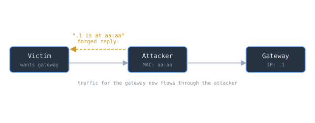

Inside a local network, IP addresses are an abstraction. Ethernet frames are delivered to hardware (MAC) addresses, so before one host can send an IP packet to another on the same segment, it must learn the target's MAC. That translation is the job of the [[cs/networking/arp-and-mac-addressing|Address Resolution Protocol]], and ARP was designed in 1982 for a network where everyone on the wire was assumed to be honest. That assumption is the whole vulnerability.

> [!note] The idea
> ARP has no authentication and its cache follows a last-writer-wins rule: a host updates its IP-to-MAC mapping from any reply it receives, whether or not it asked. An attacker on the same segment can therefore forge a reply claiming the gateway's IP belongs to the attacker's MAC, and the victim believingly sends the gateway's traffic to the attacker instead. The result is a man in the middle established with a few unsolicited packets and zero cryptographic work.

## The design that makes poisoning trivial

RFC 826 describes ARP's resolution as a table lookup: a host checks its translation table for the target protocol address, and if the pair is present it uses the stored hardware address to build the frame. The dangerous part is how that table is maintained. Per RFC 826, when a packet arrives, if the pair `<protocol type, sender protocol address>` is already in the translation table, the host will "update the sender hardware address field of the entry with the new information in the packet." And it is unconditional: "if an entry already exists for the `<protocol type, sender protocol address>` pair, then the new hardware address supersedes the old one."

Two properties fall out of those sentences. There is no authentication of the sender, and the newest claim wins. Nothing in the protocol asks whether the reply was solicited, whether the sender is entitled to speak for that IP, or whether the mapping changed suspiciously. A host that receives "IP .1 is at MAC aa:aa" simply believes it and overwrites what it knew. The protocol is not broken; it is working exactly as specified, on a threat model where no attacker exists.

## From forged reply to on-path attacker

The attack built on that design has a name. ARP spoofing "is a technique by which an attacker sends (spoofed) Address Resolution Protocol (ARP) messages onto a local area network," aiming to "associate the attacker's MAC address with the IP address of another host, such as the default gateway, causing any traffic meant for that IP address to be sent to the attacker instead." Poison both directions, victim-to-gateway and gateway-to-victim, and the attacker sits squarely in the flow.

Once there, the consequences are the full menu of an on-path position: an attacker "may allow an attacker to [[cs/law/the-wiretap-act-and-interception|intercept data frames]] on a network, modify the traffic, or stop all traffic." That is why ARP spoofing is rarely the end goal. It is a doorway: "often, the attack is used as an opening for other attacks, such as denial of service, man in the middle, or session hijacking attacks." It is one of the most common ways to become the [[man-in-the-middle-attacks|man in the middle]] on a LAN without breaking any cryptography.

> [!warning] The blast radius is exactly the broadcast domain
> ARP spoofing does not scale across the internet. It "can only be used on networks that use ARP, and requires the attacker to have direct access to the local network segment to be attacked." That is its containment and its danger: it needs a foothold on your local segment (an unlocked jack, a compromised host, an open Wi-Fi), but given that foothold, a switched network offers no protocol-level defense. The real mitigations live outside ARP entirely: authenticated encryption end to end (so an intercepted flow is useless), plus switch features like dynamic ARP inspection that add the validation the protocol itself omits.

## Related Notes

- [[man-in-the-middle-attacks|Man-in-the-Middle Attacks]] - the position ARP poisoning delivers the attacker into
- [[network-protocols|Network Protocols]] - where ARP sits in the layered stack, translating IP to hardware addresses
- [[tls-and-the-https-handshake|TLS and the HTTPS Handshake]] - the end-to-end defense that makes an intercepted LAN flow useless
- [[zero-trust-architecture|Zero-Trust Architecture]] - the model that refuses to trust the local segment ARP assumes is friendly
- [[wifi-security-wpa2-wpa3|Wi-Fi Security: WPA2 and WPA3]] - the wireless case of the same problem, a shared medium anyone in range can join

## Sources

- "An Ethernet Address Resolution Protocol," RFC 826, IETF. https://www.rfc-editor.org/rfc/rfc826.txt . Supports that ARP resolves protocol (IP) addresses to hardware addresses by table lookup, that a host updates the sender hardware address in its translation table from a received packet, and that a new hardware address unconditionally supersedes the old one, with no authentication of the sender.
- "ARP spoofing," Wikipedia. https://en.wikipedia.org/wiki/ARP_spoofing . Supports the definition of ARP spoofing as sending spoofed ARP messages to associate the attacker's MAC with another host's IP such as the gateway, that it lets an attacker intercept, modify, or stop traffic, that it is often an opening for DoS, man-in-the-middle, or session-hijacking attacks, and that it requires direct access to the local segment.
