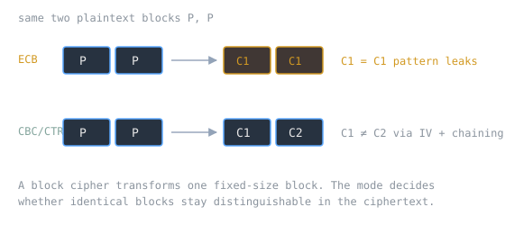

[[aes-and-block-ciphers|AES]] encrypts exactly 128 bits at a time. Real data is almost never exactly 128 bits. The gap between "encrypts one block" and "encrypts a message" is filled by a mode of operation, and the choice of mode matters far more than most people assume, because the simplest one leaks the very patterns encryption is supposed to hide.

> [!note] The idea
> "A block cipher by itself is only suitable for the secure cryptographic transformation ... of one fixed-length group of bits called a block." A mode of operation "describes how to repeatedly apply a cipher's single-block operation to securely transform amounts of data larger than a block." The naive mode, ECB, encrypts each block independently, and that independence is exactly the flaw: identical plaintext blocks become identical ciphertext blocks, so structure survives encryption.

## Why one block is not enough

The cipher is a keyed permutation on a fixed block size. Feed it a whole message and you have to decide how the blocks relate. Encrypt them in isolation and nothing links block N to block N-1, which is the electronic codebook (ECB) mode. ECB "fails to hide data patterns when it encrypts identical plaintext blocks into identical ciphertext blocks." The canonical demonstration is encrypting a bitmap: "the overall image may still be discerned, as the pattern of identically colored pixels in the original remains visible in the encrypted version." Each pixel is encrypted, and the picture is still there.

## The fix is a per-message randomizer

Better modes break the block-to-block independence with an initialization vector. Most modes "require a unique binary sequence, often called an initialization vector (IV), for each encryption operation," whose job "is to ensure that distinct ciphertexts are produced even when the same plaintext is encrypted multiple times independently with the same key." CBC chains each block into the next; CTR turns the cipher into a keystream generator by encrypting a counter. Both make identical plaintext blocks land on different ciphertext, which is precisely what ECB fails to do. The IV is not secret, but "it is important that an initialization vector is never reused under the same key, i.e. it must be a cryptographic nonce."

> [!warning] Confidentiality is not integrity
> ECB, CBC, OFB, CFB, CTR, and XTS "provide confidentiality, but they do not protect against accidental modification or malicious tampering." A mode hides content; it does not prove the content was not altered. That gap is what pushed the field toward [[authenticated-encryption-aead|authenticated encryption]], where a mode like GCM adds a tag that catches tampering.

## Related Notes

- [[aes-and-block-ciphers|AES and Block Ciphers]], the single-block primitive these modes extend
- [[authenticated-encryption-aead|Authenticated Encryption and AEAD]], the modes that also guarantee integrity
- [[cryptographically-secure-randomness|Cryptographically Secure Randomness]], the source a unique unpredictable IV depends on
- [[symmetric-vs-asymmetric-cryptography|Symmetric vs. Asymmetric Cryptography]], where the symmetric cipher carries bulk data
- [[perfect-secrecy-and-the-one-time-pad|Perfect Secrecy and the One-Time Pad]], the keystream idea CTR mode approximates

## Sources

- "Block cipher mode of operation," Wikipedia. https://en.wikipedia.org/wiki/Block_cipher_mode_of_operation . Supports that a block cipher alone handles only one fixed-length block, that a mode repeatedly applies the single-block operation to larger data, that ECB leaks patterns by mapping identical plaintext blocks to identical ciphertext blocks (with the bitmap example), that most modes need a non-repeating IV to produce distinct ciphertexts, and that these confidentiality modes do not protect against tampering.
