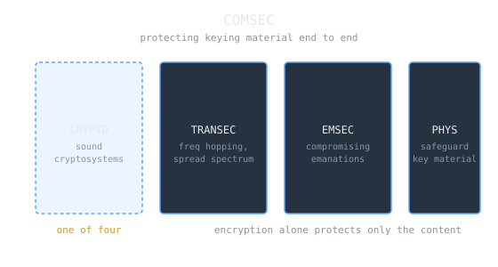

Civilian information security tends to treat "we encrypted it" as the finish line. Military communications security has always treated encryption as one line item on a longer list, because the ways a communication betrays you do not stop at the ciphertext. That older doctrine, [[cs/military-computing/naval-cryptology-roof-gang|COMSEC]], decomposes the problem in a way that names exactly where a perfectly encrypted link still leaks.

> [!note] The idea
> Communications security "includes cryptographic security, transmission security, emissions security and physical security of COMSEC equipment and associated keying material." Encryption is only the first of those four. A link can be uncrackable and still give you away through when and how it transmits, through the emanations of the equipment, or through captured keys. The doctrine's payload is that protecting message content is necessary and nowhere near sufficient.

## The four components

Each component is defined against a different attack surface.

Cryptographic security is the part civilians recognize: "the component of communications security that results from the provision of technically sound cryptosystems and their proper use," ensuring confidentiality and authenticity. This is the domain of ciphers, key exchange, and [[symmetric-vs-asymmetric-cryptography|symmetric and asymmetric algorithms]].

Transmission security (TRANSEC) defends the signal itself, not its content: "the component of communications security that results from the application of measures designed to protect transmissions from interception and exploitation by means other than cryptanalysis (e.g. [[cs/military-computing/link-16-tactical-data-links|frequency hopping]] and spread spectrum)." Even if the payload is unreadable, the mere presence, timing, and volume of a transmission is intelligence. Frequency hopping and spread spectrum hide the signal so it cannot be easily found, jammed, or traffic-analyzed.

Emission security (EMSEC) addresses the hardware leaking on its own. It is "the protection resulting from all measures taken to deny unauthorized persons information of value that might be derived from communications systems and cryptographic equipment intercepts and the interception and analysis of compromising emanations." A cipher machine can radiate information through unintended emanations from the equipment itself, entirely bypassing the strength of the cipher.

Physical security closes the loop on the keys: "the component of communications security that results from all physical measures necessary to safeguard classified equipment, material, and documents from access thereto or observation thereof by unauthorized persons." A cryptosystem is only as strong as the custody of its keying material.

## Why the decomposition is the insight

The four are not a checklist of redundant precautions. They partition genuinely different failure modes. Break the crypto and you read the message. Ignore TRANSEC and you learn who is talking to whom and when, which is often enough without ever reading a word. Neglect EMSEC and the machine hands you the plaintext for free. Lose physical control of keys and every other layer is moot. This is why [[perfect-secrecy-and-the-one-time-pad|the one-time pad]], mathematically unbreakable, still failed operationally when its key material was reused or captured: the failure was never in the cryptographic layer.

> [!tip] The lesson for civilian systems
> Modern security keeps rediscovering COMSEC's structure under other names: traffic analysis is a TRANSEC problem, side-channel attacks are EMSEC, key management is physical security. Treating encryption as the whole of security is the exact mistake the four-component model was written to prevent.

## Related Notes

- [[symmetric-vs-asymmetric-cryptography|Symmetric vs. Asymmetric Cryptography]], the cryptographic-security component in detail
- [[perfect-secrecy-and-the-one-time-pad|Perfect Secrecy and the One-Time Pad]], strong crypto undone by key handling
- [[naval-cryptology-roof-gang|The Roof Gang and Naval Cryptology]], COMSEC and SIGINT as Navy practice
- [[cryptography-codebreaking-and-the-nsa|Cryptography, Codebreaking, and the NSA]], the agency that owns U.S. COMSEC doctrine
- [[venona-and-one-time-pad-reuse|Venona and One-Time Pad Reuse]], a physical and procedural failure, not a cryptographic one

## Sources

- "Communications security," Wikipedia. https://en.wikipedia.org/wiki/Communications_security . Supports COMSEC comprising cryptographic security, transmission security, emissions security, and physical security of equipment and keying material, and the specialty definitions of cryptographic security, transmission security (TRANSEC, frequency hopping and spread spectrum), emission security (EMSEC, compromising emanations), and physical security.
