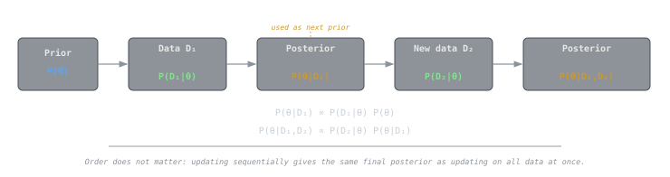

## Intuition

Bayesian inference treats **probability as a measure of belief** rather than a long-run frequency. You start with a belief about how the world works (a prior), observe data, and then update that belief proportionally to how well each possible explanation predicts what you saw. The result is a full distribution over possible answers - not just a single point estimate - so you always know how certain or uncertain you are.

The core mechanic is simple: explanations that predicted the data well gain probability mass; explanations that predicted poorly lose it. As more data arrives, the prior matters less and the data dominates. This is the self-correcting property of Bayesian reasoning.

## Core Idea

### Bayes' theorem

For a parameter $\theta$ and observed data $D$:

$$P(\theta \mid D) = \frac{P(D \mid \theta)\, P(\theta)}{P(D)}$$

| Term | Name | Role |
|---|---|---|
| $P(\theta)$ | **Prior** | What you believed before seeing data |
| $P(D \mid \theta)$ | **Likelihood** | How probable the data are under each $\theta$ |
| $P(\theta \mid D)$ | **Posterior** | Updated belief after seeing data |
| $P(D)$ | **Evidence** (marginal likelihood) | Normalizing constant ensuring the posterior integrates to 1 |

Since $P(D)$ is constant with respect to $\theta$, the operational form is:

$$\text{posterior} \propto \text{likelihood} \times \text{prior}$$

### Choosing a prior

The prior encodes what you know (or assume) before the experiment:

- **Informative priors**: encode domain knowledge. Example: "the coin is roughly fair" → $\theta \sim \text{Beta}(10, 10)$.
- **Weakly informative priors**: constrain the parameter to plausible ranges without being dogmatic. Example: $\theta \sim \text{Beta}(2, 2)$.
- **Non-informative (diffuse) priors**: attempt minimal influence. Example: $\theta \sim \text{Beta}(1, 1) = \text{Uniform}(0,1)$.

> [!tip]
> No prior is truly "objective." Even a uniform prior is a choice. The important thing is to **state your prior explicitly** and check how sensitive the posterior is to that choice (prior sensitivity analysis).

### Conjugate priors

When the prior and posterior belong to the same distribution family, the prior is **conjugate** to the likelihood. This yields closed-form updates:

| Likelihood | Conjugate prior | Posterior |
|---|---|---|
| Binomial | $\text{Beta}(\alpha, \beta)$ | $\text{Beta}(\alpha + k, \beta + n - k)$ |
| Poisson | $\text{Gamma}(\alpha, \beta)$ | $\text{Gamma}(\alpha + \sum x_i, \beta + n)$ |
| Normal (known $\sigma$) | $\text{Normal}(\mu_0, \sigma_0^2)$ | $\text{Normal}(\mu_n, \sigma_n^2)$ |

Conjugacy makes hand computation tractable. For non-conjugate models, numerical methods like **[[cs/military-computing/monte-carlo-method-and-the-bomb|Markov chain Monte Carlo]]** (MCMC) sample from the posterior.

### Sequential updating

A distinctive feature of Bayesian inference is **sequential updating**: today's posterior becomes tomorrow's prior. After observing data $D_1$:

$$P(\theta \mid D_1) \propto P(D_1 \mid \theta)\, P(\theta)$$

Then upon observing $D_2$:

$$P(\theta \mid D_1, D_2) \propto P(D_2 \mid \theta)\, P(\theta \mid D_1)$$

The final result is identical to updating on both datasets at once - order does not matter. This makes Bayesian methods natural for **streaming data** and **[[cs/machine-learning/supervised-learning|online learning]]**.

### Bayesian vs. frequentist

| Aspect | Frequentist | Bayesian |
|---|---|---|
| Probability refers to | Long-run frequency | Degree of belief |
| Parameters are | Fixed but unknown | Random variables with distributions |
| Result | Point estimate + confidence interval | Full posterior distribution |
| Prior information | Not formally incorporated | Encoded as prior distribution |

> [!note]
> The two frameworks often agree with large samples. The Bayesian advantage is most evident with small data, informative priors, or when you need to quantify uncertainty in a decision-theoretic way.

## Example

**Estimating a coin's bias.** You suspect a coin may be unfair. Your prior: $\theta \sim \text{Beta}(2, 2)$, mildly favoring fairness. You flip 10 times and observe $k = 7$ heads.

Prior parameters: $\alpha = 2$, $\beta = 2$. After updating:

$$\theta \mid D \sim \text{Beta}(2 + 7,\; 2 + 3) = \text{Beta}(9, 5)$$

The posterior mean is $\frac{9}{9+5} = 0.643$, pulled toward 0.5 from the naive MLE of $0.7$ by the prior. The 95% **credible interval** (the Bayesian analogue of a confidence interval) is approximately $[0.39, 0.85]$ - wide, reflecting genuine uncertainty from a small sample.

With 100 flips and 70 heads, the posterior becomes $\text{Beta}(72, 32)$ with mean $0.692$ and a much tighter credible interval $[0.60, 0.78]$. The data now dominate the prior.

## Related Notes

- [[probability-distributions|Probability Distributions]] - priors and posteriors are distributions
- [[hypothesis-testing|Hypothesis Testing]] - frequentist alternative; Bayesian methods compute $P(H \mid D)$ directly
- [[regression-fundamentals|Regression Fundamentals]] - Bayesian regression places priors on coefficients
