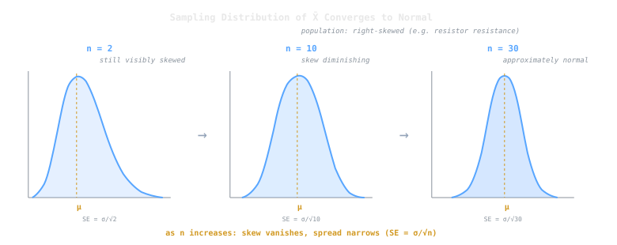

## Intuition

Take *any* population - skewed, bimodal, uniform, it doesn't matter - and repeatedly draw random samples of size $n$. Compute the sample mean each time. As $n$ grows, those sample means form a distribution that looks increasingly **normal**, regardless of what the original population looked like. This is the Central Limit Theorem (CLT), and it is the reason the [[normal-distribution|normal distribution]] dominates statistics: even when individual data aren't Gaussian, averages of enough data points are.

## Definition

Let $X_1, X_2, \dots, X_n$ be independent and identically distributed (i.i.d.) random variables with mean $\mu$ and finite variance $\sigma^2$. The CLT states that as $n \to \infty$:

$$\frac{\bar{X} - \mu}{\sigma / \sqrt{n}} \xrightarrow{d} \mathcal{N}(0, 1)$$

where $\bar{X} = \frac{1}{n}\sum_{i=1}^n X_i$ is the sample mean and $\xrightarrow{d}$ denotes convergence in distribution.

In practice, the approximation is considered reliable when $n \ge 30$, though the threshold depends on how non-normal the underlying distribution is. Highly skewed populations may need larger $n$.

## Key Formulas

**Standard error of the mean:**

$$\text{SE} = \frac{\sigma}{\sqrt{n}}$$

The standard error shrinks as $\sqrt{n}$ - quadrupling the sample size halves the standard error.

**Standardized test statistic:**

$$Z = \frac{\bar{X} - \mu}{\sigma / \sqrt{n}}$$

When $\sigma$ is unknown and estimated by the sample standard deviation $s$, use the $t$-distribution instead:

$$t = \frac{\bar{X} - \mu}{s / \sqrt{n}}, \quad \text{df} = n - 1$$

**Sum version:** The CLT also applies to sums. If $S_n = \sum_{i=1}^n X_i$, then:

$$\frac{S_n - n\mu}{\sigma\sqrt{n}} \xrightarrow{d} \mathcal{N}(0, 1)$$

> [!tip]
> The CLT explains *why* many test statistics (z-tests, t-tests) and confidence intervals rely on the normal distribution - even when the raw data are not normal.

## Example

**Resistor quality control.** A factory produces resistors with mean resistance $\mu = 100\;\Omega$ and standard deviation $\sigma = 8\;\Omega$. The individual resistance distribution is right-skewed (not normal). A quality inspector samples $n = 36$ resistors and measures the average.

By the CLT, $\bar{X}$ is approximately normal:

$$\bar{X} \sim \mathcal{N}\!\left(100,\; \frac{8^2}{36}\right) = \mathcal{N}(100,\; 1.78)$$

What is the probability the sample average exceeds $102\;\Omega$?

$$Z = \frac{102 - 100}{8/\sqrt{36}} = \frac{2}{1.333} = 1.50$$

$$P(\bar{X} > 102) = 1 - \Phi(1.50) \approx 0.067$$

About 6.7% - even though individual resistances are skewed, the CLT lets us use normal probability calculations on the sample mean.

Notice that increasing the sample to $n = 64$ would tighten the standard error to $8/\sqrt{64} = 1.0\;\Omega$, making the same deviation more significant ($Z = 2.0$, $p \approx 0.023$). The CLT quantifies exactly how more data sharpens inference.

## Why It Matters in CS

- **Monte Carlo simulation:** averaging many random simulation runs yields normally distributed estimates, enabling confidence intervals on the result.
- **Algorithm analysis:** when benchmarking runtime over many random inputs, the mean runtime is approximately normal, justifying Gaussian-based statistical tests for performance comparisons.
- **Large-scale data:** in big-data pipelines, aggregate statistics (means, counts per partition) behave normally, which simplifies anomaly detection and threshold setting.
- **A/B testing:** conversion rate differences across thousands of users are approximately normal, which is why z-tests power most A/B testing frameworks.

## Related Notes

- [[normal-distribution|Normal Distribution]] - the distribution the CLT converges to
- [[hypothesis-testing|Hypothesis Testing]] - CLT justifies z-tests and t-tests
- [[probability-distributions|Probability Distributions]] - CLT connects non-normal populations to the normal family
- [[bayesian-inference|Bayesian Inference]] - large-sample posteriors become approximately normal (Bernstein–von Mises theorem)
