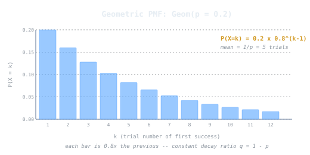

## Intuition

How many times do you have to try before you succeed? If each attempt is independent with the same probability of success, the number of the trial on which you first succeed follows a **geometric distribution**. It is the only discrete distribution with the memoryless property: no matter how many failures you have already seen, the probability of succeeding on the next trial stays the same.

## Definition

A random variable $X$ follows a geometric distribution $X \sim \text{Geom}(p)$ if it represents the trial number on which the first success occurs in a sequence of independent Bernoulli trials, each with success probability $p$ and failure probability $q = 1 - p$.

$X$ can take positive integer values $x = 1, 2, 3, \ldots$

> **Convention note:** Some texts define the geometric as the number of *failures* before the first success, giving $Y = X - 1$ with support $y = 0, 1, 2, \ldots$ and PMF $g(y; p) = p \, q^y$. The formulas below use the "trial number" convention ($x = 1, 2, \ldots$).

## Key Formulas

**Probability Mass Function (PMF):**

$$g(x; p) = p \, q^{x-1}, \quad x = 1, 2, 3, \ldots$$

The $q^{x-1}$ factor accounts for the $x - 1$ failures before the first success.

**Cumulative Distribution Function (CDF):**

$$P(X \leq x) = 1 - q^x$$

**Mean (expected number of trials):**

$$\mu = \frac{1}{p}$$

**Variance:**

$$\sigma^2 = \frac{1 - p}{p^2}$$

**Memoryless Property:**

$$P(X > s + t \mid X > s) = P(X > t)$$

This property says: given that you have already failed $s$ times, the distribution of additional trials needed is the same as starting fresh. The geometric is the *only* discrete distribution with this property.

**Moment Generating Function:**

$$M(t) = \frac{pe^t}{1 - qe^t}, \quad t < -\ln q$$

## Example

A telephone exchange is busy 95% of the time. Each attempt to connect succeeds independently with probability $p = 0.05$. How many attempts are expected, and what is the probability of connecting within the first 3 tries?

- Expected attempts: $\mu = 1/0.05 = 20$ tries.
- $P(X \leq 3) = 1 - (0.95)^3 = 1 - 0.8574 = 0.1426$.

So you have roughly a 14.3% chance of getting through in 3 or fewer attempts, and on average you will need 20 attempts.

We can also find how many attempts guarantee at least a 50% chance of connecting:

$$P(X \leq k) = 1 - (0.95)^k \geq 0.5 \implies k \geq \frac{\ln 0.5}{\ln 0.95} \approx 13.5$$

So after 14 attempts, you have at least a 50% cumulative chance of having connected at least once.

## Why It Matters in CS

- **Las Vegas algorithms**: algorithms that always produce the correct answer but have random running time. The expected execution count follows a geometric model when each attempt succeeds with fixed probability.
- **Hash table collision resolution**: under uniform hashing, the expected number of probes to find an empty slot in an open-addressing scheme is geometrically distributed.
- **Retry protocols**: Ethernet's exponential backoff and TCP reconnection strategies are analyzed using geometric waiting times as a baseline.
- **Random search**: brute-force key search in cryptography, where each guess succeeds with probability $1/N$, requires $N$ expected attempts.
- **Coupon collector variant**: the geometric distribution appears as a building block in the coupon collector problem, where the wait for each new distinct item is geometric with a shrinking success probability.

## Related Notes

- [[binomial-distribution|Binomial Distribution]] - counts total successes in $n$ trials; the geometric focuses on time to first success
- [[probability-distributions|Probability Distributions]] - overview of discrete and continuous distributions
- [[expected-value|Expected Value]] - the geometric mean $1/p$ is a foundational example of expectation
- [[hash-tables|Hash Tables]] - collision resolution analyzed via geometric waiting times
