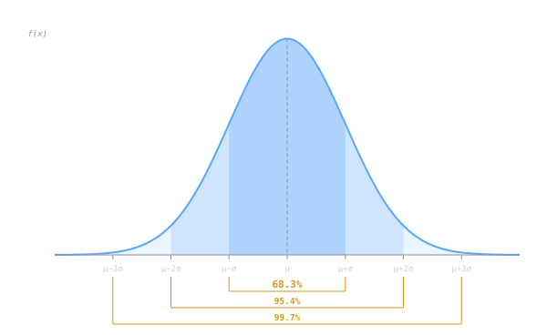

## Intuition

The normal distribution is the symmetric **bell curve** that shows up whenever many small, independent effects add together. Heights, measurement errors, exam scores - all tend to cluster around a central value with symmetric tails. The curve is entirely described by two numbers: where it is centered and how wide it spreads. This simplicity, combined with the [[central-limit-theorem|Central Limit Theorem]], makes it the single most important distribution in statistics.

## Definition

A continuous random variable $X$ follows a **normal distribution** with mean $\mu$ and standard deviation $\sigma$ (written $X \sim \mathcal{N}(\mu, \sigma^2)$) if its probability density function is:

$$f(x) = \frac{1}{\sigma\sqrt{2\pi}} \exp\!\left(-\frac{(x - \mu)^2}{2\sigma^2}\right), \quad -\infty < x < \infty$$

- $\mu$ controls the **center** (location) of the bell.
- $\sigma$ controls the **width** (spread); larger $\sigma$ means flatter and wider.
- The distribution is symmetric about $\mu$, so the mean, median, and mode coincide.

The **standard normal** distribution is the special case $Z \sim \mathcal{N}(0, 1)$. Its CDF is denoted $\Phi(z)$ and serves as the universal reference for all normal probabilities.

## Key Formulas

**Standardizing transformation** - convert any normal variable to standard normal:

$$Z = \frac{X - \mu}{\sigma}$$

This lets you look up probabilities in a single $Z$-table or use a single CDF $\Phi(z)$.

**The 68-95-99.7 rule** (empirical rule) - worth memorizing:

| Interval | Probability |
|---|---|
| $\mu \pm 1\sigma$ | $\approx 68.3\%$ |
| $\mu \pm 2\sigma$ | $\approx 95.4\%$ |
| $\mu \pm 3\sigma$ | $\approx 99.7\%$ |

**Moment-generating function:**

$$M_X(t) = \exp\!\left(\mu t + \frac{\sigma^2 t^2}{2}\right)$$

**Linear combinations:** If $X_i \sim \mathcal{N}(\mu_i, \sigma_i^2)$ are independent, then $\sum a_i X_i \sim \mathcal{N}\!\left(\sum a_i \mu_i,\; \sum a_i^2 \sigma_i^2\right)$.

## Example

**Manufacturing tolerances.** A machine produces ball bearings whose diameters follow $X \sim \mathcal{N}(10.00,\; 0.02^2)$ mm. Bearings outside the tolerance $10.00 \pm 0.05$ mm are scrapped. What proportion is scrap?

Standardize the upper bound:

$$Z = \frac{10.05 - 10.00}{0.02} = 2.5$$

By symmetry, the proportion outside tolerance is:

$$P(|X - 10| > 0.05) = 2\,[1 - \Phi(2.5)] = 2(0.0062) \approx 1.24\%$$

So about 1.24% of production is scrapped - a number that directly informs cost analysis and quality control decisions.

If the process variance drifted to $\sigma = 0.03$ mm, the scrap rate would jump to $2[1 - \Phi(1.67)] \approx 9.5\%$ - demonstrating how sensitive quality is to the spread parameter.

## Why It Matters in CS

The 68-95-99.7 rule is burned into every engineer's brain for a reason: it lets you eyeball whether data is behaving normally without running a formal test. If roughly 5% of your values fall outside two standard deviations, things are probably fine. If 20% do, something interesting is going on.

In ML, the normal shows up constantly. [[cs/deep-learning/weight-initialization|Weight initialization]] in neural networks samples from $\mathcal{N}(0, \sigma^2)$ because symmetric, light-tailed starting points help gradient flow. [[cs/machine-learning/k-means-clustering|Gaussian Mixture Models]] are just "what if the data came from $k$ overlapping bell curves?" [[cs/deep-learning/autoencoders|Variational autoencoders]] and [[cs/deep-learning/diffusion-models|diffusion models]] both lean on the normal as a latent prior because it's easy to sample from and has nice analytic properties.

> [!note]
> OLS regression assumes $\varepsilon \sim \mathcal{N}(0, \sigma^2)$, which is what justifies $t$-tests on coefficients. If the residuals aren't roughly normal, those p-values you're reading off the regression output may not mean much.

## Related Notes

- [[central-limit-theorem|Central Limit Theorem]] - explains *why* the normal distribution appears so often
- [[probability-distributions|Probability Distributions]] - the normal in context with other distribution families
- [[regression-fundamentals|Regression Fundamentals]] - normality assumption on residuals
- [[bayesian-inference|Bayesian Inference]] - normal priors and conjugate updating
