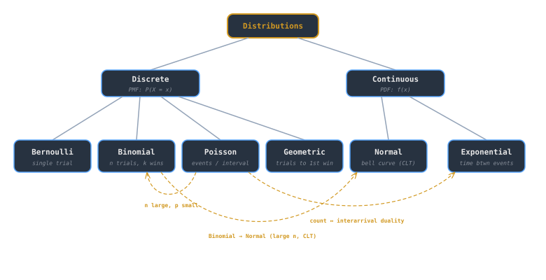

## Intuition

A probability distribution answers a simple question: **how likely is each possible outcome?** Roll a die and every face has probability $\frac{1}{6}$. Measure human heights and values cluster around a central peak. Distributions give us a precise language for these patterns - discrete distributions count outcomes, continuous distributions measure them.

Understanding distributions matters because almost every statistical method (estimation, testing, regression) assumes the data follow *some* distribution. Choosing the right one shapes the analysis. In CS, distributions also underpin [[best-worst-average-cases|average-case analysis]]: the "average" is an expectation over an assumed input distribution.

## Core Idea

### Discrete distributions

A **probability mass function** (PMF) assigns a probability to each value in a countable set: $P(X = x)$.

**Bernoulli** - a single trial with success probability $p$:

$$P(X = x) = p^x (1-p)^{1-x}, \quad x \in \{0, 1\}$$

**Binomial** - $n$ independent Bernoulli trials, counting successes:

$$P(X = k) = \binom{n}{k} p^k (1-p)^{n-k}, \quad k = 0, 1, \dots, n$$

Mean $\mu = np$, variance $\sigma^2 = np(1-p)$.

**Poisson** - count of events in a fixed interval when events arrive at rate $\lambda$:

$$P(X = k) = \frac{\lambda^k e^{-\lambda}}{k!}, \quad k = 0, 1, 2, \dots$$

Mean and variance both equal $\lambda$. The Poisson approximates the binomial when $n$ is large and $p$ is small.

### Continuous distributions

A **probability density function** (PDF) $f(x)$ gives probability via integration: $P(a \le X \le b) = \int_a^b f(x)\,dx$.

**Normal (Gaussian)** - the bell curve, parameterized by mean $\mu$ and variance $\sigma^2$:

$$f(x) = \frac{1}{\sigma\sqrt{2\pi}} \exp\!\left(-\frac{(x - \mu)^2}{2\sigma^2}\right)$$

The Central Limit Theorem guarantees that sums of independent random variables converge to a normal distribution, which is why it appears everywhere.

**Exponential** - time between Poisson events, parameterized by rate $\lambda$:

$$f(x) = \lambda e^{-\lambda x}, \quad x \ge 0$$

Mean $\frac{1}{\lambda}$, variance $\frac{1}{\lambda^2}$. It is **memoryless**: $P(X > s + t \mid X > s) = P(X > t)$.

### Cumulative distribution function

The **CDF** $F(x) = P(X \le x)$ works for both discrete and continuous distributions. For continuous $X$, $F(x) = \int_{-\infty}^x f(t)\,dt$. For discrete $X$, $F(x) = \sum_{k \le x} P(X = k)$. The CDF is non-decreasing, right-continuous, and ranges from 0 to 1.

> [!tip]
> The CDF is the unifying abstraction. Any distribution - discrete, continuous, or mixed - has a CDF. Many statistical tests (Kolmogorov–Smirnov, Anderson–Darling) operate directly on CDFs rather than PMFs or PDFs.

### Key relationships

| Distribution | Support | Parameters | Mean | Variance |
|---|---|---|---|---|
| Bernoulli | $\{0,1\}$ | $p$ | $p$ | $p(1-p)$ |
| Binomial | $\{0,\dots,n\}$ | $n, p$ | $np$ | $np(1-p)$ |
| Poisson | $\{0,1,2,\dots\}$ | $\lambda$ | $\lambda$ | $\lambda$ |
| Normal | $(-\infty, \infty)$ | $\mu, \sigma^2$ | $\mu$ | $\sigma^2$ |
| Exponential | $[0, \infty)$ | $\lambda$ | $1/\lambda$ | $1/\lambda^2$ |

## Example

**Server request arrivals.** Suppose a web server receives requests at an average rate of $\lambda = 5$ per second. The number of requests in a given second follows a Poisson distribution:

$$P(X = 8) = \frac{5^8 e^{-5}}{8!} \approx 0.065$$

The time *between* consecutive requests follows an Exponential distribution with $\lambda = 5$:

$$P(T > 0.5) = e^{-5 \cdot 0.5} = e^{-2.5} \approx 0.082$$

So there is roughly an 8% chance of waiting more than half a second between requests - useful for timeout tuning and capacity planning.

## Related Notes

- [[hypothesis-testing|Hypothesis Testing]] - tests assume a distribution under the null hypothesis
- [[regression-fundamentals|Regression Fundamentals]] - residuals are assumed normally distributed
- [[bayesian-inference|Bayesian Inference]] - distributions serve as priors and likelihoods
- [[best-worst-average-cases|Best, Worst & Average Cases]] - average-case analysis requires a distribution over inputs
