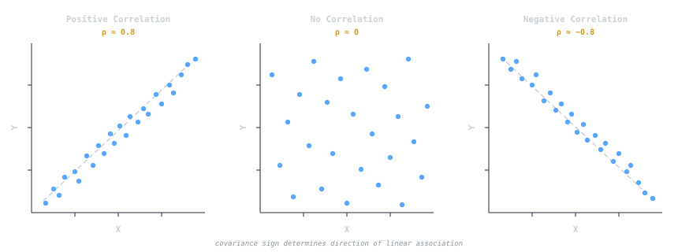

## Intuition

The [[expected-value|expected value]] tells you where a distribution is centered, but not how spread out it is. **Variance** fills that gap: it measures the average squared distance from the mean. A low variance means outcomes cluster tightly; a high variance means they are dispersed.

**Covariance** extends this idea to pairs of variables. It answers: when $X$ is above its mean, does $Y$ tend to be above its mean too (positive covariance), below it (negative), or neither (zero)? Covariance is the raw material for correlation, regression, and dimensionality reduction.

## Definition

### Variance

The **variance** of a random variable $X$ with mean $\mu = E[X]$ is:

$$\sigma^2 = \text{Var}(X) = E\!\left[(X - \mu)^2\right]$$

Expanding the square gives the **computational formula**, which is often easier to evaluate:

$$\sigma^2 = E[X^2] - \mu^2$$

The **standard deviation** $\sigma = \sqrt{\sigma^2}$ has the same units as $X$ and is more interpretable as a measure of spread.

### Covariance

The **covariance** of $X$ and $Y$ with means $\mu_X$ and $\mu_Y$:

$$\sigma_{XY} = \text{Cov}(X, Y) = E\!\left[(X - \mu_X)(Y - \mu_Y)\right]$$

The computational form:

$$\sigma_{XY} = E[XY] - \mu_X \mu_Y$$

> [!note]
> $\text{Cov}(X, X) = \text{Var}(X)$. Variance is just the covariance of a variable with itself.

## Key Formulas

### Properties of variance

$$\text{Var}(aX + b) = a^2\, \text{Var}(X)$$

Adding a constant shifts the distribution but does not change spread. Scaling by $a$ scales variance by $a^2$.

### Variance of a sum

$$\text{Var}(X + Y) = \text{Var}(X) + \text{Var}(Y) + 2\,\text{Cov}(X, Y)$$

If $X$ and $Y$ are **independent**, then $\text{Cov}(X, Y) = 0$ and:

$$\text{Var}(X + Y) = \text{Var}(X) + \text{Var}(Y)$$

### Independence and covariance

$$X \perp Y \implies \text{Cov}(X, Y) = 0$$

> [!warning]
> The converse is **false**. Zero covariance does not imply independence. Example: let $X \sim \text{Uniform}(-1,1)$ and $Y = X^2$. Then $\text{Cov}(X,Y) = 0$ but $Y$ is entirely determined by $X$.

### Correlation coefficient

The **Pearson correlation** normalizes covariance to $[-1, 1]$:

$$\rho_{XY} = \frac{\sigma_{XY}}{\sigma_X \, \sigma_Y}$$

$|\rho| = 1$ indicates a perfect linear relationship; $\rho = 0$ means no linear association.

## Example

**Manufacturing consistency.** Two companies produce resistors rated at 100 ohms. Sample measurements:

| Company | Sample mean | Sample variance |
|---|---|---|
| A | 100.2 $\Omega$ | 1.4 $\Omega^2$ |
| B | 99.8 $\Omega$ | 8.7 $\Omega^2$ |

Both hit the target mean, but Company A's resistors are far more consistent ($\sigma_A \approx 1.18\, \Omega$ vs. $\sigma_B \approx 2.95\, \Omega$). For precision circuits, Company A is the clear choice.

**Covariance in practice.** Suppose study hours $X$ and exam score $Y$ have $\text{Cov}(X,Y) = 12.5$, $\sigma_X = 2.5$, $\sigma_Y = 8.0$. The correlation:

$$\rho = \frac{12.5}{2.5 \times 8.0} = 0.625$$

A moderately strong positive linear association - more study hours correlate with higher scores.

## Why It Matters in CS

- **PCA and dimensionality reduction.** [[pca-and-dimensionality-reduction|Principal Component Analysis]] finds directions of maximum variance by computing eigenvectors of the **covariance matrix**. Features with high covariance are collapsed into single components, reducing dimensionality while preserving information.
- **Stability of randomized algorithms.** Low variance in a randomized algorithm's runtime means its performance is predictable. Chebyshev's inequality bounds tail probabilities using variance: $P(|X - \mu| \geq k\sigma) \leq 1/k^2$.
- **Sensor fusion and robotics.** Kalman filters propagate **covariance matrices** to track how uncertainty evolves over time. Sensor measurements with lower variance receive more weight in the fused estimate.
- **Portfolio and resource optimization.** In distributed systems, covariance between server loads determines whether load-balancing reduces total variance or not - negatively correlated loads are ideal.

## Related Notes

- [[expected-value|Expected Value]] - variance measures spread around the expected value
- [[probability-distributions|Probability Distributions]] - each distribution has characteristic variance formulas
- [[regression-fundamentals|Regression Fundamentals]] - regression coefficients are ratios of covariance to variance
